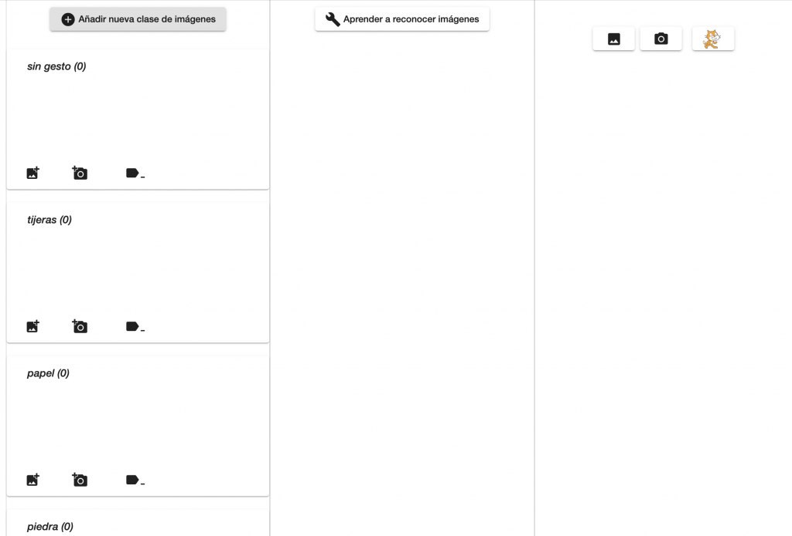
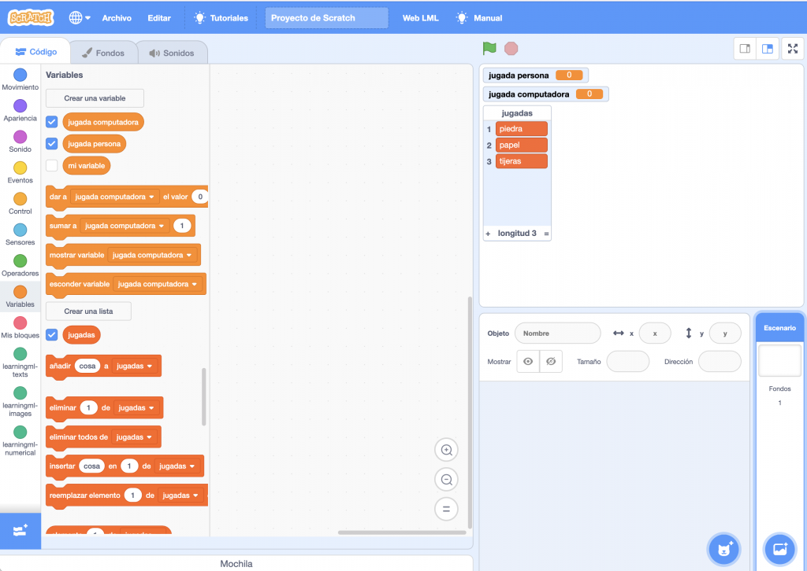
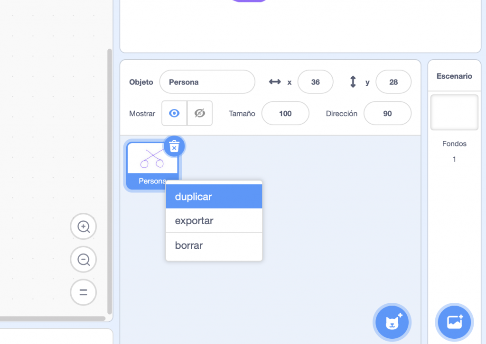
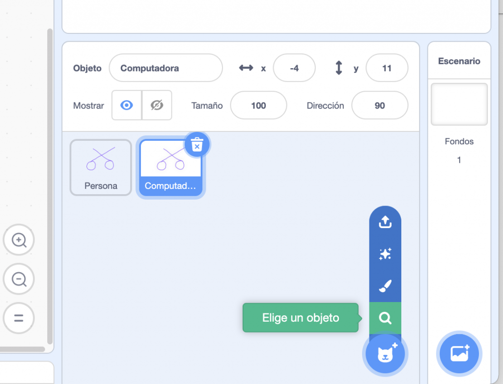
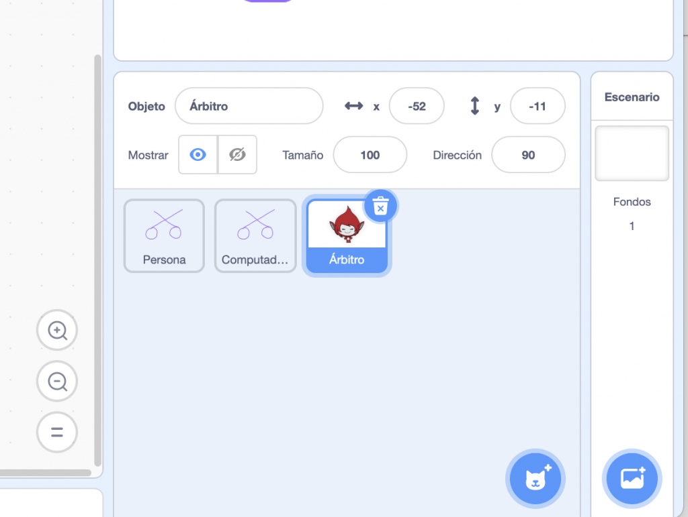
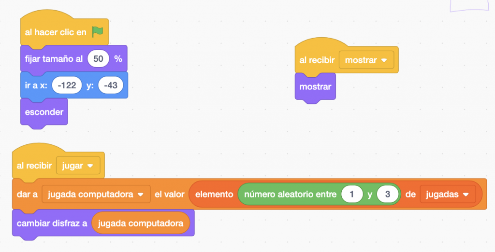
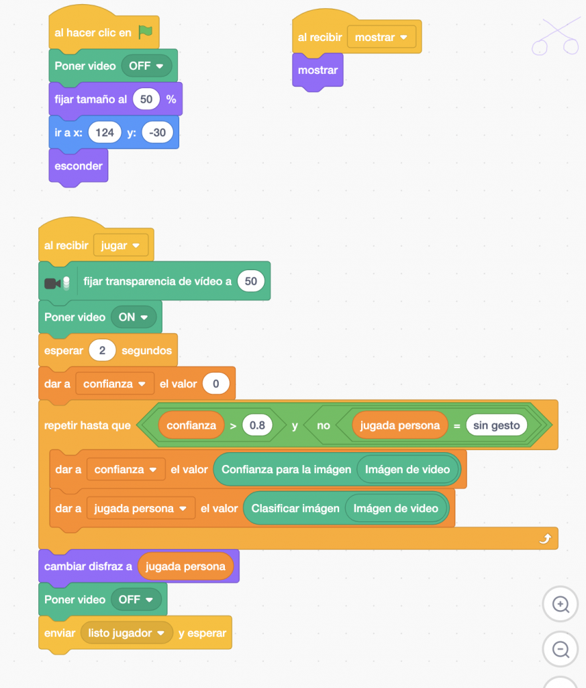
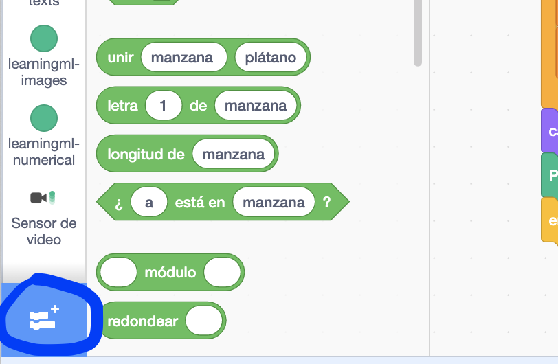
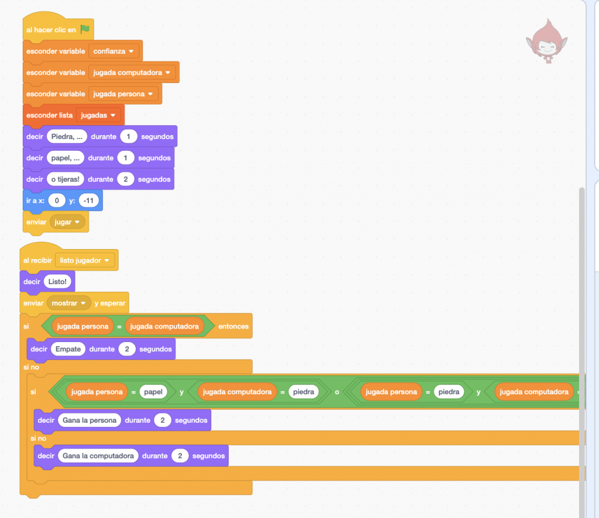
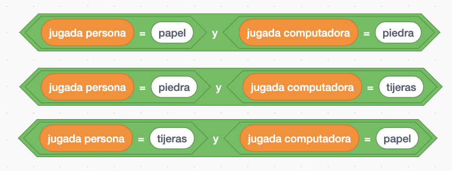

#### Goal

In this activity **we will build a video game** in which the computer will play against us the popular game "rock, paper, scissors". **It will do so by seeing and interpreting our hand gestures.**

That is, it will have to be able to recognise the hand gesture that symbolises each of the moves allowed in the game.

#### In this video you can see the final result

https://youtu.be/6H1rBWBE3fY

#### What is the game like?

Although 99% of the population is probably familiar with the game, we will explain it for the remaining 1% of the population. **Two players face each other, hide one of their hands behind their backs and place them in one of three possible positions:**

- **stone**, with a closed fist,

- **paper**, with an open palm, or

- **scissors**, with the index and ring fingers extended and the rest contracted.

**Then the chant is sung: "rock, paper or scissors"**, and at the end of the chant both players show their move. If both have played the same gesture, they tie. If not, the stone beats the scissors, because it breaks it, the scissors beats the paper, because it cuts it, and the paper beats the stone, because it wraps it. And so it goes on, play after play, until the players get bored.

#### So how do we create it?

The intention of the application we are going to develop is that one of the players is the computer, and the other a person.

Taking into account the rules of the game, a possible analysis of the problem would be the following:

1. An **object**, which we will call **Referee**, will say: "rock, paper, scissors".

3. An **object**, which we will call **Computer**, will randomly play one of the three possible moves, and it will be stored in a variable. We can call it computer\_play.

5. An **object**, which we will call **Person**, will activate the computer's camera, and the player will show its gesture, i.e. the move it has chosen.

7. The **computer**, through the **Person** object, will recognise the move that corresponds to the player's gesture, and when the confidence in the recognition of the image is sufficiently high, it will store the result in a variable. We can call it person\_play.

9. Then, the Referee object, applying the rules of the game, will decide which of the two has won and the game ends.

#### It seems that the computer is judge and jury in the game, but it doesn't have to be like that…

Although it seems that **the computer is judge and jury in the game,** it doesn't have to be like that. Remember that the computer is an absolutely obedient machine, it only does what we order it to do through our program, so the Computer object, when it selects its game, does not have to use the information that the computer has about the gesture that the person has used. That is something the programmer decides. **So the computer does not play with an advantage.**

#### Well, let's get down to business!

Well, let's get down to business! The analysis we have carried out seems easy to convert into a computer programme. However, there is a part that could seem very complicated to implement: **the recognition of the gesture that the person exposes to the computer through the camera.** But we already know that this kind of problem can be solved by applying the Machine Learning techniques that we are learning in this course.

To solve that part of the problem we can create an ML model capable of recognising the three gestures of the game, and once it works correctly, we can use it, like any other block, in our videogame.

#### Comencemos por construir el modelo de ML

Let's start there. By building the ML model. We open the LearningML editor and in section 1. Train, we create four classes, one for each move, which we will call rock, paper, scissors, and the fourth one to recognise the absence of gesture, which we will call no gesture. This last one will be useful for us so that the computer does not mistakenly associate one of the moves when we have not yet shown it to the camera.

- To each class we add about 30 images of the corresponding gesture.

- It is important to place the hand in different positions in front of the camera, i.e. higher, lower, to the right, to the left, closer, further away, etc.

The intention is for the set of images to be representative of the gesture, and for the model to be able to recognise each gesture regardless of the exact position of the hand.

The intention is that the set of images should be representative of the gesture, and that the model should be able to recognise each gesture regardless of the exact position of the hand in the camera frame.

#### We move on to the learning phase

When we have completed the training set, we move on to the learning phase **so that the ML algorithm builds a model from the images.**

We do this by clicking on the "Learn to recognise images" button in section 2.

#### Let's test

And when it is finished, it is time **to test it and see if it works correctly.** We do this by using the controls in section 3. We click on the button with the camera and check if the gestures we present to the camera are recognised correctly and with sufficient confidence.

If during the evaluation we see that the model **is not working properly,** **the training dataset needs** to be improved by adding or removing images to the classes that present problems in classification.

#### And now we have the model!

Now we have to use it in the video game we are going to build. **This model will constitute the Artificial Intelligence component of the application.**

Now we click on the Scratch kitty button to start the programming platform. Once there, **we will create 3 objects:** one to implement the player's actions, one for the computer's actions and the last one for the referee.

First we delete the default kitty object and then we create the variables person\_play and computer\_play, which will store the moves made by the person and the computer respectively.

We will also create a list, which we will call moves, with the elements rock, paper and scissors.

Now we add the Person object using the manual object creation tool. This is accessed by clicking on the object creation drop-down and choosing the brush button.

We will use Person as the object name.

And in the disguises section of the code editor we will add three disguises named after the moves: rock, paper and scissors. In each of the disguises we will draw something that resembles a rock, a piece of paper and a scissors respectively.

You can also use images you download from the internet or pictures you take yourself.

#### Now let's create the Computer object

Copying the Person object and renaming it.

Finally, we have two objects with the same disguises.

#### We create the Referee object

From a predefined Scratch object.

#### We will be left with something like this

We select the Referee object and add the following code that implements the countdown to draw the play.

The last block sends the message "to play", and will be picked up by both the Computer and the Person object.

Let's start with the code for the Computer object.

When we click on the flag, i.e. when the programme starts, we set the size of the object to half, place it on the left side of the screen and hide it, as we do not want to show the computer's play yet.

Also, when you receive the message "show", the object will be displayed. This message will be sent by the referee when both parties have made their move. Finally, when it receives the message "to play", the object generates a random number between 1 and 3 (both inclusive) that will be used to choose one of the elements of the list of moves, and store it in the variable computer\_move. That is, this variable will end up containing one of the texts "rock", "paper" or "scissors".

Finally, as we have called the disguises with the names of the moves, we can use the content of the variable computer\_play to select the disguise that the computer will display.

#### At this point you can test the code!

If all goes well, the referee will start the game and the computer will select your move.

Then we add the following code to the Person object.

As with the Computer object, when the flag is clicked, it is set to half size, placed on the right side of the screen and hidden, as we don't want the person's play to be seen until the time is right.

In addition, the camera will be switched off, as the game has not yet started, so it is not needed. On receiving the "show" message, the object will appear on the screen. As mentioned above, it is the Referee object that decides when to send this message.

#### What is happening?

And the most complex part happens when the object receives the message "to play".

- First we set the transparency of the camera to 50%. To use this block you have to add the extension "video sensor". Click on the button at the bottom left. The available extensions will appear, including "video sensor". Once selected, this block is available.

- The next block activates the camera. This block is located in the "learningml-images" section. Then we wait for 1 second. This is done in order to stabilise the video camera.

- **We create a variable called confidence,** to store the confidence of the recognition performed by the ML model, and assign it the initial value zero. Then, we create a loop that will be repeated until the confidence value is greater than 0.8 and the classification is different "without gesture". The latter guarantees that no reading of the move will be performed until the hand is presented to the camera.

During the execution of the loop, the confidence variable is updated with the value calculated by the block "confidence for the image " and the play\_person variable is loaded with the value given by the block "classify image ", that is, with the result offered by our ML model.

Both blocks are located in the "learningml-images" section. Finally note that these blocks can read the input image from one of the object's disguises or from the camera. **In our case we want it to be done from the camera.** That's why you must place the "video image" block as arguments of both blocks.

#### What happens when the person's gesture is presented?

When the person presents the gesture to the camera and the exit condition of the loop has been fulfilled, we have stored in the variable play\_person, the value that the ML model has interpreted on the person's gesture. And since we have been careful to call the names of the move classes the same as the costumes, i.e. "rock", "paper", or "scissors", we can use the value of the variable juagada\_persona to set the costume that the Person object should display.

- Finally we turn off the camera and send the message "ready player", to indicate to the referee that the reading of the player's gesture has been done correctly.

- Now back to the code of the Referee object. Let's hide the representation of the variables and the list and solve the game. To do this we use the following code:

The variables, we must hide them and place the referee in the centre of the screen.

We add the program that will be executed when the referee receives the message ‘player ready’, i.e. when the gesture shown by the person in front of the camera has been correctly interpreted.

#### We have a very simple programme

This program, as shown in the image, is very simple: first it says "Ready", to indicate that the game is over, then it sends the message "show", which is received by the objects Computer and Person to appear on the screen and show the disguise that corresponds to their move. And finally the game is resolved in the nested "yes - no" blocks.

First, a check is made to see if both players have drawn the same hand, in which case a draw occurs. If not, all of the person's winning options are checked.

This is done on the diamond-shaped block which is so long that it does not fit in the picture. Constructing the condition can be a bit messy, but it is not difficult. You have to concatenate two "OR" condition blocks:

Insert a "Y" condition block in each hole:

And in each of these conjunctive blocks (AND), put one of the winning conditions:

Finally, we can add two objects without code to indicate who is the computer and who is the person.

**And with this we now have a simple version of the game "rock, paper, scissors". All we have to do now is try it out and play.**
