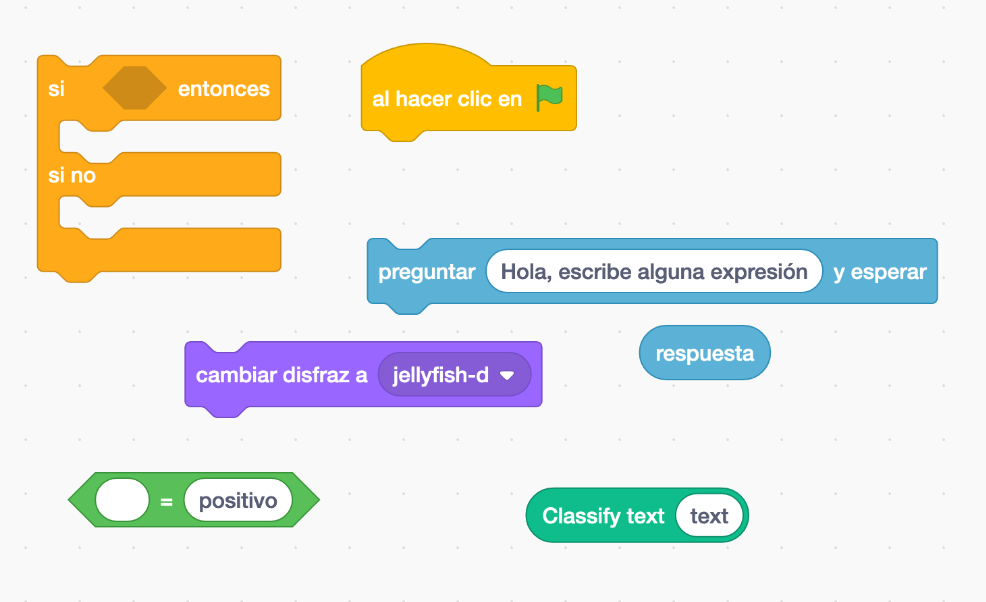

#### Objetivo

En esta actividad **vas a construir un programa capaz de analizar si expresiones escritas por el usuario son de buen rollo o malo,** y según como sean mostrará un personaje con aspecto contento o triste.

#### Creación del modelo para clasificar textos positivos o negativos

El primer paso es **crear un modelo** que sea capaz de clasificar las expresiones que escribimos como positivas o negativas. **Puedes imaginarte al _modelo_ como una máquina.** Por un lado le metemos un texto y entonces la máquina lo analiza sacando por otro lado el tipo de sentimiento al que pertenece ese texto. El editor de [LearningML](https://learningml.org/editor) es la herramienta que usarás para construir este **modelo**.

1. **Abre el editor de [LearningML](https://learningml.org/editor)**. Para ello, dirige tu navegador (_Chrome_ o _Firefox_) a la dirección **[https://learningml.org/editor](https://learningml.org/editor).**

3. **Como queremos reconocer textos, pincha en el botón _Reconocer Textos_**, y se abrirá la herramienta con las opciones necesarias para construir un modelo de reconocimiento de texto.

5. **En la sección  “1. Entrenar”, vas a añadir 2 clases** (o etiquetas, que también se llaman así), una para cada tipo de conducta. El nombre de estas clases (o etiquetas) serán: _positivo_ y negativo. Para crear una nueva clase pincha en el botón **_Añadir nueva clase de texto_**.

7. **Añade a cada clase varios textos que tengan que ver con lo que la clase representa.** Te damos algunos ejemplos.

**positivo**

- Si necesita ayuda, dímelo

- Puedes contar conmigo

- Si no te importa

- Si te parece bien

**negativo**

- Vete ya hombre

- No sirves para nada

- No puedo ni verte

**Para añadir nuevos textos a una clase, pincha en el botón _+_ de esa clase.** Fíjate que cada clase tiene su propio botón **_+_** para añadir sus textos.

5. Muy bien, ya tienes el **conjunto de datos de ejemplo**! Cuanto más datos añadas, mejor será el resultado. Ahora pincha en el botón **_Aprender a reconocer textos_** de la sección “2. Aprender”. Asegúrate de que el desplegable **_Lenguaje de los textos_** esté en **_Español_**, o escoge el idioma que hayas usado para escribir los textos. 

- **IMPORTANTE**: Una vez que pinches en este botón, tu ordenador estará “aprendiendo” a partir de los textos que has escrito. Este aprendizaje se hace gracias a un algoritmo que denominamos **Algoritmo de Machine Learning**. Esto puede tardar un ratito. Sé paciente. Al final de este paso, el algoritmo de Machine Learning ha creado lo que llamamos un **modelo**. Ese modelo es algo que tú puedes utilizar para que el ordenador reconozca nuevas órdenes parecidas aunque diferentes a las del conjunto de datos de entrenamiento.

6. **Ahora, hay que ver si el modelo que ha construido el algoritmo de Machine Learning funciona bien.** Utiliza la caja de texto de la sección “3. Probar” para escribir textos que tengan que ver sentimientos positivos o negativos_._ Pincha entonces en el botón **_Comprobar_** y observa si lo que dice LearningML coincide con la respuesta correcta. 

8. **Enhorabuena! Ya tienes un modelo de inteligencia artificial que reconoce conductas positivas y negativas.**

Puede ocurrir que en el paso 6, lo que dice LearningML no coincide con el tipo de conducta correcta. En ese caso, puedes añadir esa frase a la clase que realmente le corresponda y volver a ejecutar el algoritmo de machine learning, es decir, volver a pinchar en el botón **_Aprender a reconocer textos_**. Así crearás un nuevo **modelo** que habrá aprendido esa nueva frase y será más “potente”, pues es capaz de reconocer correctamente más textos. 

También puedes mejorar el análisis de conductas añadiendo una nueva clase para las expresiones que no sean ni de buen rollo ni de malo, es decir, que sean neutras.

#### Y ahora a programar

**Ya tienes la pieza fundamental del asistente virtual**, la que es capaz de reconocer a qué tipo de conducta a la que pertenece un texto. A esta pieza la hemos llamado **modelo**. Ahora usaremos esta pieza inteligente, es decir el **modelo**, para hacer un programa que reaccione a las expresiones del usuario.

1. **En la sección “3. Probar” del editor de LearningML, pincha en el botón que tiene el gato de Scratch… y se abre Scratch!**

3. Fíjate que **en la primera columna**, donde aparecen los tipos de bloques, **hay unos que se llaman “_learningml-texts_” y “l_earningml-images_”**. Pincha sobre ellos y verás que contienen varios bloques nuevos. Estos bloques sirven para usar el modelo que acabas de construir hace un momento. Como has hecho un modelo de reconocimiento de textos, debes usar los bloques de la sección “_learningml-texts_”.

5. Coloca un bloque “_classify text <texto>_” en la zona de programación de Scratch y escribe en su entrada algún texto que este escrito de buen rollo o del mal rollo. Entonces pincha encima del bloque y observa lo que ocurre. Al lado del bloque aparece el tipo de conducta a la que pertenece el texto. **Este hecho nos da la clave para construir nuestro programa**.

7. Y ahora es el momento de programar el juego. Puedes utilizar los siguientes bloques para ello:

<figure>

<figcaption>

Algunos bloques que puedes usar

</figcaption>

</figure>

Ten en cuenta que el bloque “classify <texto>” devuelve la clase a la que pertenece el texto, es decir: positivo o negativo.

**Si no consigues hacer el programa puedes bajarte esta [solución](https://web.learningml.org/sb3/analisis-sentimiento.sb3) y examinarla.**
