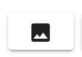
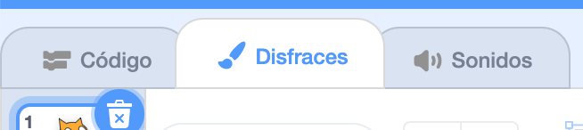
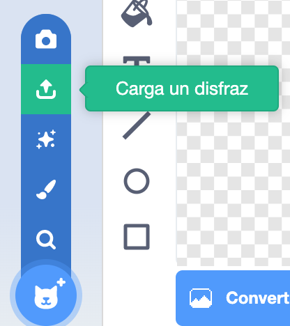
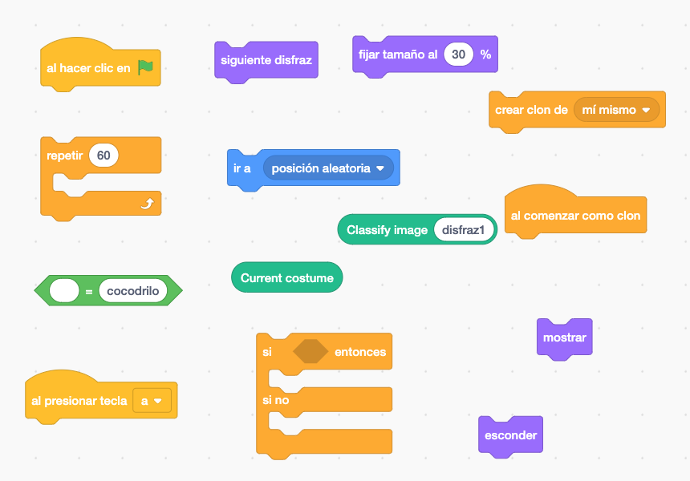

#### Objetivo

En esta actividad **vamos a programar una aplicación que dibujará en la pantalla una gran cantidad de imágenes de distintas mariposas, cangrejos, cocodrilos y canguros.** El usuario podrá seleccionar qué tipos de imágenes quiere ver. El programa, usando reconocimiento de imágenes, nos mostrará solo las imágenes que pertenezcan al tipo que el usuario le haya pedido mostrar.

Para facilitarte la realización de esta actividad **te hemos preparado un conjunto de datos** de entrenamiento con distintas imágenes de mariposas, cangrejos, cocodrilos y canguros. **Bájate este archivo y descomprímelo.**

[dataset-actividad-lml](https://web.learningml.org/wp-content/uploads/2020/06/dataset-actividad-lml.zip)[Descarga](https://web.learningml.org/wp-content/uploads/2020/06/dataset-actividad-lml.zip)

#### Creación del modelo para reconocer imágenes

El primer paso es **crear un modelo** que sea capaz de clasificar las imágenes como pertenecientes a alguna de las siguientes clases: mariposa, cangrejo, cocodrilo y canguro. **Puedes imaginarte al _modelo_ como una máquina;** por un lado le metemos una imagen y, después de analizarla, por otro lado la máquina nos dice a qué clase pertenece la imagen . El editor de [LearningML](https://learningml.org/editor) es la herramienta que usarás para construir este **modelo**.

1. **Abre el editor de [LearningML](https://learningml.org/editor).** Para ello, dirige tu navegador (_Chrome_ o _Firefox_) a la dirección **[https://learningml.org/editor](https://learningml.org/editor).**

3. **Como queremos reconocer imágenes, pincha en el botón _Reconocer Imágenes_, y se abrirá la herramienta con las opciones necesarias para construir un modelo de reconocimiento de imágenes.**

5. **En la sección “1. Entrenar”, vas a añadir 4 clases** (o etiquetas, que también se llaman así), una para cada tipo de imagen. El nombre de estas clases (o etiquetas) serán: _mariposa, cangrejo, cocodrilo_ y _canguro_. Para crear una nueva clase pincha en el botón **_Añadir nueva clase de imágenes_**.

7. **Añade a cada clase que acabas de crear, las imágenes que te has bajado como ejemplos.** Cada carpeta contiene imágenes del tipo que indica el nombre de la carpeta. También hay una carpeta que se llama **_tests_. No utilices ahora esas imágenes. Son para más adelante.**

Para añadir desde tu ordenador nuevas imágenes a una clase, pincha en el botón  de esa clase. Fíjate que cada clase tiene su propio botón  para añadir sus textos. También puedes añadir imágenes desde la _webcam_ de tu ordenador con el botón , pero en esta actividad no es necesario. **Ten en cuenta que puedes añadir todas las imágenes de una vez seleccionándolas simultáneamente.**

5. Muy bien, ya tienes el **conjunto de datos de ejemplo! Cuanto más datos añadas, mejor será el resultado,** pero con 20 imágenes que te hemos proporcionado para cada clase tienes más que suficiente. Ahora pincha en el botón **_Aprender a reconocer imágenes_** de la sección “2. Aprender”.

- **IMPORTANTE**: Una vez que pinches en este botón, tu ordenador estará “aprendiendo” a partir de las imágenes que has proporcionado. Este aprendizaje se hace gracias a un algoritmo que denominamos **Algoritmo de Machine Learning**. Esto puede tardar un ratito. Sé paciente. Al final de este paso, el algoritmo de Machine Learning ha creado lo que llamamos un **modelo**. Ese modelo es algo que tú puedes utilizar para que el ordenador reconozca nuevas órdenes parecidas aunque diferentes a las del conjunto de datos de entrenamiento.

6. **Ahora hay que ver si el modelo que ha construido el algoritmo de Machine Learning funciona bien.** Utiliza el botón  de la sección “3. Probar” para introducir nuevas imágenes con las que probar si el modelo funciona bien o no_._ Pincha entonces en el botón **_Comprobar_** y observa si LearningML clasifica la imagen correctamente.

8. **Enhorabuena! Ya tienes un modelo de inteligencia artificial que reconoce varios tipos de imágenes.**

Puede ocurrir que en el paso 6, lo que dice LearningML no coincide con el tipo de imagen correcta. En ese caso, puedes añadir la imagen que has usado para probar a la clase que realmente le corresponda y volver a ejecutar el algoritmo de machine learning, es decir, volver a pinchar en el botón **_Aprender a reconocer imágenes_**. Así crearás un nuevo **modelo** que habrá aprendido esa nueva imagen y será más “potente”, pues es capaz de reconocer correctamente más imágenes parecidas. 

#### Y ahora a programar

**Ya tienes la pieza fundamental que necesitas para programar el filtro de imágenes,** la que es capaz de reconocer a qué clase pertenece una imagen. A esta pieza la hemos llamado **modelo**. Ahora usaremos esta pieza inteligente, es decir el **modelo**, para hacer un programa capaz de filtrar las imágenes del tipo que el usuario indique.

1. **En la sección “3. Probar” del editor de LearningML, pincha en el botón que tiene el gato de Scratch… y se abre Scratch!**

3. Fíjate que **en la primera columna,** donde aparecen los tipos de bloques, hay unos que se llaman **“_learningml-texts_” y “l_earningml-images_”. Pincha sobre ellos y verás que contienen varios bloques nuevos.** Estos bloques sirven para usar el modelo que acabas de construir hace un momento. Como has hecho un modelo de reconocimiento de imágenes, debes usar los bloques de la sección “_learningml-_images”.

5. **Añade todas las imágenes de la carpeta _tests_ a los disfraces de un objeto (sprite).** Como objeto puedes usar el mismo gato con el que se inician todos lo proyectos de Scratch. Para añadir nuevos disfraces a un objeto, selecciona la pestaña "disfraces"  y pincha en el botón "_Carga un disfraz_" al que accedes colocando el ratón sobre  y usando el botón:
    - 
    
    - Puedes añadir todas las imágenes de una vez seleccionándolas simultáneamente.

7. Coloca un bloque  en la zona de programación de Scratch y coloca en su entrada el bloque  . Entonces pincha encima de este bloque de clasificación y observa lo que ocurre. Al lado del bloque debe aparecer el tipo de imagen a la que pertenece el disfraz que esté actualmente seleccionado. Prueba a cambiar de disfraz manualmente y comprueba el funcionamiento del bloque. **Estos bloques nos dan la clave para construir nuestro programa**.

9. **Y ahora es el momento de programar el juego!** El funcionamiento que te proponemos es el siguiente. Cuando se pulse en la bandera, creamos muchos clones del objeto, le asignamos un disfraz aleatorio a cada uno de ellos y los colocamos en una posición aleatoria en la pantalla. De esa manera tendremos un mosaico de imágenes de distintos tipos. Ahora, para filtrar las imágenes, usaremos las teclas "a", "b", "c" y "d". De manera que cuando el usuario pulsa la tecla "a" cada clon comprueba si el modelo de reconocimiento de imágenes lo clasifica como cocodrilo. Si es así lo muestra y si no lo oculta. Lo mismo hacemos con las teclas "b" (para mostrar mariposas), "c" (para mostrar cangrejos) y "d" (para mostrar canguros). Puedes utilizar los siguientes bloques para ello:

<figure>

<figcaption>

Algunos bloques que puedes usar

</figcaption>

</figure>

Ten en cuenta que el bloque “classify image <disfraz1>” cuando colocamos en su entrada el bloque "current costume" devuelve la clase a la que pertenece el disfraz actual.

**Si no consigues hacer el programa puedes bajarte esta [solución](https://web.learningml.org/sb3/filtro-imagenes.sb3) y estudiarla.**

Ten en cuenta que cuando el usuario pulse las teclas "a", "b", "c" o "d" el filtrado no será inmediato, tardará un par de segundos en completarse. Puedes mejorar el programa añadiendo algún mensaje que indique que el filtro se está realizando y hay que esperar. También se puede mejorar haciendo que el programa pregunte al usuario por el tipo de imagen que quiere filtrar, en lugar de usar las teclas "a", "b", "c" y "d". Ten en cuenta que la solución que te ofrecemos es la más fácil de programar, pero echándole imaginación se pueden construir programas más sofisticados.
