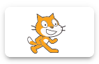
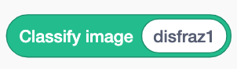
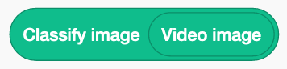
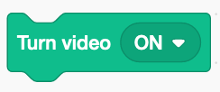
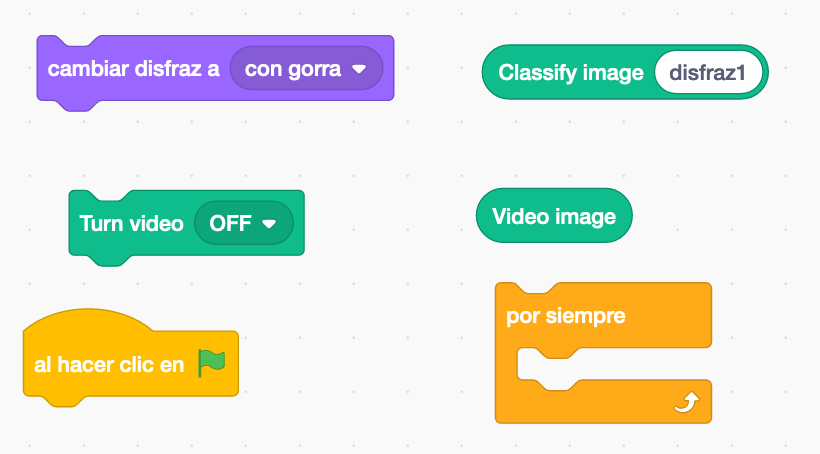
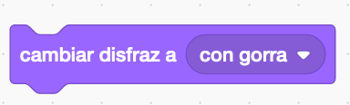

#### Objetivo

En esta actividad **vamos a programar una aplicación en la que un personaje imitará nuestros gestos.** Por ejemplo, ponernos una gorra, ponernos unas gafas o no ponernos nada. Usaremos la _webcam_ del ordenador para recoger nuestra imagen y usarla como entrada del modelo de reconocimiento de imágenes que construiremos previamente con LearningML.

#### Creación del modelo para reconocer imágenes

El primer paso es **crear un modelo que sea capaz de clasificar nuestros gestos. Puedes imaginarte al _modelo_ como una máquina;** por la entrada le metemos la imagen que viene de la _webcam_ y, después de analizarla, por la salida la máquina nos dice qué gesto es el que estamos haciendo. El editor de [LearningML](https://learningml.org/editor) es la herramienta que usarás para construir este **modelo**.

1. **Abre el editor de [LearningML](https://learningml.org/editor).** Para ello, dirige tu navegador (_Chrome_ o _Firefox_) a la dirección **[https://learningml.org/editor](https://learningml.org/editor).**

3. Como queremos reconocer imágenes, pincha en el botón **_Reconocer Imágenes_**, y se abrirá la herramienta con las opciones necesarias para construir un modelo de reconocimiento de imágenes.

5. **En la sección  “1. Entrenar”, vas a añadir 3 clases** (o etiquetas, que también se llaman así), una para cada tipo de gesto. El nombre de estas clases (o etiquetas) serán: _con\_gorra, con\_gafas_ y _sin\_nada_. Para crear una nueva clase pincha en el botón **_Añadir nueva clase de imágenes_**.

7. **Añade a cada clase que acabas de crear, imágenes de ti mismo haciendo el gesto que corresponda con el nombre de la clase.** Por ejemplo, si estás añadiendo imágenes de ejemplo a la clase _con\_gorra_, ponte una gorra y añade fotos de ti mismo con la gorra pulsando el botón de esa clase. Es conveniente que muevas un poco la cabeza para que las imágenes no sean exactamente iguales.

9. Muy bien, ya tienes el **conjunto de datos de ejemplo**! Cuanto más datos añadas, mejor será el resultado, pero con 10 imágenes es más que suficiente. Ahora pincha en el botón **_Aprender a reconocer imágenes_** de la sección “2. Aprender”.

- **IMPORTANTE**: Una vez que pinches en este botón, tu ordenador estará “aprendiendo” a partir de las imágenes que has proporcionado. Este aprendizaje se hace gracias a un algoritmo que denominamos **Algoritmo de Machine Learning**. Esto puede tardar un ratito. Sé paciente. Al final de este paso, el algoritmo de Machine Learning ha creado lo que llamamos un **modelo**. Ese modelo es algo que tú puedes utilizar para que el ordenador reconozca nuevas órdenes parecidas aunque diferentes a las del conjunto de datos de entrenamiento.

6. **Ahora hay que ver si el modelo que ha construido el algoritmo de Machine Learning funciona bien.** Utiliza el botón  de la sección “3. Probar” para introducir nuevas imágenes con las que probar si el modelo funciona bien o no_._ Pincha entonces en el botón **_Comprobar_** y observa si LearningML clasifica la imagen correctamente.

8. **Enhorabuena! Ya tienes un modelo de inteligencia artificial que reconoce varios tipos de imágenes.**

Puede ocurrir que en el paso 6, lo que dice LearningML no coincide con el tipo de imagen correcta. En ese caso, puedes añadir la imagen que has usado para probar a la clase que realmente le corresponda y volver a ejecutar el algoritmo de machine learning, es decir, volver a pinchar en el botón **_Aprender a reconocer imágenes_**. Así crearás un nuevo **modelo** que habrá aprendido esa nueva imagen y será más “potente”, pues es capaz de reconocer correctamente más imágenes parecidas. 

#### Y ahora a programar

Ya tienes la pieza fundamental que necesitas para programar el filtro de imágenes, la que es capaz de reconocer a qué clase pertenece una imagen. A esta pieza la hemos llamado **modelo**. Ahora usaremos esta pieza inteligente, es decir el **modelo**, para hacer un programa capaz de filtrar las imágenes del tipo que el usuario indique.

1. **En la sección “3. Probar” del editor de LearningML, pincha en el botón que tiene el gato de Scratch … y se abre Scratch!**

3. Fíjate que **en la primera columna, donde aparecen los tipos de bloques, hay unos que se llaman “_learningml-texts_” y “l_earningml-images_”**. Pincha sobre ellos y verás que contienen varios bloques nuevos. Estos bloques sirven para usar el modelo que acabas de construir hace un momento. Como has hecho un modelo de reconocimiento de imágenes, debes usar los bloques de la sección “_learningml-_images”.

5. Coloca un bloque  en la zona de programación de Scratch y coloca en su entrada el bloque . Debe quedar así: . Ahora, para que se pueda capturar la imagen de la _webcam_, coloca el bloque , selecciona la opción '_ON_' y pulsa sobre él. Entonces pincha encima del bloque de clasificación y observa lo que ocurre. Al lado del bloque debe aparecer el tipo de imagen a la que pertenece la imagen de la _webcam_. Prueba a ponerte y quitarte la gorra y las gafas y comprueba el funcionamiento del bloque. **Estos bloques nos dan la clave para construir nuestro programa**.

7. **Es el momento de programar el juego!** El funcionamiento que te proponemos es el siguiente. Cuando se pulse en la bandera se activa la cámara y, de manera continua, se hace la clasificación de la imagen de la _webcam_. Según sea el resultado de esta clasificación, se cambia el disfraz del personaje para que imite el gesto que estamos haciendo. Es decir, si el bloque de clasificación dice que la imagen corresponde a la clase _con\_gorra_, pues usamos un disfraz en el que el personaje aparece con una gorra, y así con los demás. Para realizar el programa basta con que utilices los siguientes bloques:

<figure>

<figcaption>

Algunos bloques que puedes usar

</figcaption>

</figure>

Ten en cuenta que cuando colocamos el bloque "video imagen", como entrada del bloque “classify image <disfraz1>”, este último devuelve la clase a la que pertenece el disfraz actual.

**Si no consigues hacer el programa puedes bajarte esta [solución](https://web.learningml.org/sb3/imitador.sb3) y estudiarla.**

**Sugerencia**: Como nombres de los disfraces del personaje, puedes usar el mismo nombre que has usado para las clases de los gestos . Así puedes usar , directamente el bloque  como entrada del bloque . Con este truco no es necesario usar bloques condicionales y e programa se simplifica.
