#### Objetivo

Esta es la primera actividad que proponemos para usar [lml\_snap!](https://snap.learningml.org), un nuevo proyecto educativo para profundizar en el conocimiento del Machine Learning (ML) y la programación de aplicaciones informáticas. Construirás la misma aplicación de la actividad "[juegos de preguntas y respuestas](https://web.learningml.org/juego-de-preguntas-y-respuestas/)" pero usando [lml\_snap!](https://snap.learningml.org) en lugar de [learningML](https://advanced.learningml.org/editor): la computadora preguntará al jugador por los diferentes periodos de la prehistoria; paleolítico, neolítico y edad de los metales, y el jugador responderá escribiendo libremente lo que sepa sobre ese periodo. Entonces la computadora responderá diciendo si lo que ha dicho es correcto o no y asignará una puntuación a la respuesta.

#### Creación del modelo para clasificar definiciones de los periodos prehistóricos

Como siempre, lo primero que haremos es crear un modelo de Machine Learning capaz de reconocer textos que tengan que ver con los periodos de la prehistoria. [lml\_snap!](https://snap.learningml.org), a diferencia de [LearningML](https://advanced.learningml.org/editor), **no dispone de un editor de modelos de ML**. Eso significa que tenemos que ser nosotros los que creemos el modelo **programando**. Así que vayamos por partes y sigamos las fases del Machine Learning supervisado.

##### Fase I. Entrenamiento

En esta fase tenemos que recopilar los textos de entrenamiento a partir de los cuales se creará nuestro modelo de ML. Usaremos un fichero de datos con formato [CSV](https://es.wikipedia.org/wiki/Valores_separados_por_comas) para recoger dichos textos y sus etiquetas. Los ficheros CSV (Comma Separated Values), no son más que archivos de textos con datos estructurados tabularmente (como una tabla, vamos). De manera que cada linea del fichero representa una fila de la tabla, y los valores de las columnas están separados, normalmente, por el carácter coma (,), aunque también se puede usar otro carácter como separador. A veces es más fácil mostrar que explicar, así que veamos un ejemplo del contenido de un fichero CSV:

```
eran cazadores y recolectores, paleolítico
comenzaron a vivir en poblados, neolítico
```

Ese fichero sería equivalente a la siguiente tabla:

| eran cazadores y recolectores | paleolítico |
| --- | --- |
| comenzaron a vivir en poblados | neolítico |

Así que, de esta forma tan sencilla, podemos recolectar textos y etiquetarlos. Basta con crear un archivo de texto y por cada texto de entrenamiento escribir una línea con el texto en sí y la etiqueta o clase a la que pertenece separados por un carácter coma (,). Si, por lo que sea, el texto en sí contiene una coma, habría que meterlo entre comillas ("). Por ejemplo:

```
"eran cazadores, recolectores y usaban piedras como herramienta", paleolítico.
```

Siguiendo esta idea hemos generado el siguiente fichero CSV con textos etiquetados con las edades de la prehistoria. Tú puedes crear el tuyo propio o modificar este fichero.

[textos\_entrenamiento\_prehistoria](https://web.learningml.org/wp-content/uploads/2023/04/textos_entrenamiento_prehistoria.csv)[Descarga](https://web.learningml.org/wp-content/uploads/2023/04/textos_entrenamiento_prehistoria.csv)

Abre el editor de programación [lml\_snap!](https://snap.learningml.org) y carga el contenido de este fichero en una variable.

Primero creamos la variable.

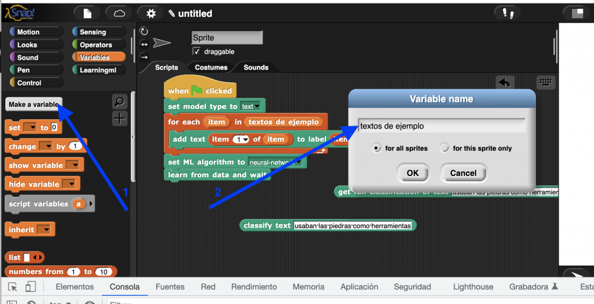

Y después importamos el contenido del fichero CSV a la variable que acabamos de crear. Para ello hacemos clic con el botón derecho del ratón situado sobre el "slot" donde se visualiza la variable en el escenario y seleccionamos la opción de menú "import".

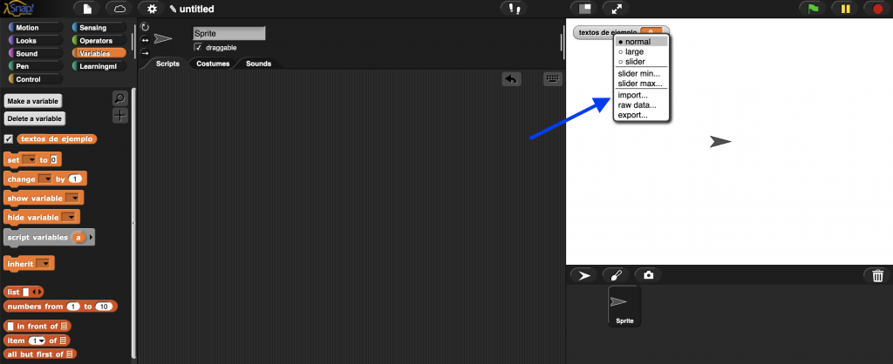

Una vez realizada la importación vemos que el contenido del archivo CSV se ha transferido a la variable "textos de ejemplos" que hemos creado.

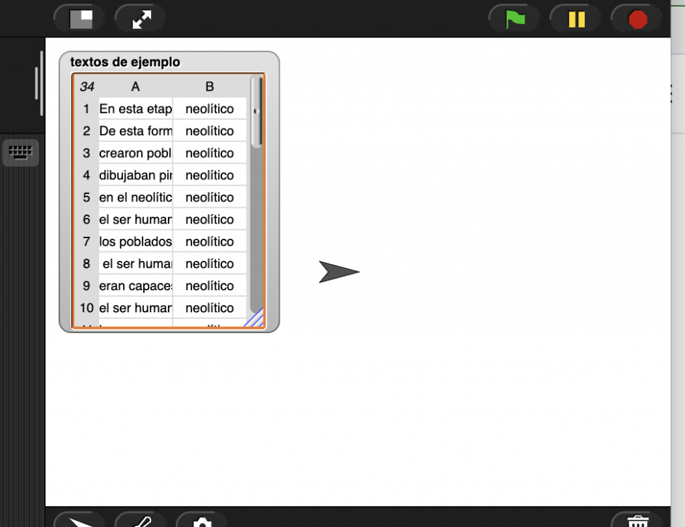

Fíjate en el formato tabular con sus filas (1, 2, 3, ...) y columnas (A, B) del contenido de la variable. En realidad es una ¡lista de listas! Y es que **una tabla** no es más que eso, **una lista cuyos elementos son otras listas**. En este caso es una lista de 34 elementos (las filas) siendo cada elemento a su vez listas de 2 elementos (las columnas).

Vamos a explorar esto un poco más a fondo. En la sección variable contamos con un bloque de tipo reporter, es decir, que devuelve un valor al ejecutarse, denominado "elemento <n> de <lista>". El nombre es bastante descriptivo.


¿Qué pasa cuando pedimos el elemento 1 de la lista "textos de ejemplo". Pasa a la pestaña de programación un bloque de este tipo usando como argumento la variable "textos de ejemplo" y "1" como elemento a obtener. Haz clic sobre el bloque para que se ejecute y comprueba que devuelve como resultado la primera fila de la tabla. Esto es, otra lista con dos elementos; el primero es el texto y el segundo la clase a la que pertenece (o la etiqueta, que es lo mismo).

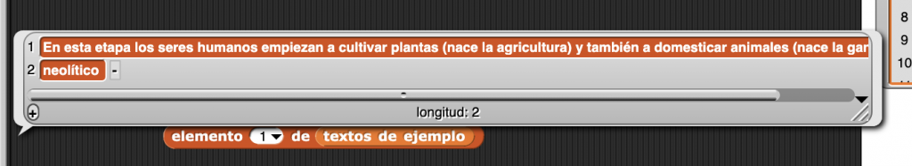

Prueba a obtener otros elementos de la lista. Verás que son similares al anterior; una lista cuyo primer elemento es un texto y como segundo la etiqueta.

¿Cómo podemos obtener el texto de, pongamos, la fila 5? Pues usamos dos veces el bloque "elemento <n> de <lista>". La primera vez pedimos el elemento 5 de la lista total, y el resultado, que ya hemos visto que es otra lista de dos elementos, lo usamos como argumento del segundo bloque "elemento <n> de <lista>", pidiendo en esta ocasión el elemento 1, que es el que tiene el texto.

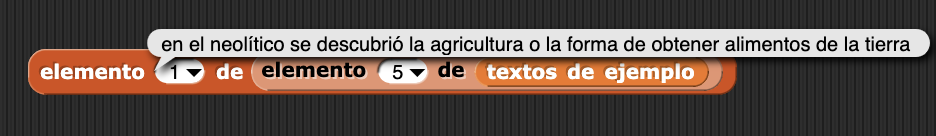

Y lo mismo podemos hacer para obtener la etiqueta a la que pertenece el texto de la fila 5. Pero ahora pedimos el 2º elemento de la fila.


O sea, que podemos acceder a cualquier elemento de la tabla usando dos bloques "elemento <n> de <lista>", uno de ellos recupera la fila y el otro la columna. Perfecto, ya tenemos los datos de entrenamiento almacenados en una variable y también la manera de acceder a cada texto y su etiqueta.

El siguiente paso es pasarle esta información al algoritmo de ML para que construya el modelo. Los datos son la gasolina del Machine Learning, sin datos no hay modelo. Es el momento de comenzar a usar los bloques de la sección "learningml". En primer lugar, como nuestro propósito es elaborar un modelo de reconocimiento de textos, usaremos el bloque "set model type to <tipo>", y lo fijaremos a "text".


A continuación usaremos el bloque "add text <text> to label <label>", el cual, como su expresión indica añade un texto con una etiqueta al conjunto de datos de entrenamiento. El problema es que solo añade un texto. Y tenemos 32.


Ahora es cuando llega el momento de combinar los elementos de la lista "texto de ejemplos" con el bloque "add text <text> to label <label>". Pero aún nos queda una importante tarea por aprender: recorrer una lista. Esto significa leer en secuencia todos sus elementos. A este proceso se le llama **iterar una lista**. Y lo podemos hacer de varias maneras. La más sencilla y directa es usando el bloque de tipo "C" "para cada <elemento> de <lista>". Si colocamos en el lugar reservado para la <lista> nuestra variable "textos de ejemplo", lo que pongamos dentro de este bloque se ejecutará para cada elemento de la lista.


Fíjate en el siguiente programa. Según acabamos de decir, el bloque "add text <text> to label <label>" se ejecutará una vez para cada elemento de la lista "textos de ejemplo". El valor de cada elemento se almacena en la variable "elemento". Y según hemos comprobado anteriormente, dicho valor debe ser una lista de dos elementos, siendo el primero el texto que deseamos añadir y el segundo su etiqueta. Así le proporcionamos al algoritmo de ML cuales son los textos y cuales las etiquetas que debe utilizar para construir el modelo.

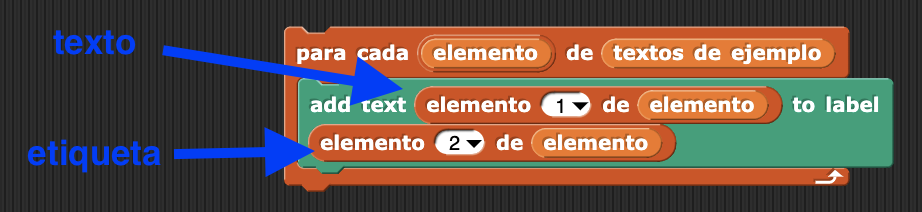

##### Fase II. Aprendizaje

Pues ya estamos cerca de conseguir nuestro modelo. Ahora tenemos que definir qué algoritmo queremos usar para construir el modelo. Por lo pronto, lml\_snap!, al igual que learningML, ofrece 2 algoritmos de ML para construir modelos: una red neuronal feedforward con dos capas y KNN (k - nearest neighbors). En otra actividad estudiaremos cada uno de ellos con más detalle. Por lo pronto diremos que estos algoritmos dependen de los denominados hiperparámetros; valores que modifican la ejecución de algoritmo. Por eso en lml\_snap! encontramos dos bloques para definir el algoritmo, cada uno de ellos ofrece la posibilidad de modificar sus hiperparámetros.

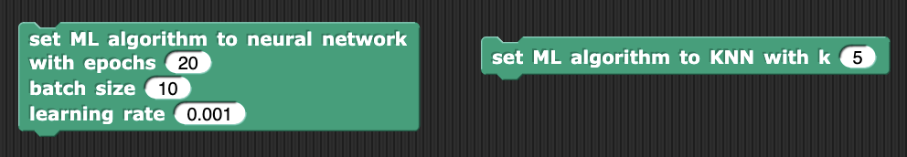

Puedes elegir cualquiera de los dos algoritmos. Aunque, para el reconocimiento de textos la red neuronal funciona mejor.

Así que juntando todo lo que hemos dichos hasta aquí nos quedaría el siguiente programa:

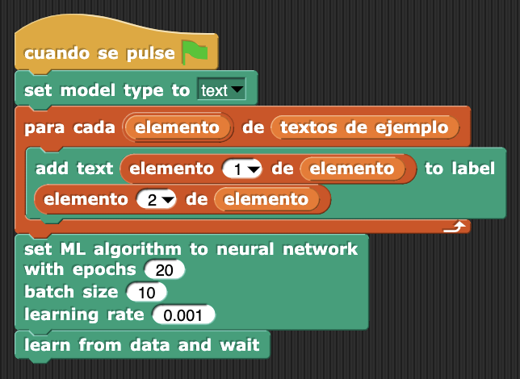

Con pocos bloques hemos conseguido conseguido un programa que, al ejecutarse, creará un modelo de ML basado en los textos de ejemplo del fichero CSV original. Primero indicamos el tipo de modelo que queremos construir, de reconocimiento de textos en este caso, después añadimos los textos de ejemplos y sus etiquetas como entradas del algoritmo y, finalmente definimos el tipo de algoritmo con sus hiperparámetros (se pueden dejar los que vienen por defecto, que funcionan bastante bien). El último bloque ejecuta el algoritmo seleccionado usando los textos de entrenamiento añadidos. Después de unos segundos ese bloque termina de ejecutarse y tendremos disponible el modelo creado.

##### Fase III. Evaluación

Vamos a comprobar si el modelo está funcionando. Para ello nos traemos a cualquier lugar de la pestaña de Programa el bloque "get full classification of text <text>". Introducimos un texto y hacemos clic en el bloque para ejecutarlo. Verás que el resultado es una lista (de nuevo las listas) en la que cada fila informa sobre la clase a la que pertenece el texto y su confianza (la probabilidad de que el texto pertenezca a la clase propuesta).

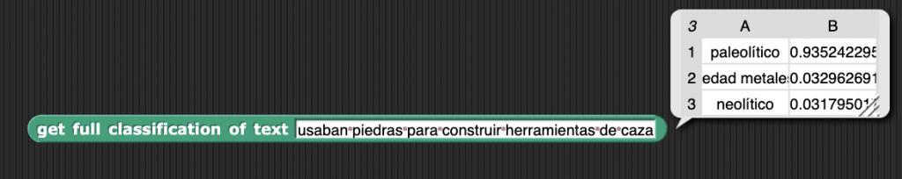

También podemos usar el bloque "classify text <text>" que nos da directamente la clase más probable.

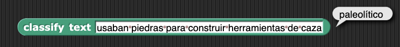

Y el bloque "confidence for text <text>" que nos da la confianza para el texto. Dependiendo de lo que queramos conseguir, usaremos unos u otros.

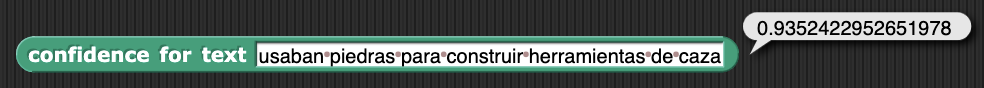

Ahora que disponemos de un modelo de ML capaz de reconocer y clasificar textos sobre la prehistoria, podemos construir el juego de preguntas y respuestas que planteamos en la actividad.

#### Implementación del juego de preguntas y respuestas

Llegados a este punto, la implementación es idéntica a la que se propuso en la actividad [https://web.learningml.org/juego-de-preguntas-y-respuestas/](https://web.learningml.org/juego-de-preguntas-y-respuestas/), pero con lml\_snap! en lugar de con Scratch. Se trata de hacer uso de los bloques de clasificación que hemos visto al final del apartado anterior para comprobar lo acertado de las respuestas dadas por el usuario. Una posible solución sería la siguiente:

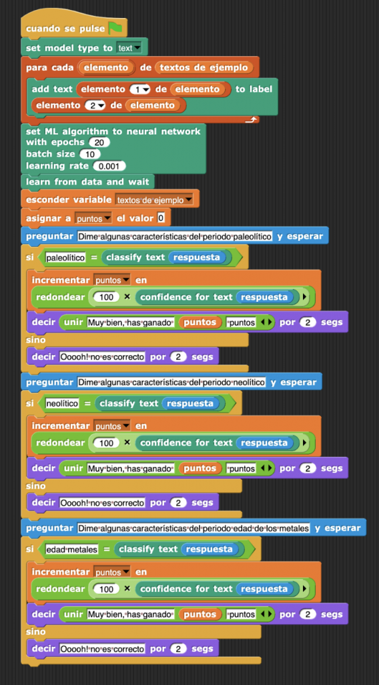

Sin embargo, cada vez que se ejecute el programa se vuelve a crear el modelo, lo cual provoca que hay que esperar un poco hasta poder jugar. Podemos mejorar esto haciendo uso del bloque "model state", que nos devuelve uno de los siguientes estados:

- EMPTY, si no hay datos de entrenamiento,

- UNTRAINED, si aún no se ha construido el modelo,

- TRAINING, si se está construyendo el modelo,

- READY, si el modelo está listo,

- OUTDATED, si hay un modelo construido, pero se han añadido nuevos datos desde el momento en que se generó.

Basta con que comprobemos el estado del modelo para decidir si ejecutar la parte de generación o no.

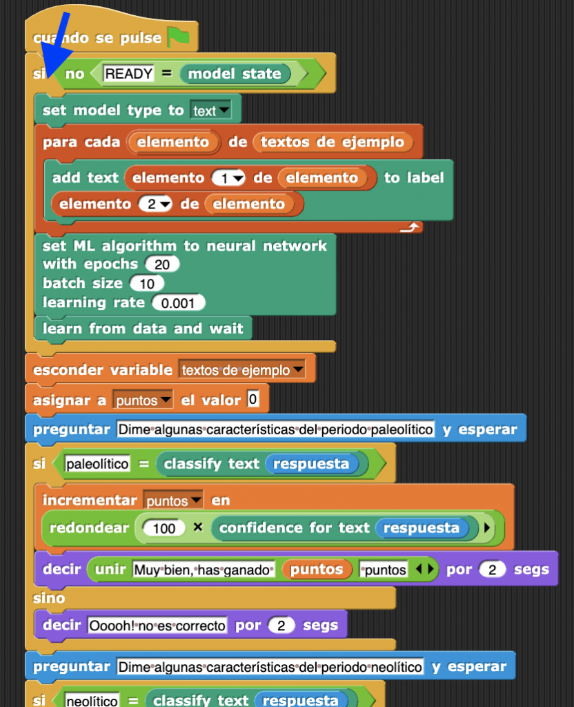

Y ya lo tenemos todo. Si quieres puedes descargarte el código de la aplicación completa con el siguiente enlace (atención que tienes que descomprimirlo antes de cargarlo en lml\_snap!:

[prehistoria.xml-1](https://web.learningml.org/wp-content/uploads/2023/04/prehistoria.xml-1.zip)[Descarga](https://web.learningml.org/wp-content/uploads/2023/04/prehistoria.xml-1.zip)

En esta primera actividad con lmlSnap! hemos introducido la principal característica de esta nueva herramienta para el aprendizaje del ML: la generación de modelos de ML desde el propio entorno de programación. Ya no necesitamos un editor de modelos de ML como en [learningML](https://advanced.learningml.org/editor). Con lmlSnap! todo el proceso de ML se realiza programando. Y esto es una manera más parecida a como se trabaja en el mundo profesional que, además, te permitirá desarrollar mucho más tus habilidades para programar aplicaciones informáticas. ¡Y eso es todo por lo pronto! En la próxima actividad construiremos un modelo de ML para reconocer imágenes. ¡Hasta la próxima!
