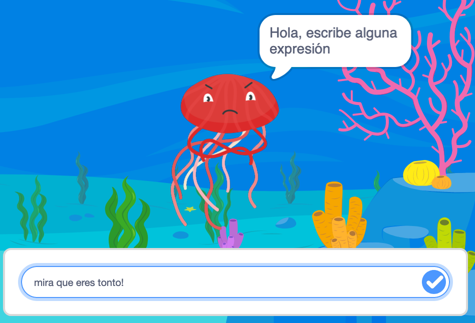
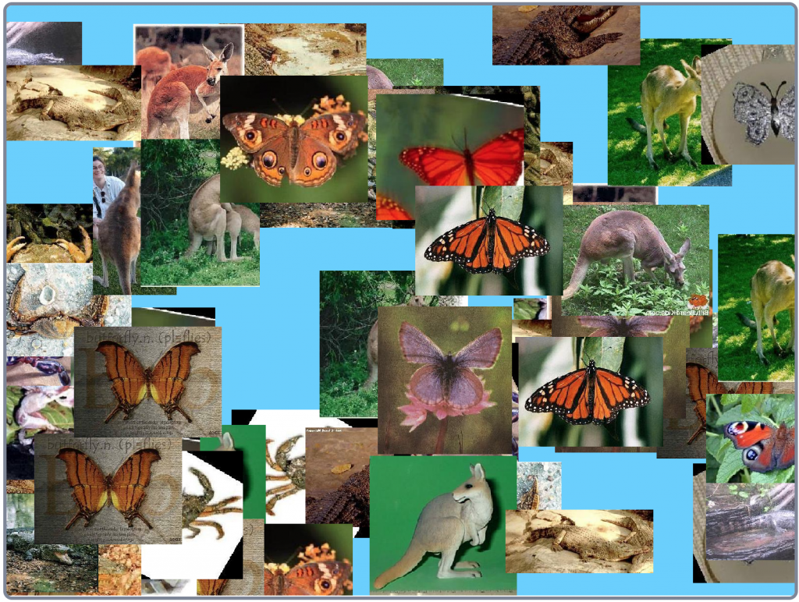
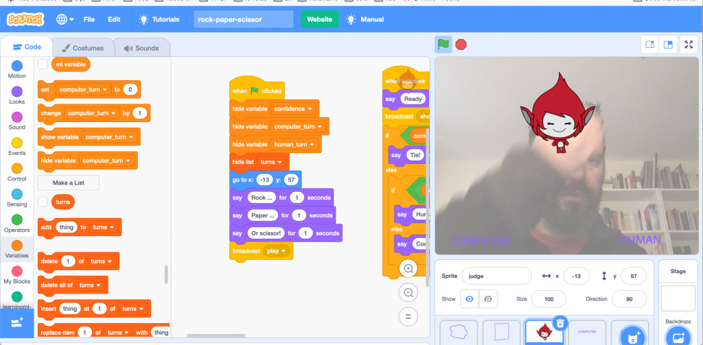

En esta sección te presentamos algunas actividades guiadas que puedes realizar con LearningML para aprender Inteligencia Artificial.

[**Análisis de conducta**](https://web.learningml.org/actividad-analisis-de-conductas/) (fácil)

Un programa que analiza si una expresión esta escrita de buen o mal rollo y reacciona según el caso.

**[Juego de preguntas y respuestas](https://web.learningml.org/juego-de-preguntas-y-respuestas/)** (fácil)

Programa un juego de preguntas y respuestas sobre los periodos de la prehistoria.

**[Asistente virtual](https://web.learningml.org/asistente-virtual)** (intermedio)

Usa el lenguaje natural para ordenarle a Giga, nuestro asistente virtual, que encienda o apague una luz y un ventilador.

[**Filtrado de imágenes**](https://web.learningml.org/actividad-filtro-de-imagenes-inteligente/) (intermedio)

Un programa que filtra los tipos de imágenes que le pidas.

**[El imitador (fácil)](https://web.learningml.org/actividad-imitador/)**

Un programa que imita nuestros gestos.

[**Piedra, papel o tijeras (avanzado)**](https://web.learningml.org/actividad-piedra-papel-o-tijeras/)

Programa el clásico juego "piedra, papel o tijeras" para jugar contra el ordenador.

