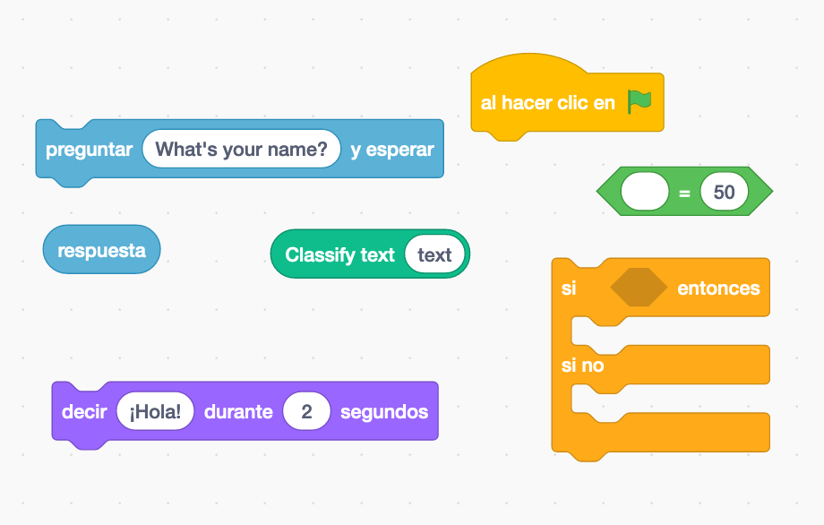
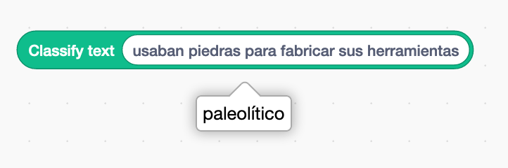

#### Objetivo

En esta actividad vas a construir un juego de preguntas y respuestas.

**La computadora preguntará al jugador por los diferentes periodos de la prehistoria**; paleolítico, neolítico y edad de los metales, y el jugador responderá escribiendo libremente lo que sepa sobre ese periodo. Entonces, la computadora **responderá diciendo si lo que ha dicho es correcto o no** y asignará una puntuación a la respuesta.

#### Creación del modelo para clasificar definiciones de los periodos prehistóricos

El primer paso es **crear un** **modelo** que sea capaz de clasificar las definiciones que escribimos como pertenecientes al _paleolítico_, _neolítico_ o _edad de los metales_. **Puedes imaginarte al _modelo_ como una máquina.** Por un lado, le metemos un texto y entonces la máquina lo analiza sacando por otro lado el tipo de orden a la que pertenece ese texto. El editor de [LearningML](https://learningml.org/editor) es la herramienta que usarás para construir este modelo.

1. **Abre el editor** de [LearningML](https://learningml.org/editor). Para ello, dirige tu navegador (_Chrome_ o _Firefox_) a la dirección **[https://learningml.org/editor](https://learningml.org/editor).**

3. **Daremos las órdenes presentándole textos, pincha en el botón _Reconocer Textos_**, y se abrirá la herramienta con las opciones necesarias para construir un modelo de reconocimiento de texto.

5. **En la sección  “1. Entrenar”, vas a añadir 3 clases** (o etiquetas, que también se llaman así), una para cada periodo prehistórico. El nombre de estas clases (o etiquetas) serán: _paleolítico_, _neolítico_, _edad de los metales_. Para crear una nueva clase pincha en el botón **_Añadir nueva clase de texto_**.

7. **Añade a cada clase varios textos que tengan que ver con lo que la clase representa.** Te damos algunos ejemplos. Puedes consultar en Internet o en tu libro de historia nuevos textos sobre cada periodo prehistórico. Escribe por lo menos 10 textos en cada clase.

**paleolítico**

- En esta etapa los primeros seres humanos cazaban animales y recogían frutos del bosque.

- Podían vivir al aire libre, pero también en cabañas y en cuevas

- utilizaban piedras que golpeaban contra otras piedras

**neolítico**

- crearon poblados donde permanecían y ya no cambiaban de lugar.

- dibujaban pinturas en las paredes de las cuevas.

- el ser humano inventa el tejido y la cerámica

**edad de los metales**

- Primero apareció el cobre

- Después el bronce, que es en realidad una mezcla de cobre y zinc

- El ser humano empieza a utilizar metales, para fabricar herramientas distintas, armas, pero también adornos.

**Para añadir nuevos textos a una clase, pincha en el botón _+_ de esa clase.** Fíjate que cada clase tiene su propio botón **_+_** para añadir sus textos.

5. Muy bien, ya tienes el **conjunto de datos de ejemplo**! Ahora pincha en el botón **_Aprender a reconocer textos_** de la sección “2. Aprender”. Asegúrate de que el desplegable **_Lenguaje de los textos_** esté en **_Español_**, o en el idioma que hayas usado para escribir los textos. 

- **IMPORTANTE**: Una vez que pinches en este botón, tu ordenador estará “aprendiendo” a partir de los textos que has escrito. Este aprendizaje se hace gracias a un algoritmo que denominamos **Algoritmo de Machine Learning**. Esto puede tardar un ratito. Sé paciente. Al final de este paso, el algoritmo de Machine Learning ha creado lo que llamamos un **modelo**. Ese modelo es algo que tú puedes utilizar para que el ordenador reconozca nuevas órdenes parecidas aunque diferentes a las del conjunto de datos de entrenamiento.

6. **Ahora, hay que ver si el modelo que ha construido el algoritmo de Machine Learning funciona bien.** Utiliza la caja de texto de la sección “3. Probar” para escribir textos que tengan que ver con las  características del _paleolítico,_ el _neolítico_ y la _edad de los metales._ Pincha entonces en el botón **_Comprobar_** y observa si lo que dice LearningML coincide con la respuesta correcta. 

8. **Enhorabuena!** Ya tienes un modelo de inteligencia artificial que reconoce 4 órdenes.

Puede ocurrir que en el paso 6, lo que dice LearningML no coincide con el tipo de periodo correcto. Por ejemplo, imagina que has usado como texto “Descubrieron la ganadería y la agricultura” y LearningML dice que ese texto pertenece a la orden _paleolítico_. Obviamente no ha funcionado bien, pues debería ser _neolítico_, que es cuando la humanidad se convirtió en ganadera y agricultora. En ese caso, puedes añadir esa frase a la clase que realmente le corresponda (en este caso _neolítico_) y volver a ejecutar el algoritmo de machine learning, es decir, volver a pinchar en el botón **_Aprender a reconocer textos_**. Así crearás un nuevo **modelo** que habrá aprendido esa nueva frase y será más “potente”, pues es capaz de reconocer correctamente más textos. 

#### Programamos el juego de preguntas y respuestas

Ya tienes la pieza fundamental del asistente virtual, la que es capaz de reconocer a qué tipo de orden pertenece un texto. A esta pieza la hemos llamado **modelo**. Ahora usaremos esa pieza inteligente, es decir el **modelo**, para hacer el juego de preguntas y respuestas.

1. **En la sección “3. Probar”** del editor de LearningML, **pincha en el botón que tiene el gato de Scratch… y se abre Scratch!**

3. Fíjate que **en la primera columna**, donde aparecen los tipos de bloques, hay unos que se llaman **“_learningml-texts_” y “l_earningml-images_”.** Pincha sobre ellos y verás que **contienen varios bloques nuevos.** Estos bloques sirven para usar el modelo que acabas de construir hace un momento. Como has hecho un modelo de reconocimiento de textos, debes usar los bloques de la sección “_learningml-texts_”.

5. **Coloca un bloque “_classify text <texto>_” en la zona de programación de Scratch! y escribe en su entrada algún texto que tenga que ver con una de las órdenes de nuestro asistente.** Por ejemplo: “usaban piedras para hacer sus herramientas”. Entonces pincha encima del bloque y observa lo que ocurre. Al lado del bloque aparece la clase de orden a la que pertenece el texto. Y así es, precisamente, cómo funciona ese bloque: al ejecutarse calcula la clase a la que pertenece el texto que ponemos en su entrada. **Este hecho nos da la clave para construir nuestro juego de preguntas y respuestas**.

7. Y ahora es el momento de programar el juego. Puedes utilizar los siguientes bloques para ello:

<figure>

<figcaption>

Algunos bloques que puedes usar para hacer el juego de preguntas y respuestas sobre la prehistoria

</figcaption>

</figure>

Ten en cuenta que el bloque “classify <texto>” devuelve la clase a la que pertenece el texto, es decir alguna de las siguientes: 

- paleolítico

- neolítico

- edad de los metales

Si no consigues hacer el programa puedes bajarte esta solución y examinarla.

[juego-prehistoria](https://web.learningml.org/wp-content/uploads/2023/04/juego-prehistoria.sb3)[Descarga](https://web.learningml.org/wp-content/uploads/2023/04/juego-prehistoria.sb3)
