[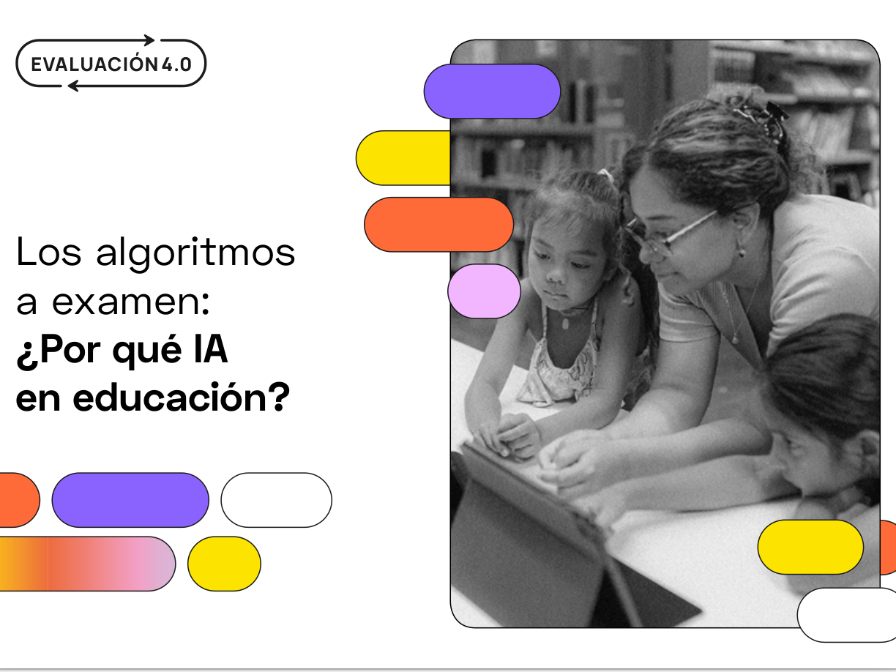](https://fundaciobofill.cat/es/publicaciones/los-algoritmos-a-examen)

**Los algoritmos a examen: ¿Por qué IA en educación?**

[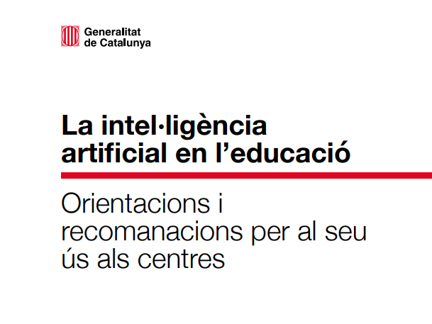](https://projectes.xtec.cat/ia/wp-content/uploads/usu2387/2024/02/La-intelligencia-artificial-en-leducacio-Orientacions-i-recomanacions-per-al-seu-us-als-centres.pdf)

**La intel·ligència artificial en l’educació: Orientacions i recomanacions per al seu ús als centres**

[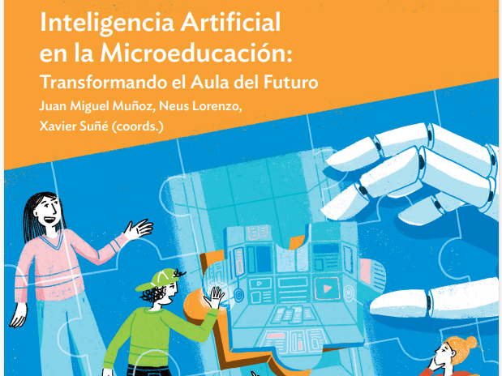](https://ciberespiral.org/es/el-odite-presenta-el-libro-inteligencia-artificial-en-la-microeducacion-transformando-el-aula-del-futuro/)

**Inteligencia Artificial en la Microeducación: Transformando el Aula del Futuro**

* * *

[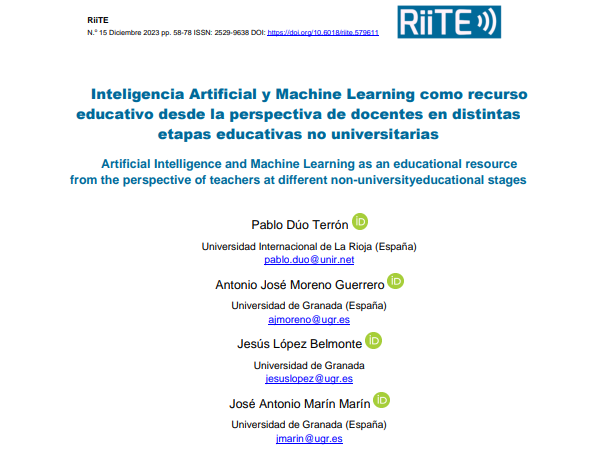](https://revistas.um.es/riite/article/view/579611/350971)

**Inteligencia Artificial y Machine Learning como recurso educativo desde la perspectiva de docentes en distintas etapas educativas no universitarias**

[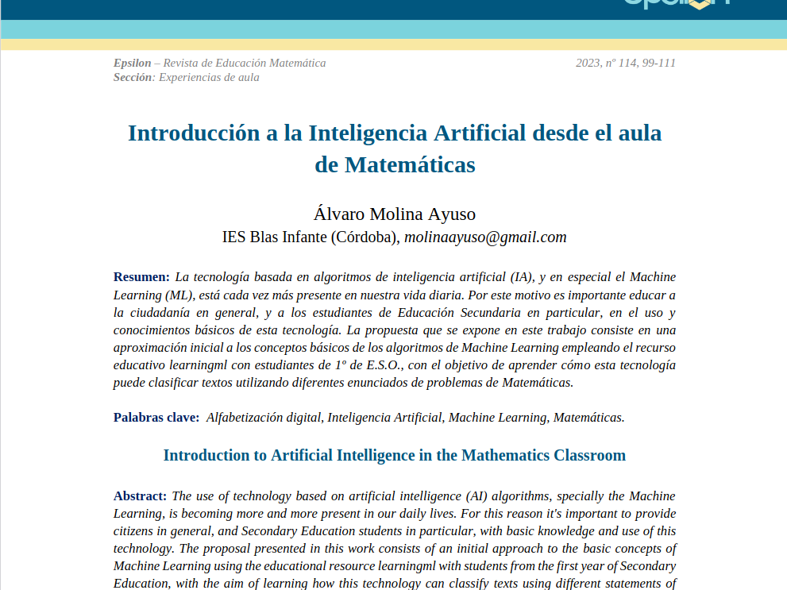](https://www.saemthales.es/epsilon/sites/default/files/2023-09/epsilon114_06.pdf)

**Introducción a la Inteligencia Artificial desde el aula  
de Matemáticas**

[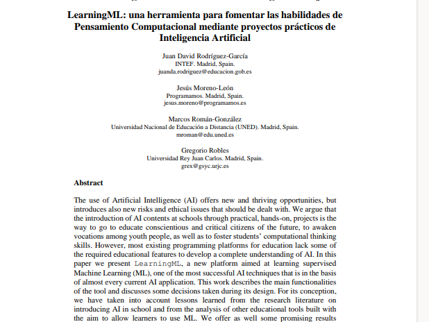](https://revistas.um.es/red/article/view/410121)

**LearningML: A Tool to Foster Computational Thinking  
Skills Through Practical Artificial Intelligence Projects**

* * *

[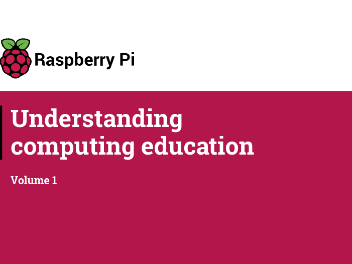](https://www.raspberrypi.org/app/uploads/2021/05/Understanding-computing-education-Volume-1-%E2%80%93-Raspberry-Pi-Foundation-Research-Seminars.pdf)

**Understanding computing education. Volume 1.**

[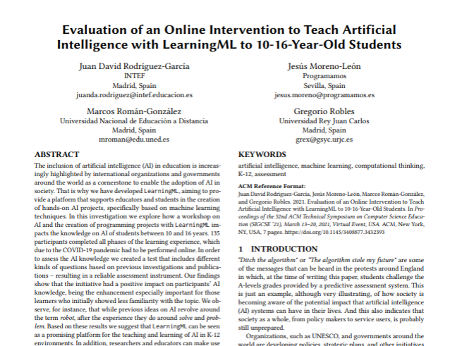](https://www.researchgate.net/profile/Marcos-Roman-Gonzalez/publication/344744220_Evaluation_of_an_Online_Intervention_to_Teach_Artificial_Intelligence_With_LearningML_to_10-16-Year-Old_Students/links/5f8d56e892851c14bcd2afbc/Evaluation-of-an-Online-Intervention-to-Teach-Artificial-Intelligence-With-LearningML-to-10-16-Year-Old-Students.pdf)

**Evaluation of an Online Intervention to Teach Artificial  
Intelligence with LearningML to 10-16-Year-Old Students**

[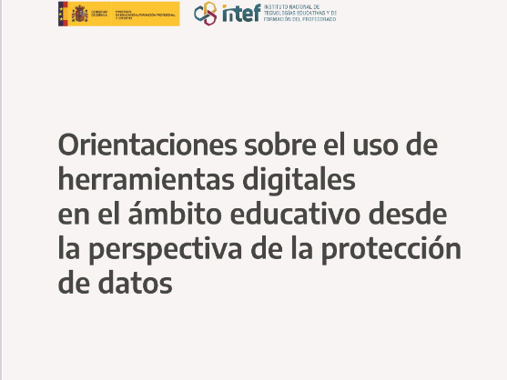](https://intef.es/Noticias/orientaciones-sobre-el-uso-de-herramientas-digitales/)

**Orientaciones sobre el uso de herramientas digitales en el ámbito educativo desde la perspectiva de la protección de datos**

* * *

[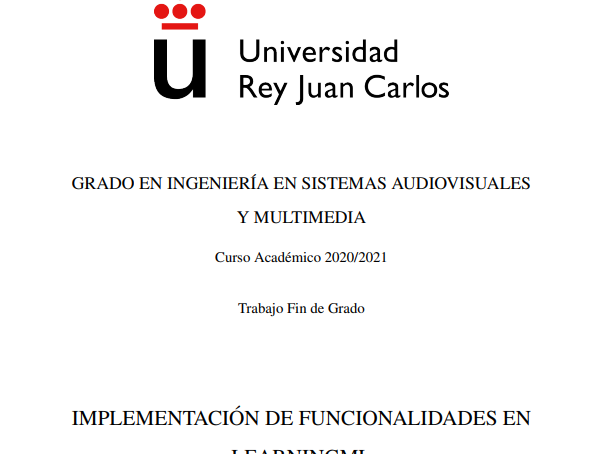](https://web.learningml.org/wp-content/uploads/2024/05/memoria_grado_isaac_merchan-lml.pdf)

**Implementación de funcionalidades en LearningML**

[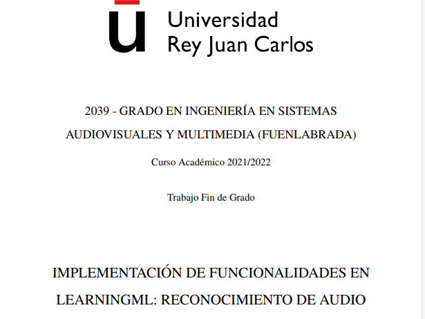](https://web.learningml.org/wp-content/uploads/2023/10/Implementacion-de-funcionalidades-en-LearningML-TFG-Alvaro-del-Hoyo-Arias-2.pdf)

**Implementación de funcionalidades en LearningML: Reconocimientro de audio**

[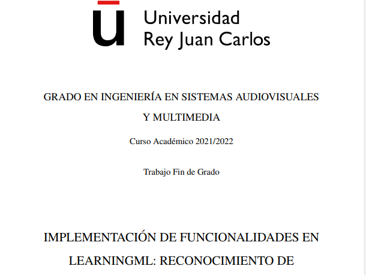](https://web.learningml.org/wp-content/uploads/2023/10/IgnacioRueda-ImplementacionFuncionalidadLearningML-ConjuntoDeDatos-3.pdf)

**Implementación de funcionalidades en LearningML: Reconocimiento de conjuntos numéricos**
