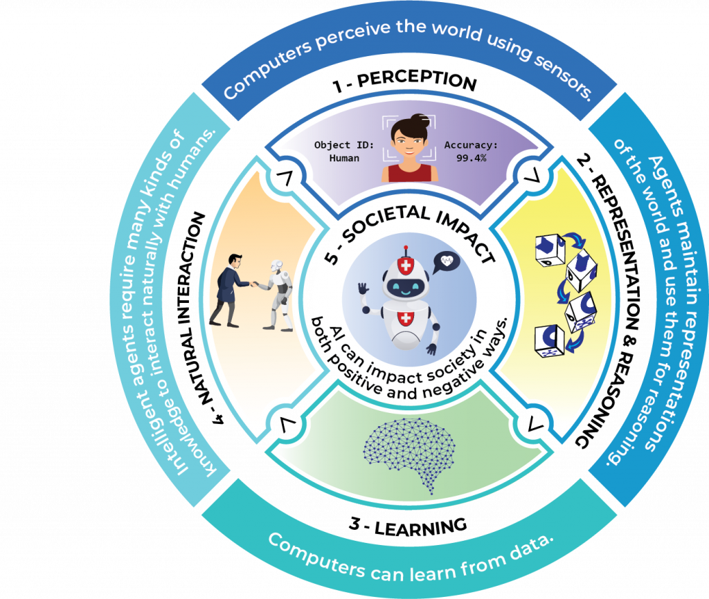

Many of the real **applications of artificial intelligence make use of sensors to perceive data and actuators to perform actions.** That is, to interact with the physical world. Therefore, **from the educational point of view,** it would be very interesting **to be able to use the Machine Learning models that we built with LearningML, in applications that interact** with the real world **through sensors and actuators.** That is, to **join the AI with educational robotics.**

Well, **with LearningML this is already possible!** Recently, **in collaboration with the [EchidnaSteam](https://echidna.es/) team, we have created [EchidnaScratch](https://echidna.es/a-programar/echidnascratch/)**. A programming platform based on Scratch that, in addition to allowing the programming of Echidna boards, allows the use of Machine Learning models created with LearningML.

#### **Incorporating artificial intelligence into educational robotics projects is a reality with the Echidna - LearningML tandem**

**Echidna educational boards** have been designed with the aim of facilitating the programming of programmable systems from which you can control sensors and actuators such as buttons, light sensors or different types of LEDs. That is, they are boards **designed to work educational robotics.** On the [website of the project](https://echidna.es/) you can find all the details about these boards, as well as many activities to perform in the classroom!

This **combination of LearningML with Echidna offers** a set of **practical tools**. **The 5 great ideas proposed by [AI4K12](http://github.com/touretzkyds/ai4k12/wiki) can be worked on globally.** An American initiative whose purpose is to promote the teaching of AI in school.

<figure>

<figcaption>

Five Big Ideas for AI

</figcaption>

</figure>

Taking these 5 big ideas as a frame of reference and using the Echidna boards together with LearningML, what a few years ago could be considered a chimera that was light years away from the classroom, is currently a reality that **can be implemented even in the first grades of primary school.**

Both EchidnaScratch, **LearningML** **and the Echidna boards themselves have been developed with ease of use (low floor) as the main design element.**

Translated with www.DeepL.com/Translator (free version)
