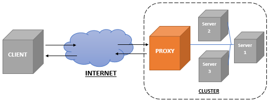

We have already seen in a previous post that the LearningML **platform consists of two applications:**

- the Machine Learning model editor (**_learningml-editor_**) and

- the program editor (**_lml-scratch_**).

In that same post, it was explained how to set up a development environment to be able to work locally in the construction of the applications.

However, there is a small detail to resolve to have a complete development environment: **connect both applications so that the Machine Learning (ML) models that are built in _lml-editor_ can be used in the _lml-scratch_ blocks.**

Indeed, if you try to do the following in your development environment:

- **run both applications** on their respective development servers,

- **build an ML model** with _learningml-editor_ and

- **open the programming** editor by clicking on the kitten button,

You will see that even though _lml-scratch_ opens, the ML templates are not available. **Why does this happen? How can we fix it?** These will be the questions that we will answer in this post.

#### Why is the ML template not available in the Scratch programming editor?

**The strategy that I have used** to be able to use the model built with _learningml-editor_ in _lml-scratch_, is based on **two mechanisms offered by web browsers: The [LocalStorage](https://developer.mozilla.org/en-US/docs/Web/API/Window/localStorage) and the [Broadcast Channel](https://developer.mozilla.org/en-US/docs/Web/API/BroadcastChannel).** The first is used to store data in the browser that can be accessed by applications that run in different tabs. While the second is used to send messages between applications that also run in different browser tabs.

**When a new model is created with the learningml-editor, it places information about the type of model that was created in the LocalStorage,** so that _lml-scratch_ knows which Machine Learning blocks can use it. On the other hand, **when a Machine Learning block is used** **in _lml-scratch_** (for example a block to classify a text) **it sends a message to _lml-editor_ requesting the result.** When _lml-editor_ receives it, it performs the operation (for example classifying the text) and returns it to the block that requested it.

**But it turns out that the LocalStorage and Broadcast Channel mechanisms only work between browser** tabs that have been **loaded from the same domain.** And this is where the problem lies: **the _learningml-editor_ and _lml-scratch_ development servers are raised on different ports,** so that the first application is accessed from _http://localhost: 4200_, and the second from _http:// localhost: 8601_. And these two urls **are considered by the web browser as different domains.** Go shit, right?

#### How can we overcome this problem?

Well, it is clear that the only way to **solve the problem is by serving both applications from the same domain.** How can we do it? We have two possibilities:

- **Create a dropdown of each application** (both applications are static, i.e. they are composed only of HTML code, Javascript and CSSs). **Deploy them on a web server** (apache or nginx, for example) so that both are served from the same domain (for example: _http://mi.dominio/learningml_ and _http://mi.dominio/scratch_)..

- **Place the development servers behind a reverse proxy** accessed from the same domain.

**The first solution** is suitable for a production environment **but it is not operative in a development environment,** since we would have to rebuild the dropdowns and put them in place every time we make a modification to the code and want to check how it works.

So we only have the second :-)

#### Let's see what it consists of in more detail

A reverse proxy is nothing more than a server that makes queries to different servers, according to the url requested by the client (here client means web browser). Then, it returns the response obtained from the server to the client as if it had built it itself. That is to say, the client does not know all this hodgepodge that I just told. **The following diagram helps to understand the operation of a reverse proxy.**

<figure>



<figcaption>

Fuente: https://commons.wikimedia.org/wiki/File:Reverse\_Proxy.png

</figcaption>

</figure>

What is interesting about this “gizmo” is that **requests arriving with the same domain but with different paths can be resolved on servers listening on different ports.** That way, for the client making the original request, all responses come from the same domain. This is what we are trying to achieve so that the web browser (_i.e. the client_) allows us to use the LocalStorage and Broadcast Channel mechanisms.

**There are many solutions to deploy a reverse proxy.** I will tell the one I use for LearningML development, based on [Nginx](http://nginx.com), enough to work on the problems that require connection between _learningml-editor_ and _lml-scratch_ in development.

#### **Install a Nginx server, and configure it** (_nginx.conf_ file)

```
worker_processes  1;
 
events {
    worker_connections  1024;
}
 
 
http {
    include       mime.types;
    default_type  application/octet-stream;
 
    sendfile        on;
 
    keepalive_timeout  65;
 
    server {
        listen       8080;
        server_name  localhost;
 
        proxy_buffering off;
 
        location / {
            proxy_pass http://localhost:4200/;
        }
        location /scratch/ {
            proxy_pass http://localhost:8601/;
        }
    }
 
    include servers/*;
}
```

**Notice that the interesting part is in the server section.** It says that, when the proxy server receives a request _http://localhost:8000/_, it queries the _learningml-editor_ development server (remember that it responds to _http://localhost:4200_), and returns the result to the client. And when it receives a request _http://localhost:8000/scratch_, it queries the _lml-scratch_ development server (remember that it responds to _http://localhost:8601_), and returns the result to the client (i.e. the web browser).

In this way, **the client receives the two applications: _learningml-editor_ and _lml-scratch_ from the same domain,** namely: _localhost:8080_. And therefore, **the LocalStorage and Broadcast Channel mechanisms, necessary for both applications to communicate,** will work.

**And that's it!** This is the solution I came up with to make the LocalStorage and Broadcast Channel mechanisms work in my development environment. **I don't know if there is a simpler one. If any of you can think of it, please, don't hesitate to tell me about it.** It must be taken into account that normally each application works independently, and in this case it is not necessary to use the reverse proxy. Only when we are involved with problems related to the use of the Machine Learning model from lml-scratch, it will be necessary to use it.
