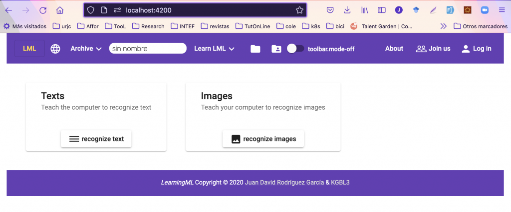
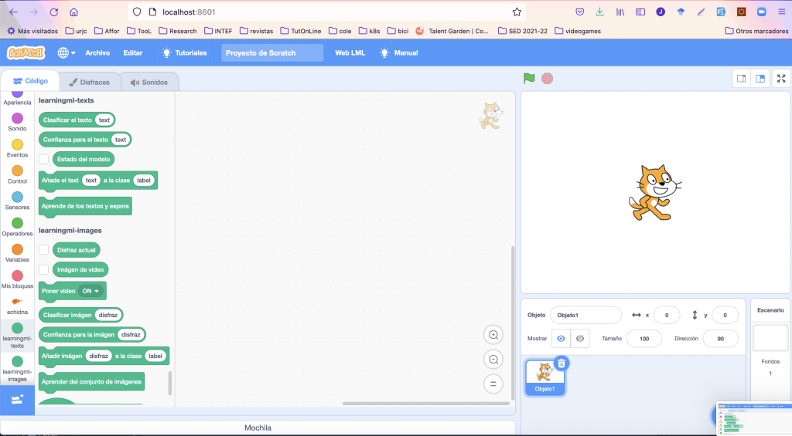

En esta entrada te cuento cómo crear un entorno de desarrollo para LearningML: el primer paso para poder desarrollar nuevas funcionalidades, arreglar errores en el proyecto o simplemente para trastear un poco con el código.

Para comenzar hay que saber que LearningML consta de dos aplicaciones basadas en javascript:

- El editor de modelos de Machine Learning (learningml-editor)

- El editor de programación lml-scratch.

La primera se ha construido con Angular y la segunda con React. Las herramientas que estos frameworks de desarrollo javascript ofrecen para realizar tareas como la generación de código base, la transpilación o la ejecución de un servidor de desarrollo, estan basadas en [node.js](https://nodejs.org). Por tanto, lo primero que necesitamos para montar nuestro entorno es instalar node.js. En los siguientes videos puedes aprender como hacerlo en los distintos sistemas operativos (Windows, MacOS y Linux).

> **Nota**: Como los videos los grabé hace algún tiempo, la versión de node.js habrá cambiado, lo cual no supone ningún problema. Utiliza la versión más actual cuando vayas a instalarlo.
> 
> Estos videos forman parte de un [curso sobre javascript](https://programamos.es/hack/javascript/) que confeccioné para revelar aspectos claves de este lenguaje de programación. Te recomiendo que lo sigas si quieres profundizar en javascript.

#### **Instalación de node.js en MacOS**

https://youtu.be/0M0OTpmgan8?list=PL-D2tjyELlMGDAoL-RZtERvZh4mLGuJgd

#### **Instalación de node.js en Windows 10**

https://youtu.be/7QPjwSusz4c?list=PL-D2tjyELlMGDAoL-RZtERvZh4mLGuJgd

#### **Instalación de node.js en Ubuntu**

https://youtu.be/ev091zfNpO0?list=PL-D2tjyELlMGDAoL-RZtERvZh4mLGuJgd

La siguiente herramienta que necesitamos es [git](https://git-scm.com/), un sistema de control de versiones, ya que el código de LearningML, con toda su historia, está alojado en [gitlab](https://gitlab.com/), un servicio para proyectos de desarrollo que usa git para el control de versiones. Su [instalación](https://git-scm.com/book/en/v2/Getting-Started-Installing-Git) es muy sencilla en cualquiera de los sistemas operativos (Windows, MacOs o Linux).

> Otros servicios similares a gitlab son [github](https://github.com/) (posiblemente el más conocido) y [bitbucket](https://bitbucket.org/).
> 
> Si quieres aprender a usar git, no dudes en leer libro gratuito [pro-git](https://git-scm.com/book/en/v2). Es, en mi opinión, uno de los mejores recursos para aprender git.

## Editor de texto

Y por último necesitarás un editor de texto para visualizar y modificar el código. Te puede valer Notepad (en windows), TextEdit (en MacOs) o nano (en Linux), pero yo te recomiendo algo más potente y enfocado a la manipulación de código. Concretamente mi elección es Microsoft Visual Studio Code. El siguiente video hace un repaso a las principales funciones de este mágnifico editor (que es también gratis y libre).

https://youtu.be/fFDtT0JYTjY?list=PL-D2tjyELlMFrkdZqMhvqh0r7dCUz80qM

¿Ya tienes instalado node.js, git y Microsoft Visual Studio Code (u otro editor que te guste más)?

#### Llegó el momento de obtener el código y echarlo a andar!

> **Nota**: Bueno, en realidad falta algo que, aunque no es absolutamente imprescindible, si que ayuda muchísimo en las tareas de desarrollo: una interfaz de linea de comando (CLI - Command Line Interface), también conocida como terminal de comandos. Se trata de una aplicación desprovista de elementos gráficos interactivos, como botones, menús, deslizadores, que proporcionan los sistemas operativos y mediante la que se ejecutan aplicaciones cuyo control se hace exclusivamente con el teclado. Como digo, no es absolutamente imprescindible pues casi todos los comandos que se lanzan desde ella pueden lanzarse también desde el editor de código u otras aplicaciones con interfaz gráfica. De todas formas, para mí al menos, es mucho más cómoda que sus alternativas gráficas. En el siguiente video te cuento algo más sobre ella.

https://youtu.be/iYE\_XcTAGFg?list=PL-D2tjyELlMFrkdZqMhvqh0r7dCUz80qM

#### Despliegue del editor de modelos de Machine Learning (learningml-editor)

Con todo el arsenal de herramientas para el desarrollo que acabamos de ver, comenzamos por traernos el código de _learningml-editor_ desde gitlab (remoto) a nuestra computadora (local). A esta operación se le denomina clonado, y desde una interfaz de comandos se hace así:

```bash
# git clone https://gitlab.com/learningml/learningml-editor
```

Una vez finalizada la ejecución del comando anterior, tendrás una nueva carpeta de nombre _learningml-editor_, en cuyo interior se encuentra el código fuente de la aplicación. Ahora puedes abrirla dentro del editor de texto y "bichear" por el interior del código.

Sin embargo, ese código aún no puede ejecutarse. Faltan las dependencias (o librerías de terceros), es decir, código que no ha escrito necesariamente el desarrollador, pero que ha usado para construir la aplicación. En el fichero _package.json_ se encuentran declaradas todas las dependencias que requiere este proyecto. Para instalarlas basta con lanzar desde la terminal el siguiente comando desde dentro del directorio _learningml-editor_:

```bash
# npm install
```

Cuando finaliza su ejecución verás que se ha creado un directorio denominado _node\_modules_, en cuyo interior se encuentran todas las librerías de terceros utilizadas para el desarrollo de la aplicación, por ejemplo las del framework _Angular_. Y ahora sí que se puede ejecutar la aplicación ejecutando el servidor de desarrollo de _Angular_:

```bash
./node_modules/@angular/cli/bin/ng serve
```

Este comando compila el código, construye la aplicación y la sirve en un servidor web de desarrollo que escucha en el puerto 4200. Así que para acceder a la aplicación, debes abrir un navegador web y apuntar a la dirección _http://localhost:4200_.



A partir de este momento, cuando realices un cambio en el código fuente, la aplicación se recompilará automáticamente y se recargará en el navegador. De esta forma verás el efecto que ha tenido el cambio que has hecho. Y listo, ya tienes un entorno de desarrollo para la aplicación _learningml-editor_.

#### Despliegue del editor de programación (lml-scratch)

Para montar nuesto entorno de desarrollo del editor de programación (_lml-scratch_), seguiremos la misma idea: 1) instalamos las dependencias, 2) construimos la aplicación y la ejecutamos en un servidor de desarrollo.

Pero, en este caso, hay algo más que contar. Resulta que _lml-scratch_ es una modificación del archiconocido proyecto _[Scratch](https://scratch.mit.edu/)_. Es decir, que he partido del código original de Scratch y le he añadido el código necesario para que se comunique con el editor de modelos de ML y para incorporar nuevos bloques. Eso por un lado.

Y por otro lado, el [código del proyecto original de Scratch](https://github.com/LLK/), alojado en github, está dividido en varios repositorios. Uno de estos repositorios, [scratch-gui](https://github.com/LLK/scratch-gui), es el que actúa como aplicación principal, y el resto se instalan como dependencias de dicha aplicación. De todos los proyectos que componen la aplicación Scratch, tuve que hacer modificaciones en tres de ellos: [scratch-gui](https://github.com/LLK/scratch-gui), [scratch-vm](https://github.com/LLK/scratch-vm) y [scratch-l10n](https://github.com/LLK/scratch-l10n). Por tanto, el objetivo es instalar la aplicación principal ([scratch-gui](https://github.com/LLK/scratch-gui)) y aviarselas para que las dependencias [scratch-vm](https://github.com/LLK/scratch-vm) y [scratch-l10n](https://github.com/LLK/scratch-l10n) se obtengan del código fuente de los repositorios de _learningml_ en lugar de los repositorios oficiales de dependencias de _node.js_. Veamos cómo.

Primero hacemos un clonado de los tres proyectos:

```bash
# git clone https://gitlab.com/learningml/lml-scratch-gui
# git clone https://gitlab.com/learningml/lml-scratch-vm
# git clone https://gitlab.com/learningml/lml-scratch-l10n
```

> Nota: Observa que estos repositorios son los del código modificado, no los originales.

Ahora entramos en el directorio lml-scratch-l10n e instalamos las dependencias

```
# cd lml-scratch-l10n
# npm install
```

Y ahora viene el truco: le decimos al gestor de paquetes de _node.js_ (_npm_) que queremos tener nuestra propia copia local de la dependencia _scratch-l10n_:

```
# npm link
```

Lo mismo hacemos con _lml-scratch-vm_:

```
# cd ..
# cd lml-scratch-l10n
# npm install
# npm link
```

Y lo mismo con _lml-scratch-gui_:

```
# cd ..
# cd lml-scratch-gui
# npm install
```

Pero ahora lo que hemos de indicarle a _npm_ es que deseamos usar nuestra copia local de las dependencias _scratch-vm_ y _scratch-l10n_:

```
# npm link scratch-vm
# npm link scratch-l10n
```

#### Et voilà!

Ahora el proyecto _lml-scratch-gui_, usa como dependencias para _scratch-vm_ y _scratch-l10n_ nuestras versiones locales. Así, al hacer cambios en cualquiera de los proyectos l_ml-scratch-vm_ o _lml-scratch-l10n_, se verán reflejados en la aplicación.

> **Nota**: a lo largo de esta aplicación hay una sutileza que merece algo de reflexión para entenderla. Se trata de los nombre scratch-\[loquesea\] y lml-scratch-\[loquesea\]. El primero se usa como nombre de la dependencia (lo que pone en el archivo package.json), mientras que el segundo se usa como nombre del repositorio de código. Aunque el nombre del repositorio (y de la carpeta local) sean lml-scratch-\[loquesea\], el nombre de la dependencia sigue siendo el original (scratch-\[loquesea\].

Y ya podemos ejecutar nuestra versión de Scratch con bloques de LearningML:

```
# npm start
```

Al cabo de un ratito, cuando la aplicación se haya construido y el servidor de desarrollo de Scracth se haya levantado, podrémos acceder con nuestro navegador web apuntándolo a [http://localhost:8601](http://localhost:8601).

<figure>



<figcaption>

La copia local de lml-scratch ejecutándose en el navegador web que apunta al puerto 8601 de la máquina local (localhost)

</figcaption>

</figure>
