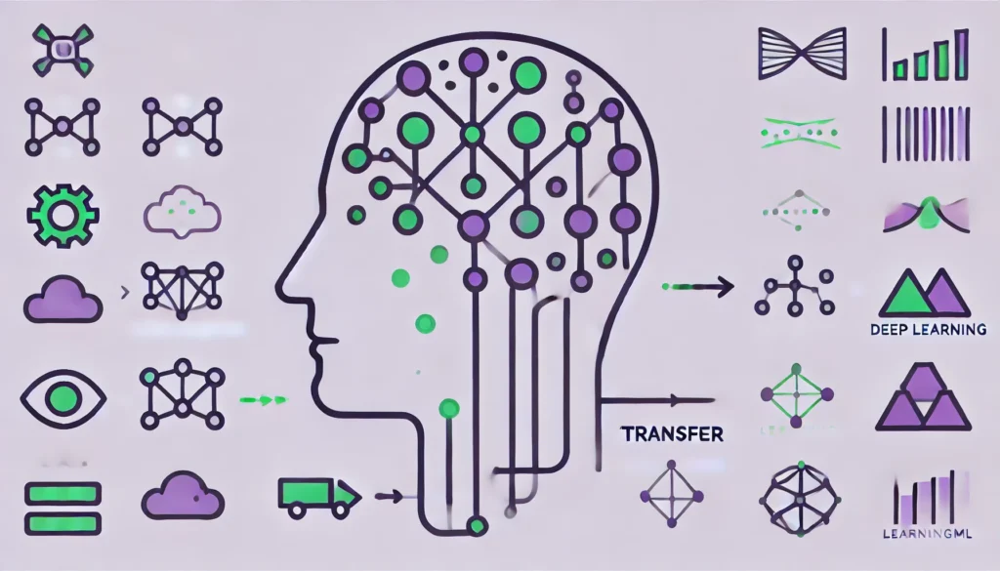

Mientras trabajaba en el **reconocimiento de imágenes de LearningML descubrí la “transferencia de aprendizaje” _(transfer learning)_,** una de las técnicas que me han parecido más útiles y potentes del Machine Learning.

#### Empieza la investigación y aparecen los baches

Lo primero que probé fue reducir el tamaño de las imágenes, transformarla en escala de grises y representarlas como vectores de dimensión ancho x alto. Esos vectores los presentaba a una red neuronal que tenía como entrada una capa de la misma dimensión que los vectores, varias capas ocultas y una capa de salida con un número de neuronas igual al de clases a reconocer. ¡El resultado fue desastroso! La clasificación era pobre y la mayor parte de las veces errónea. Fue uno de los muchos **momentos de frustración** que he tenido durante el desarrollo de LearningML.

#### ¿Redes neuronales convolucionales?!?!?!

**Seguí investigando y aprendí** que para tratar con imágenes **la arquitectura _Feed Foward_ no era la más adecuada.** Las redes que más éxito estaban teniendo en el manejo de imágenes eran las llamadas **convolucionales**. Pero incluso con este tipo de redes la clasificación, aunque mejoraba, seguía siendo muy pobre. La razón estaba clara, **los conjuntos de datos de entrenamiento no eran lo suficientemente extensos como para entrenar con éxito a ningún tipo de red neuronal.**

Parecía que mi problema no tenía solución. Los conjuntos de datos que los estudiantes podrían confeccionar cuando usaran **LearningML** no pasarían de tener unas decenas de imágenes.  
Sin embargo, sabía que **_The Teachable Machine_** era capaz de realizar clasificaciones muy precisas incluso con pocas imágenes.

##### ¿Cómo lo hacía?

**Investigando!!!**

Y por fin la solución llegó: se llamaba _“**Transfer Learning”**_ **o Tranferencia de Aprendizaje.** ¿Y en qué consiste? En reutilizar un modelo pre-entrenado en una tarea específica para aplicarlo a una nueva tarea, ahorrando tiempo y recursos. En el caso de la clasificación de imágenes, utilicé **MobileNet,** **un modelo open source pre-entrenado en una gran cantidad de categorías, como base para reconocer nuevos objetos con pocos datos.**  

#### Clasificar imágenes con MobileNet:

- **Cargar el modelo pre-entrenado.** Se usa MobileNet sin su capa de salida final, manteniendo solo las capas que extraen características. La penúltima capa tiene 1024 neuronas y se puede usar como representación de la imagen que se presenta como entrada. Esto es, usamos MobileNet sin su última capa como codificador de imágenes. Lo relevante es que, la codificación de dos imágenes parecidas da lugar a vectores cercanos, mientras que, si las imágenes difieren mucho, la distancia entre sus vectores codificados aumenta.

- **Usar un clasificador sencillo, como una red neuronal feed forward o un KNN.** Este modelo, que es el que entrenaremos, lo tendrá muy fácil, pues el codificador basado en MobileNet ya se ha encargado de colocar las imágenes de cada clase en lugares separados del espacio.Con el Transfer Learning aprovechamos el esfuerzo que previamente se ha invertido en entrenar MobileNet con aproximadamente 1.200.000 imágenes organizadas en unas 1000 clases. El modelo ya ha aprendido características como bordes y texturas y las adaptamos a la nueva tarea de clasificación, obteniendo buenos resultados con menos datos y entrenamiento.

> Y así es como resolví el **reconocimiento de imágenes en LearningML** y por eso este tipo de modelos funciona tan bien, porque **vamos montados a hombros de gigantes.**
