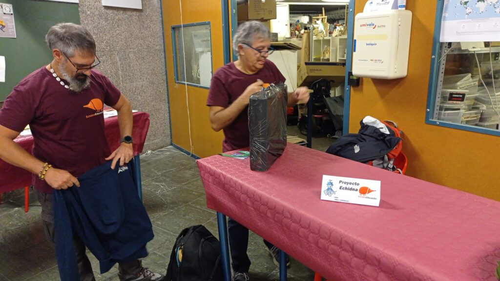

**In collaboration with the** [**Echidna Educación**](https://echidna.es/)**team** , last weekend we participated in [**OSHWDEM'24**](https://oshwdem.org/)**, the open technologies fair in A Coruña.** We had the opportunity to show in a _stand_ the **educational boards and the** _**software**_ we have developed to program them, which we have called [**EchidnaML**](https://echidna.es/a-programar/echidnaml/)**.**

#### But what is EchidnaML?

We participated in a talk where we presented the _software_ with which **you can:**

- make programs with Scratch,

- program the Echidna boards from Scratch

- and build Artificial Intelligence models that can be integrated into the programs with [LearningML](https://learningml.org).

In other words, **a comprehensive** _**hardware**_ **and** _**software**_ **combination** with which you can work on all **aspects of programming, robotics, Artificial Intelligence and Computational Thinking.** The experience was splendid and the interested and curious who came to the _booth_ were very satisfied and even surprised.

#### [**OSHWDEM**](https://oshwdem.org/) is the fair that every maker should know.

It was held in the colossal [Domus Museum](https://www.coruna.gal/mc2/es/domus), and was organized in several parts:

- **exhibitions**,

- **workshops**,

- **talks**,

- **robot competitions** (siguelineas, mazes, fighters)

- and the screwy and wacky artifacts of the **Hebocon** competition.

All the necessary ingredients for the enjoyment of_makers_: technology construction fanatics, those who enjoy the process more than the end and, in general, curious spirits. **An ideal place to make new friends with the excuse of the gadgets we design and to enrich ourselves with new and good ideas** that, maybe, with hard work, enthusiasm and tenacity, end up becoming useful products.

We were lucky to have a sunny and friendly day, enough to enjoy the free time that the fair left us. And, of course, to savor to the point of gluttony the tasty culinary delights that the city offered us, highlighting the octopus a feira, the mere memory of which still stimulates my salivary glands.

In short, **a technology fair to build, not to consume; to learn, not to entertain; to humanize, not to alienate.** We need many more technology fairs like these to amend the nefarious use that societies are making of technology itself. The enemy is not defeated by avoiding it, it is defeated by knowing it.
