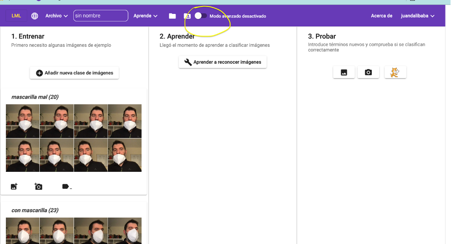
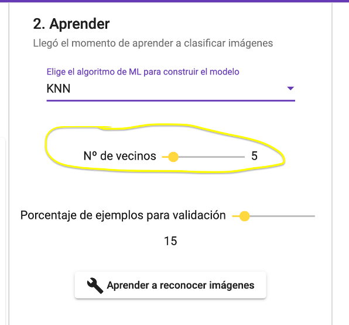
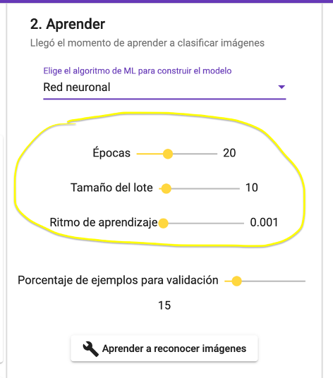
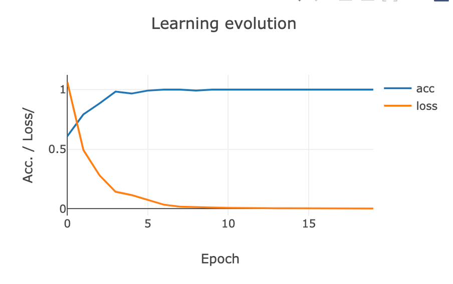
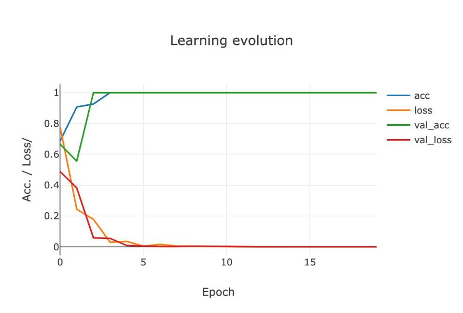

**The advanced mode of LearningML has been designed with the purpose of better understanding how ML algorithms work.** Indeed, in the normal mode, the learning process is a black box, we only see the friendly Charlot adjusting gears of a machine (as a metaphor of what the algorithm is actually doing). At the end of the process, the model has been elaborated and is ready to be used in a Scratch program. Beyond what Charlot's animation evokes in our imagination, we know nothing about the ML algorithm itself.

It would be nice to give a twist to incorporate more knowledge about how ML techniques work into the hands-on activities with LearningML. Surely, **the most important thing after understanding the 3 phases of supervised ML (training, learning and evaluation),** is to know that there **is no single ML algorithm to solve classification or recognition problems.** In fact, there are a lot of them! Also, **it is important to know some technique that gives us how good the obtained model is. And this is precisely what LearningML's advanced mode facilitates.**

To **activate the advanced mode** of LearningML, **just click on the switch-type button in the main menu.**

And, **new controls appear** in the “Learn” section.

#### Selection of the ML algorithm

**We have a selector** of the ML algorithm we want to use in the learning phase. In the current version we can choose between two: KNN and Neural Network (I will explain the basics of these two algorithms in future posts).

**Each type of algorithm can be configured with some parameters,** which are characteristic of the algorithm itself. In the case of KNN, the parameter is K is the number of nearest neighbors that will be used to determine the membership of a new data to one or another class.

In _Neural Network_, the parameters are: epochs, batch size and learning rate (the meaning of these parameters will be explained in a future post).

Therefore, **in the advanced mode you can try to generate the models by controlling both the ML algorithm and its most relevant parameters.** In that way, you will be able to gain some intuition about how ML algorithms work.

#### Confusion matrix

**But there is more!** If we define a value greater than zero for the parameter “_Percentage of examples for validation_”, when the model is generated by clicking on “_Learn to recognize texts|images|numbers_”, a graph called “_Confusion matrix_” will appear. It gives us a measure of the quality and accuracy of the model built.

How this matrix is constructed will be explained in a future post. For the moment, **the more numbers that appear on its diagonal and the closer to zero the numbers that do not belong to the diagonal, the better the model is.**

#### Learning evolution curve

Another of the graphs offered by the advanced mode of LearningML is **the evolution curve of the learning process.** This curve is only generated when the algorithm used is “Neural Network”. When the “percentage of examples for validation” is zero, the curve looks like this:

**The blue curve represents the evolution of the accuracy** of the model as it is generated. That is, in each of the training epochs. **The orange curve represents the evolution of the loss function.** The closer the accuracy is to 1 and the closer the loss function is to zero, the better the quality of the model.

If we have defined a value greater than zero for the parameter “percentage of examples for validation” before generating the model, two more curves will appear on this graph. They correspond to the evolution of the accuracy and loss function for the data reserved for model evaluation. **These two curves are even more relevant to determine the quality of the model than the previous ones.**

#### Model decision boundaries

**The last graph offered by the advanced mode of LearningML is the so-called “_decision boundary_”.** This graph is only generated when the model is a numerical set recognition model and, in addition, the example data are two-dimensional, i.e. the number of columns is 2.

**This plot is the best graphical representation of the model that can be provided.** The problem is that it can only be done when the numerical sets consist of two numbers, since in that case the data can be represented in a plane using the coordinate axes.

Two things are shown in this plot: the example data (all, those that have been used to generate the model and those that have been reserved for validation). And the areas of the plane that the model assigns to each class, filling each of them with a different color. That way we have a direct and immediate visualization of the model performance. And we see which points of the example set are correctly classified by the model and which are not.

**And that's all that the advanced mode of LearningML has to offer for the time being.** When you have outgrown the typical activities and have a good understanding of the 3 phases of Machine Learning, it is time to go further and study the basics of the most popular algorithms. Then, the advanced mode of LearningML will help you to understand them better from practice.

In this post, the terms “neural network”, “KNN algorithm”, “confusion matrix” and “learning evolution” have appeared but have not been explained in detail, as the intention of this post is to introduce the advanced mode of LearningML.

**Don't worry if there are things you haven't fully understood, in future posts I will explain them.**

**See you next time!**

Translated with DeepL.com (free version)
