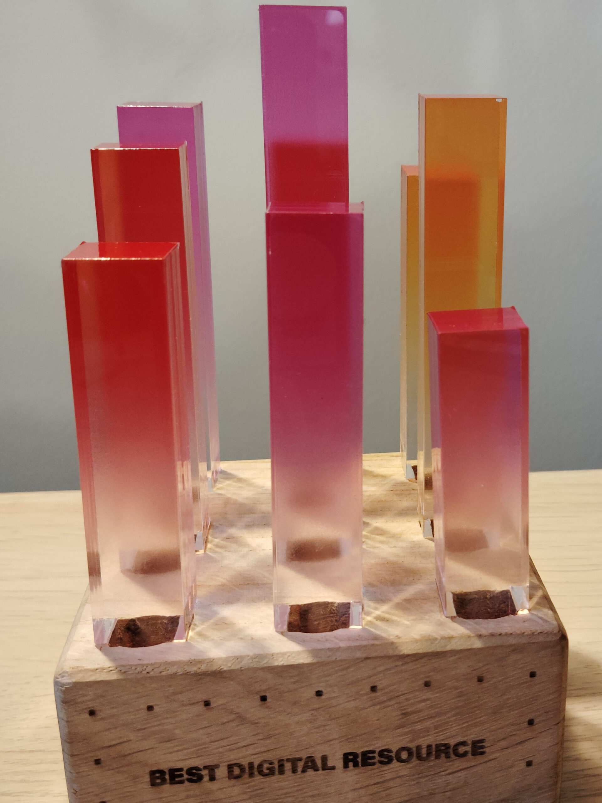
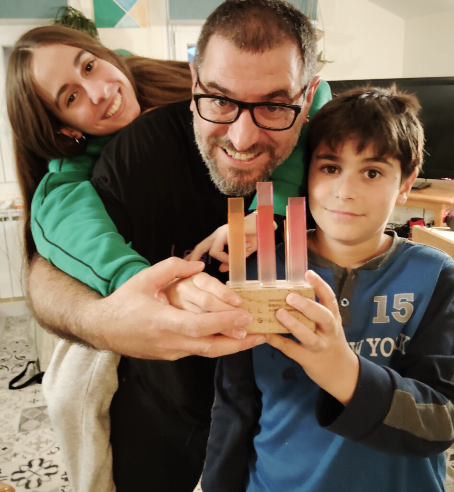

On October 16, 2024 LearningML was recognized as the “**best educational resource of 2024″** by the organization [All Digital](https://all-digital.org/).

The award ceremony took place in the Madrid space known as [La Nave](https://www.lanavemadrid.com/), and during the event the following awards were presented:

- Best digital educator

- Best digital changemaker

- **Best digital resource**

- ALL DIGITAL Weeks best event

- ALL DIGITAL Weeks best campaign

- Best use of GenAI in Education

**This award recognizes the work** we have been doing since 2019. Not only me as the developer of LearningML, but **all the** [**people and institutions**](https://web.learningml.org/agradecimientos/) that have collaborated in one way or another with the project.

#### This is a perfect moment to say **THANK YOU once again!**

I want to make a special mention to [Hector Martinez](https://www.linkedin.com/in/hmtez/) who, being in the[**Bofill Foundation**](https://fundaciobofill.cat/) as Project Manager, proposed LearningML as a candidate resource for the_**Best digital resource of 2024**_ **of All Digital.** And of course, I have to **give special thanks to the many teachers and students** who use LearningML to learn AI. Every day there are more and more of them and they are the ones who really give meaning to all the work done.

Last but not least, I would like to thank Paula, Jara and Ciro, my family, who every day put up with the frequent moments of physical or mental absence that the development of this project requires from me.

I am really excited about this award. I will not hide the fact that I had been thinking for some time that the project, for all its trajectory, deserved some recognition, and now it has it!

This is an injection of motivation that comes at a perfect time; when we have just launched [**version 2 of LearningML**](https://v2.learningml.org)and the_**LearningML**_ **Association** _**for the Development and Promotion of AI in Education**_ is already legally constituted. So, we keep pedaling hard to help teachers, students and citizens in general to learn the basics of AI in a simple and effective way.

_Translated with [DeepL.com](https://www.deepl.com/?utm_campaign=product&utm_source=web_translator&utm_medium=web&utm_content=copy_free_translation) (free version)_
