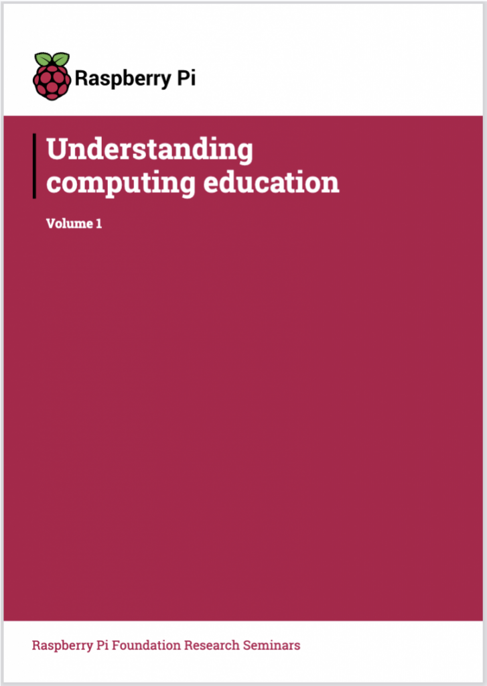
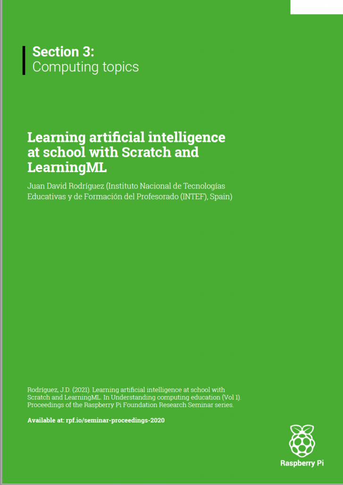

Some time ago I participated in the **first edition of the biweekly seminars of the [Raspberry Pi Foundation](https://www.raspberrypi.org/)** that aim to address current topics on **Computing Education.** With all the talks given, the organizers put together a compilation of all the papers in the form of an [**online book**](https://www.raspberrypi.org/app/uploads/2021/05/Understanding-computing-education-Volume-1-%E2%80%93-Raspberry-Pi-Foundation-Research-Seminars.pdf) that has just been published.  
  
I am very happy and proud to have contributed to this great initiative with the **article “Learning artificial intelligence at school with Scratch and LearningML”.**  
  
**Thanks to all of you who made it possible!**  
  
Translated with DeepL.com (free version)

 
