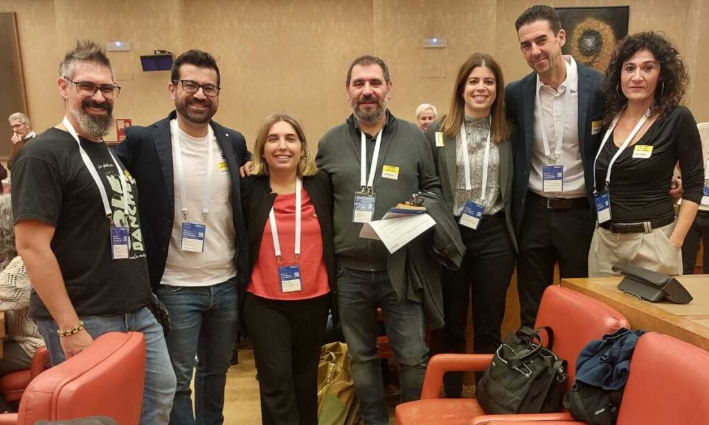
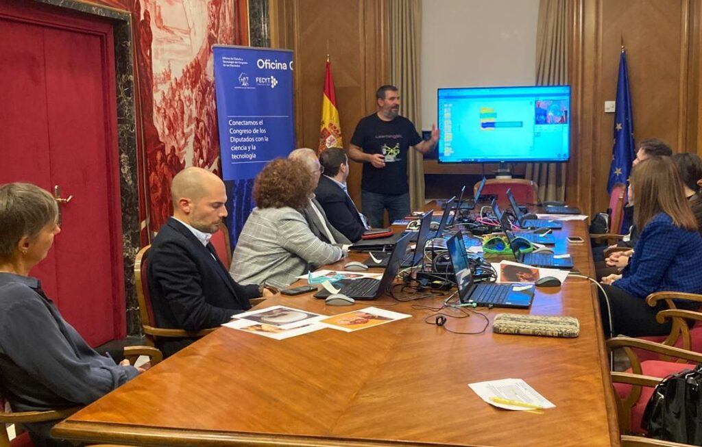

On 11 November in the **‘Sala Constitucional’ of the Congress of Deputies, the four** [**reports**](https://www.oficinac.es/es/informes-c/inteligencia-artificial-y-educacion) **that the Office of Science and Technology of the Congress of Deputies (Office C),** has prepared this year on four scientific topics of interest for current politics, **were presented** :

- Artificial intelligence and education,

- Active suicide prevention,

- Critical materials and raw materials in the energy transition, and

- Sustainable coastal zone management.

All of them were followed by a **round table** in which some of the experts consulted for the reports participated as speakers. The event **was attended by MPs, experts, journalists, staff from Office C, FECYT and Congress.** The speakers used all the skills acquired in their work to offer an enlightening and entertaining debate on each of the topics.

<figure>

<figure>

<figcaption>

Artificial Intelligence and Education Round Table

</figcaption>

</figure>

</figure>

<figure>

<figure>

<figcaption>

Jorge Lobo, César Poyatos, Azucena Vázquez, Juan David Rodríguez, Mª del Mar Sánchez, Jorge Calvo, Nuria Vallés Peris

</figcaption>

</figure>

</figure>

#### The experience did not end there

The next day, **dialogue sessions were held on each of the reports.** The ‘Artificial Intelligence and Education’ session was attended by:

- 6 MEPs,

- 5 collaborating experts

- and the coordinators of the report.

**In this working session, deputies and experts, in close dialogue, made proposals, resolved doubts and raised some concerns about AI and education.**

As a finale, the girls from office C had prepared a surprise for which they counted on me: **a short workshop to show the MEPs the constructionist proposal that we have been working on for several years in LearningML.** The workshop served to **illustrate a part of the report that dealt with AI literacy.** The experience, in such an institutional context as the Congress of Deputies, was fun and unexpected and gave a certain freshness to the event that, judging by the faces and comments of the participants, was very well received!

<figure>

<figure>

<figcaption>

AI literacy workshop

</figcaption>

</figure>

</figure>

<figure>

<figure>

<figcaption>

Andreu Martín, Roberto García, Mª del Mar Sánchez, Juan David Rodríguez, Sofía Otero, Caridad Rives

</figcaption>

</figure>

</figure>

I would like to **thank Sofía Otero,** technician of scientific and technological evidence and leader of the report, **for** her interest in LearningML. I would like to highlight her high capacities to lead, coordinate and distil information. And, especially, the fearlessness she has shown in proposing this **workshop with a playful-pedagogical approach in which participants, in order to build an AI model.**

**And, thanks to Socialist MP Caridad Rives Arcayna for offering to show us around the Chamber and the surrounding rooms of the main Congress building.**

**It was an unexpected and exciting ‘party finale’**!

_Translated with [DeepL.com](https://www.deepl.com/?utm_campaign=product&utm_source=web_translator&utm_medium=web&utm_content=copy_free_translation) (free version)_
