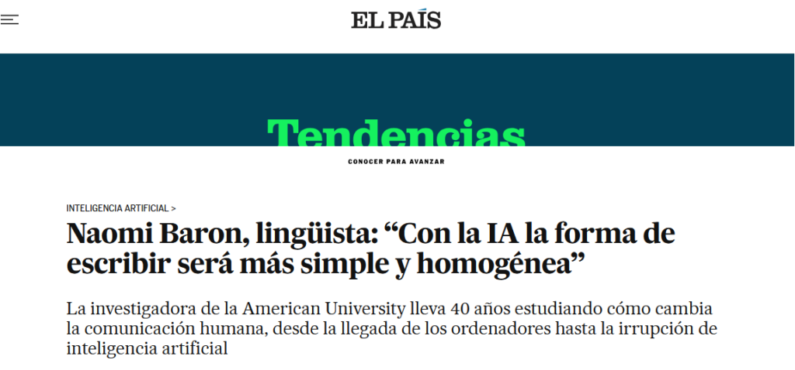

I don't know to what extent current science knows the mechanisms that happen in the human brain when we learn. But I believe that **the practice of a cognitive skill,** let's say writing, **provokes ‘something’ in our grey mass that leads decisively to its learning.** And, although some learn more easily than others, not even the greatest genius of humanity is born knowing.

> As an illustrious personage (possibly Thomas A. Edison) once said:
> 
> ‘The result is one percent inspiration and ninety-nine percent perspiration’.

> Or as another famous artist (possibly Picasso) said:
> 
> ‘Inspiration exists, but it's better if it catches you working’.

#### Focusing on writing

What happens when, in order to write, we make intensive use of generative AI, and what happens when, in addition, we have not yet developed this skill sufficiently (as happens at school age)? **Applying** that logical maxim called **syllogism**, we have no choice but to conclude that **the ability to write will not develop.** Or at least not enough.

##### The brilliance of generative AI may become the shadow of humankind

**When we write we order our ideas**, it doesn't matter so much if we do it with better or worse style, it is enough that the message is understood. **The intense and conscious process** we go through to write that message **is what develops the ability to write.** And even more: to think!

##### The voice of Naomi Baron

I am convinced that these thoughts, which I more or less correctly surmise, are shared by many people. And although they are opinions and not proven facts, **Naomi Baron's voice resonates** with this idea, which, moreover, seems self-evident.

In the interview published by ‘El País’, this illustrious linguist **warns us that digital technologies have not had a particularly positive impact on the development of writing and that Generative AI**, the latest technological bombshell, **may lead to an impoverishment of writing**, which is becoming increasingly **homogeneous, flat and anodyne.**

#### What is an LLM?

Large language model (LLM), the AI model that generates texts, is at the heart of, for example, ChatGPT.

And, having access to a good LLM, who can resist using it to develop their ideas, write their essay, solve their homework, write their report, answer their emails, generate the next blog article, write their TFM, etc., etc., etc., etc.?

##### Human beings, by nature, are lazy.

The obligations imposed by a hurried western society, driven even more crazy by digital immediacy, mercilessly gobble up our time. In this context, who can resist delegating their writing to AI? **Are we witnessing the beginning of a cultural collapse?**

**It is ironic that the moment of greatest technological splendour can result in the worst cultural level. In education, we need to encourage tasks that develop students' creativity and thinking!** And prioritise this work in the classroom, the only place where there is adequate control of the student to avoid the use of technologies, which, if misused, limit learning. **We must look for tools that require the student's intervention to build, and avoid those that give everything ready-made.** For this reason, applications such as **LearningML and Scratch** can be of great value in leading this much-needed educational transformation. Would you like to try them out?
