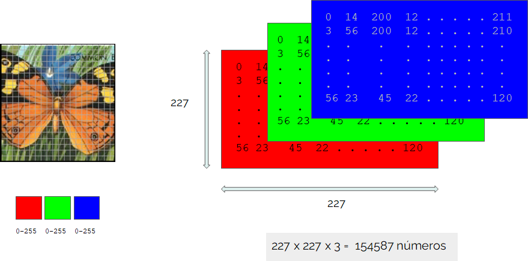
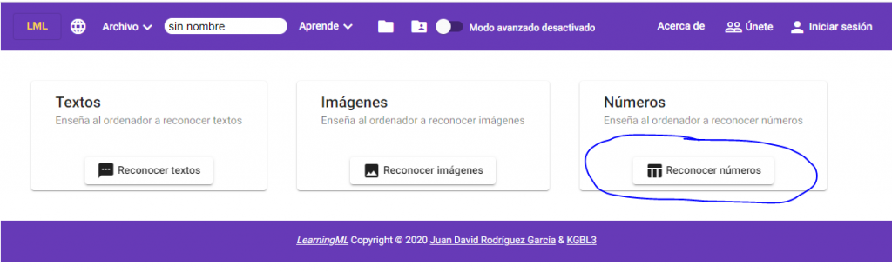

_Translated with google translator._

One of the **features** added in version 1.3 of LearningML is the **recognition of numerical sets.** And what is this recognition of numbers? Well, to be honest, **recognizing numerical patterns is the only thing that ML algorithms can do.** In fact, **when we work with images or texts, before being introduced as inputs to the algorithm, they are converted (encoded) to numerical sets.**

In LearningML, each example image is converted into a set of numbers (called a tensor). The image is divided into a grid of 227x227 squares (pixels) and the color of each of these squares is encoded as a combination of red (R), green (G) and blue (B). Hence the total number of numbers needed to encode an image is 154587.

#### Something similar happens with the texts

**A dictionary is built with all the words of all the example texts, words that do not contribute much to the semantics of the sentence** (stopwords) **are eliminated from that dictionary and the presence or absence of the dictionary terms in each text is used to code it.**

In fact, what Machine Learning algorithms actually require are numerical sets. However, until version 1.3, we did not have the possibility of directly entering these numerical sets in LearningML. And this is very useful because, **on many occasions, the data sets we have are simply data sets organized tabularly,** as in a spreadsheet, in which each row of numbers represents an exemplar.

**One of the most characteristic and well-known numerical sets in the world of statistics and Machine Learning is the [iris dataset](http://es.wikipedia.org/wiki/Conjunto_de_datos_flor_iris).** It consists of 150 specimens of Iris flowers classified into three species: Iris Setosa, Iris Virgínica and Iris Versicolor. Each specimen has been characterized using 4 typical flower traits: sepal length, sepal width, petal length and petal width.

#### We reproduce here 6 of the 150 copies of the set:

| Ejemplar | Representación numérica del ejemplar | Representación numérica de la clase |
| --- | --- | --- |
| 1 | \[5.1, 3.5, 1.4, 0.2\] | Iris Virginica |
| 2 | \[4.9, 3. , 1.4, 0.2\] | Iris Virginica |
| 3 | \[5.5, 4.2, 1.4, 0.2\] | Iris Versicolor |
| 4 | \[4.9, 3.1, 1.5, 0.2\] | Iris Versicolor |
| 5 | \[6.2, 3.4, 5.4, 2.3\] | Iris Setosa |
| 6 | \[5.9, 3. , 5.1, 1.8, 2\] | Iris Setosa |

You can download the complete set in CSV format or in the LearningML JSON format (ready to be loaded into the tool) from the following links:

| [Iris dataset CSV](http://archive.ics.uci.edu/ml/datasets/Iris) | [Iris dataset (JSON)](https://learningml.org/editor/iris.json) |
| --- | --- |

#### We are going to build with LearningML, an ML model with this sample data

The procedure is the same as always:

1. Enter the sample data (train).

3. Build the model from the sample data (learn).

5. Evaluate the model (test).

**The only difference is that in this case we click on the "_Recognize numbers_" button on the home screen.**

In the case of sets of numbers, **before starting to enter data, we must indicate the number of attributes of the data set that we want to process.** This value, by default, is 2, but we can change it using the "_Number of columns_" text box. In the example that we come up with, this number is 4.

Now we create the three classes of the problem: Iris Setosa, Iris Versicolor and Iris Virginica, and we add the numerical data corresponding to each class. The way to do this is by **separating the numbers with commas** (_","_), as seen in the following image.

Once we have the sample data, **we proceed to build the ML model by clicking on "_Learn to recognize numbers._"**

#### The time has come for “the tests”

And, once the learning process is finished, **we proceed to carry out some tests** to see if the model convinces us. Again, the way to enter the numbers is to separate them with commas.

Finally, and as with the other types of data (texts and images), **we can build a program with Scratch that uses the built model to recognize new numerical sets that encode new specimens** (of iris flowers in this model).

**The creation of number recognition models opens up new possibilities for the design of AI application programming activities**, and will help to work on the concepts of data science, big data and even IOT (internet of things). **For, using sensors we can collect data about different phenomena, classify them, create a model and use it to predict or classify new data collected with those same sensors.**

In this way, **we connect** even more intimately, **AI activities with educational robotics.** [EchidnaSTEM](http://echidna.es) and [micro:bit](bit) are two boards for educational robotics with which you can design an activity of this type.

**Are you up for it?**
