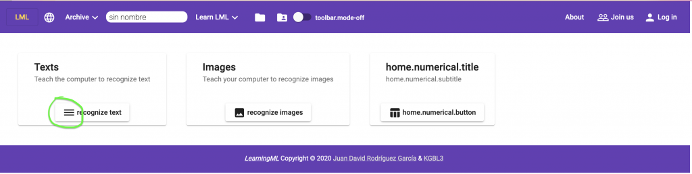
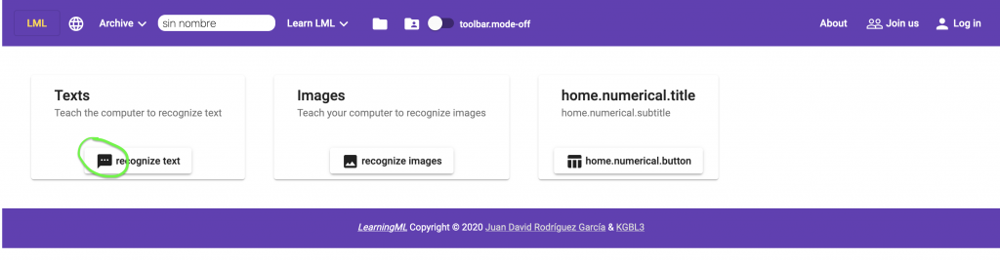

**The development of any type of software application is greatly facilitated if a suitable framework is used.** Although it is true that the learning curve for these frameworks is usually quite steep, **their advantages make it worthwhile to study them.**

First of all, **they fix the basic architecture of the application**, which eliminates a problem, and what a problem it is! On the other hand, **they incorporate solutions for most of the everyday problems that arise when developing** the type of application for which the framework has been designed.

As it was clear to me that _learningml-editor_ should be a web application, I decided to use a framework for the development of such applications. And among all of them, the one that convinced me the most, mainly because I already knew it, was [Angular](http://angular.io). I do not want to say that it is the best, but it is certainly among the best.

I am not going to explain the architectural details of **Angular** or its operation, I will only say that it **is a modular framework based on components, which greatly facilitates the organization and reuse of code**. The _learningml-editor_ GUI is a component of Angular that is composed of more components. In the following images I show all the components of the input screen and those of the Machine Learning model editor.

<figure>


<figcaption>

Components of home screen

</figcaption>

</figure>

<figure>


<figcaption>

Components of edit screen

</figcaption>

</figure>

#### And then its correspondence in the source code

Note that **only the directories of the src folder are shown**, which is where all the custom code resides. The other directories are Angular's own and, practically, are not touched.

```
src
├── app
│   ├── components
│   │   ├── ml-filemenu
│   │   ├── ml-footer
│   │   ├── ml-home
│   │   ├── ml-label-container
│   │   ├── ml-login
│   │   ├── ml-model
│   │   ├── ml-model-state
│   │   ├── ml-model-toolbar
│   │   ├── ml-projects
│   │   ├── ml-report-bugs
│   │   ├── ml-shared-projects
│   │   ├── ml-signup
│   │   ├── ml-test-image-model
│   │   ├── ml-test-numerical-model
│   │   ├── ml-test-sound-model
│   │   ├── ml-test-text-model
│   │   ├── ml-web-cam
│   │   ├── page-not-found
│   │   └── progress-spinner-dialog
│   ├── interfaces
│   ├── models
│   └── services
│       ├── featureExtractors
│       └── mlAlgorithms
├── assets
│   ├── config
│   ├── i18n
│   ├── images
│   │   └── favicon_io
│   └── models
└── environments
```

#### **Each component has at least 4 files**

- one for the typescript code, **where the component's operation logic is set** (_ml-home.component.ts_),

- one with the html code, which is **where you set how the component will be d**isplayed (_ml-home.component.html_),

- one with the CSS's that **define the styles with which the component will be displayed** (_ml-home.component.css_),

- and finally, **one to perform unit tests** (_ml-home.component_).

Let's see an example that shows how to change the icon of the button for text recognition for a different one:

<figure>



<figcaption>

The icon chosen to be changed

</figcaption>

</figure>

As it is a presentation element, we look in the .html file of its respective component, in this case ml-home. That is, the file is src/app/ml-home/ml-home.component.html. We look for the line where the icon is set:

```
<mat-card-actions style="text-align: center;">
        <button (click)="openText()" matTooltip="Reconocer textos" mat-raised-button>
          <mat-icon>textsms</mat-icon> {{'home.text.button' | translate}}
        </button>
 </mat-card-actions>
```

We save the changes and the Angular development server reloads the page and shows these changes:

<figure>



<figcaption>

The changed icon

</figcaption>

</figure>

**And that's it!** The best way to understand the code of _learningml-editor_, is to set up a development environment and play around with the files of the different components. You can try to remove parts, to see their effect, change them, add new ones, etc, etc, etc, etc… In short, what it is **to tinker to reach to understand what each thing does and how you can change its behavior.**

Remember that you have available the code to study and modify it in [https://gitlab.com/learningml/learningml-editor](https://gitlab.com/learningml/learningml-editor). **And, if you do something “cool” and you want me to add it to the official version don't hesitate to make a pull request!**
