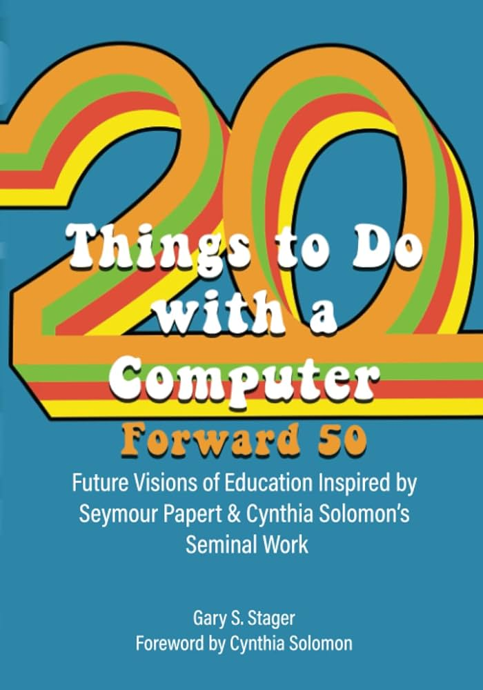

#### La cita

> _¿Por qué, entonces, deberían los ordenadores en las escuelas limitarse a calcular la suma de los cuadrados de los primeros veinte números impares y otros usos similares de "resolución de problemas"? ¿Por qué no usarlos para producir alguna acción? No hay mejor razón que la timidez intelectual de la comunidad docente, que parece ser notablemente reacia a usar los ordenadores para cualquier propósito que no se asemeje mucho a algo que se ha enseñado en las escuelas durante los últimos siglos._
> 
> _Esto es aún más sorprendente dado que los informáticos son custodios de una revolución intelectual y tecnológica trascendental. Los conceptos de las ciencias de la computación — "cibernética", "teoría de la información", "inteligencia artificial" y todos sus otros nombres — han afectado profundamente el pensamiento en biología, psicología e incluso en la filosofía de las matemáticas. Las máquinas están cambiando nuestra forma de vida. Qué extraño, entonces, que las "computadoras en la educación" a menudo se reduzcan a "usar nuevos y brillantes dispositivos para enseñar lo mismo de siempre en versiones apenas disfrazadas del mismo método antiguo."_

#### El comentario

Más de cincuenta años después de esta cita, en un momento en el que la dotación informática de los centros educativos comienza a dejar de ser un problema, **el mundo educativo sigue enfrentándose,** en gran medida sin saberlo, **a sus pasados fantasmas.**

Ya he comentado en otros momentos que **la innovación educativa no es hacer lo mismo de siempre con nuevas tecnologías.** Y muchas voces, posiblemente no tantas como debieran, proclamamos y defendemos esta idea que puede parecer novedosa.

Pero retrocedemos a los orígenes del uso de computadores en educación y comprobamos que ya entonces se denunciaba este problema: **_"usar nuevos y brillantes dispositivos para enseñar lo mismo de siempre en versiones apenas disfrazadas del mismo método antiguo."_**

##### En su introducción...

La cita pertenece a un artículo que **Seymour Papert y Cynthia Solomon** escribieron en el año 1971(¡madre mía, aún no había nacido, aunque faltaba poco). [Este trabajo](https://dspace.mit.edu/bitstream/handle/1721.1/5836/AIM-248.pdf), que podéis consultar de arriba a abajo, defiende en su impecable introducción que **las computadores pueden y deben ser utilizadas para desarrollar actividades creativas que ayuden al estudiante, no solo a comprender su funcionamiento y su lenguaje, si no también para aprender sobre otras materias.** Es decir, a hacer algo nuevo, algo que no se haya hecho ya con otros recursos.

El resto del artículo, como su nombre indica, propone 20 actividades para hacer con una computadora que trascienden su uso como papagayo digital. La última actividad es un guiño a uno de los conceptos más importantes de la computación; **la recursividad**, y dice así: _**"piensa 20 cosas más que hacer con un ordenador".**_

##### Y ahora qué...

Cincuenta y cuatro años después de este trabajo pionero, **me gustaría ser optimista y pensar que**, poco a poco, grano a grano, **el mundo educativo y la sociedad** en general, **van comprendiendo esta idea imprescindible que concibe a la computadora como un revolucionario recurso capaz de potenciar nuestro pensamiento.**

Sin embargo, la historia de la educación no es lo que nos enseña. Y la furiosa irrupción de la IA generativa, con todas sus promesas y virtudes aparentes, no parece ayudar demasiado.

**Muchos docentes buscan el generador milagroso que en cinco minutos compone una situación de aprendizaje** y muchos estudiantes el que te la resuelve en uno. Pero no generalicemos, no todo es correr como "_pollos sin cabeza_", **también hay un importante sector docente que le ha puesto la puntilla al reloj y ha entendido que la innovación no debe ir por la vía de la premura, si no que debe ser reflexiva y meditada** y debe discurrir por la vía de lo que es más propiamente humano y donde una computadora puede ser de gran ayuda si se usa para ello: **¡la creatividad!**

Así que docentes, estudiantes, madres, padres y ciudadanos del mundo, **¡no perdamos la esperanza!** y sigamos trabajando con el tesón de Sísifo y con la esperanza de la desconocida Elpis para materializar esta sencilla y poderosa idea (_de fondo suena el dúo dinámico cantando la canción "resistiré"_).

