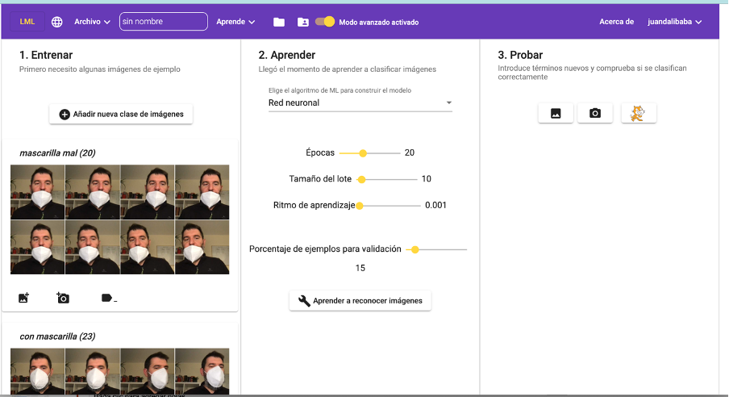
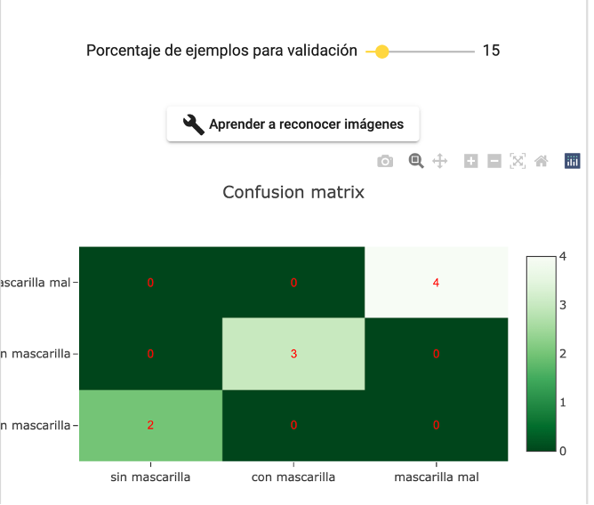
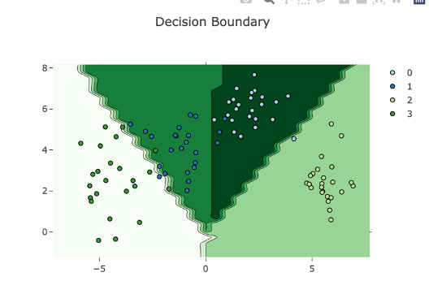

**El modo avanzado de LearningML ha sido diseñado con el propósito de entender mejor cómo funcionan los algoritmos de ML.** En efecto, en el modo normal, el proceso de aprendizaje es una caja negra, solo vemos al simpático _Charlot_ ajustar engranajes de una máquina (como metáfora de lo que está realizando realmente el algoritmo). Al final del proceso, el modelo ha sido elaborado y está listo para ser usado en un programa de _Scratch_. Más allá de lo que evoque en nuestra imaginación la animación de _Charlot_, nada sabemos sobre el algoritmo de ML en sí.

Sería bueno dar una vuelta de tuerca para incorporar en las actividades prácticas con LearningML más conocimiento acerca del funcionamiento de las técnicas de ML. Seguramente, **lo más importante después de entender las 3 fases del ML supervisado (entrenamiento, aprendizaje y evaluación),** sea saber que **no existe un solo algoritmo de ML para resolver los problemas de clasificación o reconocimiento.** De hecho, ¡existen un montón! También, **es importante conocer alguna técnica que nos proporcione cómo de bueno es el modelo obtenido. Y esto es, precisamente, lo que facilita el modo avanzado de LearningML.**

Para **activar el modo avanzado** de LearningML, basta con **hacer _clic_ en el botón de tipo interruptor que se encuentra en el menú principal.**

Y, **aparecen nuevos controles** en la sección “_Aprender_”.

#### Selección del algoritmo de ML

**Disponemos de un selector** del algoritmo de ML que deseamos usar en la fase de aprendizaje. En la versión actual podemos elegir entre dos: _KNN_ y _Red neuronal._ (En próximas entradas explicaré sus fundamentos).

**Cada tipo de algoritmo puede ser configurado con unos parámetros,** que son característicos del algoritmo en sí. En el caso de _KNN_, el parámetro es _K_ es el número de vecinos más próximos que se usarán para determinar la pertenencia de un nuevo dato a una u otra clase.

En _Red Neuronal_, los parámetros son: épocas, tamaño del lote y ritmo de aprendizaje. (El significado de estos parámetros lo explicaremos en una próxima entrada).

Por tanto, **en el modo avanzado puedes probar a generar los modelos controlando tanto el algoritmo de ML como sus parámetros más relevantes.** De esa manera, podrás ir adquiriendo cierta intuición acerca del funcionamiento de los algoritmos de ML.

#### Matriz de confusión

**¡Pero aún hay más!** Si definimos un valor mayor que cero para el parámetr_o “Porcentaje de ejemplos para validación”_, cuando se genere el modelo al hacer _clic_ en _“Aprender a reconocer textos|imágenes|números”_, aparecerá un gráfico denominado “_Confusion matrix_” (Matriz de confusión). Nos ofrece una medida de la calidad y precisión del modelo construido.

Cómo se construye esta matriz lo explicaremos en una próxima entrada. Por momento, **cuanto mayor sean los números que aparecen en su diagonal y más próximo a cero los que no pertenecen a la diagonal, mejor es el modelo.**

#### Curva de evolución del aprendizaje

Otra de las gráficas que ofrece el modo avanzado de LearningML, es la **curva de evolución del proceso de aprendizaje.** Esta curva solo se genera cuando el algoritmo que se ha usado es “_Red Neuronal_”. Cuando el “_porcentaje de ejemplos para validación_” es cero, la curva tiene la siguiente pinta:

**La curva azul representa la evolución de la precisión (_accuracy_)** del modelo a medida que se va generando. Es decir, en cada una de las épocas de entrenamiento. **La curva naranja representa la evolución de la función de pérdida (_loss_).** Cuanto más próxima a 1 sea la precisión y más próxima a cero sea la función de pérdida, mejor es la calidad del modelo.

Si antes de la generación del modelo hemos definido un valor mayor que cero para el parámetro “_porcentaje de ejemplos para validación_”, aparecerán en esta gráfica dos curvas más. Se corresponden con la evolución de la precisión y de la función de pérdida para los datos reservados para la evaluación del modelo. **Estás dos curvas son aún más relevantes para determinar la calidad del modelo que las anteriores.**

#### Límites de decisión del modelo

**La última gráfica que ofrece el modo avanzado de _LearningML_ es la denominada “_decision boundary_” (límites de decisión).** Esta gráfica sólo se genera cuando el modelo es de reconocimiento de conjuntos numéricos y además, los datos de ejemplos son bidimensionales, es decir, el nº de columnas es 2.

**Esta gráfica es la mejor representación gráfica del modelo que se puede ofrecer.** El problema es que solo se puede realizar cuando los conjuntos numéricos constan de dos números, ya que en ese caso los datos se pueden representar en un plano usando los ejes coordenados.

En esta gráfica se muestran dos cosas: los datos de ejemplos (todos, los que se han usado para generar el modelo y los que se han reservado para validación). Y las zonas del plano que el modelo asigna a cada clase, rellenando cada una de ellas con un color distinto. De esa manera tenemos una visualización directa e inmediata del desempeño del modelo. Y vemos qué puntos del conjunto de ejemplo son clasificados correctamente por el modelo y cuales no.

**Y eso es todo lo que, por lo pronto, ofrece el modo avanzado de LearningML.** Cuando ya se te hayan quedado pequeñas las actividades típicas y hayas entendido bien las 3 fases del Machine Learning, es el momento de ir más allá y estudiar los fundamentos de los algoritmos más populares. Entonces, el modo avanzado de LearningML te ayudará a entenderlos mejor desde la práctica.

En esta entrada han aparecido los términos "_red neuronal_", "_algoritmo KNN_", "_matriz de confusión_" y "_evolución del aprendizaje_" pero no se han explicado en detalle, pues la intención de este _post_ es presentar el modo avanzado de LearningML.

**No te preocupes si hay cosas que no has entendido del todo, en próximas entradas las explicaré.**

**¡Hasta la próxima!**
