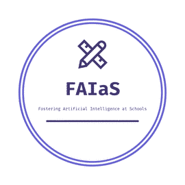
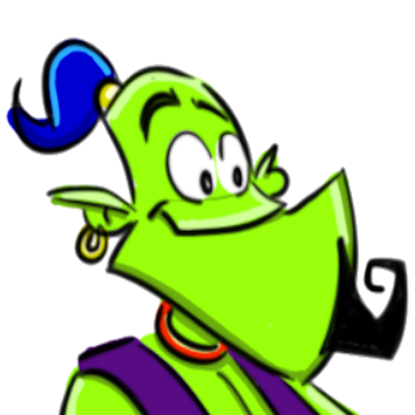

Con un poco de tristeza, escribo esta entrada de blog para dar por **finalizado el Proyecto FAIaS (Fostering Artificial Intelligence at School), que ha supuesto un avance importante para LearningML.** FAIaS es un proyecto Erasmus+ financiado por la Comisión Europea cuya **finalidad fue acercar el uso y comprensión de la inteligencia artificial a los colegios.** Empezó en septiembre de 2020 y ha terminado recientemente en agosto de 2023.

#### ¿Y qué mejor herramienta que LearningML para realizar esa aventura?

En estos últimos años **han sido muchos los aportes del proyecto FAIaS a LearningML,** desde desarrollos de **nuevas funcionalidades** hasta la **creación de materiales** y **video tutoriales** sobre la herramienta.

Pero quizás, lo más relevante ha sido el trabajo de diseminación e implicación de educadores con LearningML. Gracias al proyecto FAIaS, contamos con una gran cantidad de video tutoriales sobre la herramienta, y **lo que es más importante, tenemos muchas actividades didácticas creadas por y para profesores.** Hay más de un centenar de actividades didácticas de una gran variedad de asignaturas (desde matemáticas hasta griego) para todas las edades. Para alumnos de primaria, de secundaria, de bachillerato, de educación especial, e incluso para estudios de formación profesional.

#### Enlaces a resultados del proyecto FAIaS relacionados con LearningML

[_Varios cientos de actividades didácticas con LearningML (en español)_](https://fosteringai.github.io/project/result3/)

**Varios videotutoriales de cómo usar LearningML**

<figure>

https://www.youtube.com/watch?v=i4tFHjrxmHQ

<figcaption>

Varios videotutoriales de cómo usar LearningML

</figcaption>

</figure>

**Varias _happy hours_ sobre cómo introducir la IA en colegios con la participación de profesores presentando sus experiencias, comentarios de expertos, etc.**

<figure>

https://www.youtube.com/watch?v=dNqTIVoByWM

<figcaption>

Varias happy hours

</figcaption>

</figure>

Además, en colaboración con el proyecto, se gestaron varias funcionalidades como el uso de _K-nearest neighbors (KNN) y Naive Bayes_, el reconocimiento de conjuntos de datos o el reconocimiento de audio. Desafortunadamente, aún no he podido integrarlas en producción, pero han dado lugar a tres magníficos trabajos fin de máster. También se han realizado traducciones, se han testeado las nuevas funcionalidades, se han confeccionado informes de errores y todas esas cosas que hay que hacer en un proyecto _software_.

#### Trabajos fin de máster

**Aquí tenéis los trabajos fin de máster que elaboraron: Isaac Merchán, Ignacio Rueda y Álvaro del Hoyo.**

[memoria\_grado\_isaac\_merchan-lml-1](https://web.learningml.org/wp-content/uploads/2023/10/memoria_grado_isaac_merchan-lml-1.pdf)[Descarga](https://web.learningml.org/wp-content/uploads/2023/10/memoria_grado_isaac_merchan-lml-1.pdf)

[Implementacion-de-funcionalidades-en-LearningML-TFG-Alvaro-del-Hoyo-Arias-1](https://web.learningml.org/wp-content/uploads/2023/10/Implementacion-de-funcionalidades-en-LearningML-TFG-Alvaro-del-Hoyo-Arias-1.pdf)[Descarga](https://web.learningml.org/wp-content/uploads/2023/10/Implementacion-de-funcionalidades-en-LearningML-TFG-Alvaro-del-Hoyo-Arias-1.pdf)

[IgnacioRueda-ImplementacionFuncionalidadLearningML-ConjuntoDeDatos-2](https://web.learningml.org/wp-content/uploads/2023/10/IgnacioRueda-ImplementacionFuncionalidadLearningML-ConjuntoDeDatos-2.pdf)[Descarga](https://web.learningml.org/wp-content/uploads/2023/10/IgnacioRueda-ImplementacionFuncionalidadLearningML-ConjuntoDeDatos-2.pdf)

Estoy seguro de que **la colaboración entre LearningML y el proyecto FAIaS ha sido un éxito.** La herramienta ha madurado significativamente y ahora es un recurso valioso para profesores y estudiantes. Estoy muy agradecido por la oportunidad de haber trabajado con un equipo tan talentoso y dedicado. Seguramente, a muchos de los que han colaborado bajo el paraguas del proyecto FAIaS les seguiremos viendo por aquí.

**¡Gracias y nos veremos por aquí!**
