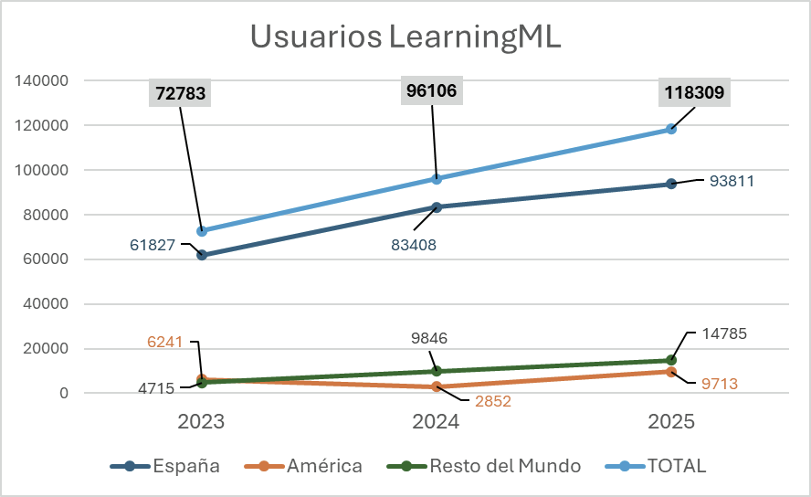

#### Nos movemos constantemente entre la razón y la emoción

La pasión, casi primitiva, que nos empuja a seguir haciendo aquello que nos gusta, sin importar los resultados, porque **tenemos la plena convicción de que la educación es una de las pocas herramientas reales para construir una sociedad más justa y solidaria**. Y la razón, moldeada por la cultura, que nos empuja hacia el camino del “beneficio”, entendido como “todo lo que se haga sin un rédito es una pérdida de tiempo”.

En LearningML hacemos lo que hacemos guiados por la emoción. Porque creemos que, desde la educación, se pueden cambiar cosas muy importantes para vivir en sociedad, como que “no todo lo que hagas debe tener un rédito porque tu propia satisfacción personal ya es un rédito en sí mismo”. **Confiamos en el pensamiento computacional como una herramienta clave para construir mentes analíticas, críticas y cuestionadoras.** Mentes capaces de entender el mundo, las reglas en las que se mueve… y de transformarlo.

Sin embargo, mantener operativa la infraestructura necesaria para que LearningML esté disponible todos los días del año, a cualquier hora, tiene unos costes económicos que nos lleva a guiarnos por la razón:

- Servidores virtuales en la nube, con infraestructura moderna basada en contenedores _docker_ e integración continua que facilita el despliegue de nuevas versiones. Así, conseguimos ofrecer un servicio de alta disponibilidad y calidad.

- Gestión de dominios y correo electrónico.

- Gastos de gestoría y cuenta bancaria.

A esto habría que añadir, si quisiéramos valorarlo económicamente, todo el trabajo de desarrollo y mantenimiento del _software_, así como el enorme esfuerzo del equipo de comunicación: diseño corporativo, logo, dossier, campañas en redes sociales, seguimiento, grabación y edición de vídeos, creación de contenidos, etc.

#### Guiados por la pasión

Hasta ahora todo ese trabajo ha sido **completamente altruista, guiados por la pasión de creer en lo que hacemos,** con la satisfacción de contribuir con nuestro granito de arena al maravilloso mundo de la educación y con la esperanza de conseguir una financiación que, no solo contribuya a mantener los gastos de mantenimiento, si no también que permita seguir desarrollando LearningML y nuevas herramientas educativas. Pero la realidad es que estos costes, durante los 5 años de vida del proyecto, se han cubierto prácticamente con nuestros ingresos personales.

#### Buscamos una solución

Para resolver el problema de la financiación decidimos crear la asociación LearningML y poner en marcha un sistema de donaciones. Pero, después dos años desde su creación, este medio de financiación no ha funcionado.

Es cierto que “a cuentagotas”, hemos recibido algunas donaciones. Muy a cuentagotas… Durante 2025 contamos con un patrocinio puntual **por parte de Aprendemanía**, que nos permitió cubrir gastos durante un tiempo. También ha habido una docena de donantes que, al principio contribuyeron con donaciones puntuales. Y a día de hoy, contamos con **una única suscripción mensual**.

Está claro. Lo hemos escuchado en muchas ocasiones y lo hemos comprobado con la experiencia; en nuestra cultura latina las donaciones no se tienen demasiado en cuenta, especialmente cuando se trata de productos que se ofrecen gratuitamente. No solemos poner en valor el trabajo ajeno, especialmente cuando se piensa que se hace “por gusto”. ¿Cuántas veces hemos escuchado -de jefes, compañeros, amistades o incluso de nuestra propia familia- frases como: _“eso no te cuesta nada, si para ti es una tontería”_, “_a ti se te dan bien esas cosas y además te lo pasas bien_”, _“en un momentito lo haces”_?

Y ese “momentito”, en realidad, son muchas horas. Horas de estudio, de aprendizaje, de discusión, de prueba y error. Horas invisibles.

Más allá de la pasión, la voluntad, el placer y satisfacción de estar haciendo algo útil y de estar contribuyendo al mundo educativo, cuando un proyecto alcanza cierto tamaño, su mantenimiento y desarrollo **requiere financiación**. Es así de sencillo, no hay mucho más. Podemos seguir trabajando “por gusto” en LearningML (algo discutible, después de 5 años hay otros temas que nos interesan tanto o más y la satisfacción está más que cubierta) Pero **no podemos mantener la infraestructura si no contamos con financiación.**

#### Y, ¿otros proyectos cómo lo hacen?

Pensemos, en otros proyectos tecnológicos de interés educativo. Por ejemplo, **Scratch**. Sin lugar a duda el referente para aprender a programar, usado por cientos de miles de docentes y estudiantes en todo el mundo, ofrece su código con una licencia libre para que podamos estudiarlo y modificarlo, gracias a lo cual hemos podido integrarlo con LearningML añadiendo nuevo código para los bloques de Machine Learning. ¿Sería posible, este proyecto sin una potente financiación? Gran parte del presupuesto proviene de aportaciones y donaciones de grandes fundaciones, también cuenta con donaciones individuales y colaboraciones con instituciones públicas y privadas.

Pensemos en **Moodle**, **App Inventor**, **¡Snap!,** **GeoGebra** ¿Serían posibles sin soporte económico? A poco que indaguéis, comprobaréis que todos estos proyectos cuentan con una sólida financiación que combina donaciones con colaboraciones público-privadas.

Salvando las distancias, y con toda humildad, sabemos que LearningML no juega en la misma división que las aplicaciones anteriores, pero no deja de ser un proyecto tecnológico de _software_ y, como tal, requiere su inevitable infraestructura. Por eso, estos ejemplos pueden ayudar a entender mejor nuestra situación.

#### Echemos un vistacito a los números

Para comprender el alcance real de LearningML y la necesidad del gasto que supone en infraestructura y mantenimiento, queremos compartir los datos sobre la evolución del proyecto en los últimos tres años: número de usuarios y distribución geográfica entre España, América y el resto del mundo.

**Nuestro objetivo sería contar con fuentes de financiación similares, basadas en colaboraciones con el sector público y privado**, además de las donaciones. Este soporte económico impulsaría el proyecto proporcionándole estabilidad, esto es, dando garantías de soporte y disponibilidad para tranquilidad de sus usuarios. Haría posible el desarrollo de nuevas funcionalidades, podríamos abarcar más aspectos de los nuevos avances en IA, computación y programación como la IA generativa, el _vibe coding_ y la computación cuántica, y, por supuesto, nos encantaría abrir el código fuente (_open source_) para que todos los interesados puedan estudiarlo, modificarlo y usarlo como quieran, al estilo de Scratch, que es nuestro modelo ideal.

Pero, hasta ahora, nuestros esfuerzos han sido en vano. Por ello, y antes de cerrar definitivamente el proyecto, **por respeto a todas las personas que usan LearningML y todas las que nos han apoyado de distintas maneras desde el principio**, hemos decidido que, a partir del mes de marzo, cerraremos todos los servicios (por falta de medios económicos para mantenerlo) y sólo **quedará a vuestra disposición una web sencilla con acceso a la versión de escritorio.**

#### Para reflexionar, sin reproches

Somos plenamente conscientes del sueldo de un docente en España, porque somos docentes.

Somos plenamente conscientes, también, de que lo adecuado sería que este tipo de recursos estuvieran financiados por la administración pública.

Y, sin ánimo de polemizar, pero para ponerle un poquito de humor a todo esto, vamos a recordar con cariño, a la gran Lola Flores, permitiéndonos la pregunta para la reflexión: ¿os imagináis todo lo que se podría haber hecho si cada usuario de España en 2025 (93.811) hubiera donado solo **1 €**? Si con prácticamente nada hemos llegado hasta aquí…

Quizá sea una cuestión cultural. Pagamos sin pensarlo **10 € al mes por plataformas de ocio**, a las que dedicamos, con suerte, unas pocas horas al día. Y, sin embargo, cuesta aportar **1 €** a una herramienta que facilita nuestro trabajo docente, que motiva al alumnado y que contribuye a mejorar la calidad educativa.

Sin juzgar ni cuestionar las decisiones personales de nadie, que aquí cada cual gasta su dinero como puede y como quiere, ¡por supuesto!, queremos dejar con esta decisión algunos “melones” abiertos para pensar con calma.

En resumen y como idea fundamental que deseamos transmitir: **mantener la infraestructura de LearningML cuesta dinero. Desarrollar LearningML cuesta dinero** (tiempo). No podemos seguir costeando el proyecto con nuestro propio dinero.

Por último: ¡solo tenemos palabras de **agradecimiento** para todas las personas que nos habéis acompañado y apoyado durante este tiempo!

> Os pedimos ayuda para difundir esta información, para que ningún docente o cualquier otro usuario de LearningML llegue a clase y se encuentre, de repente, con la sorpresa de no poder continuar su trabajo en la nube.

#### ¡Gracias, de verdad, por estar ahí!
