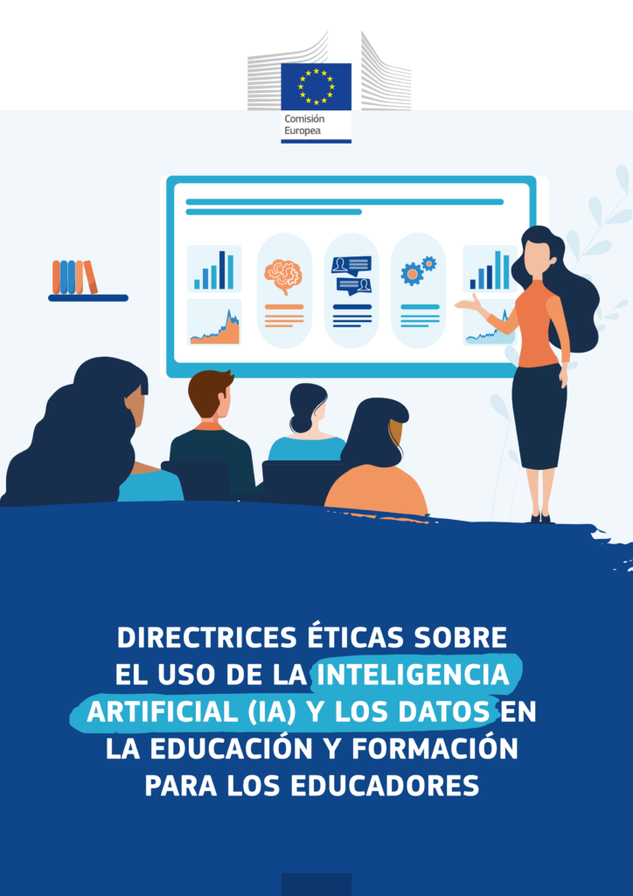

En el desarrollo de **LearningML,** uno de los desafíos clave fue crear una **herramienta educativa para enseñar Inteligencia Artificial (IA) que no dependiera de cuentas de usuario o plataformas externas.** Esto se logró implementando los algoritmos de Machine Learning directamente en el navegador del usuario, utilizando la librería _open source Tensorflow.js_ para los algoritmos de ML y _mobilenet_ para codificar imágenes mediante la técnica conocida como _transfer learning._

**Este enfoque** no solo simplificó el acceso a la herramienta, sino que también **demostró que es posible ejecutar algoritmos complejos localmente para fines educativos,** donde no se requieren grandes cantidades de datos. La experiencia resaltó la importancia de diseñar **recursos pedagógicos prácticos que fomenten el pensamiento computacional** y acerquen conceptos complejos como la IA al ámbito escolar.

Y, lo que es más importante, **se ha convertido en un principio de diseño de LearningML**, de manera que todas las funcionalidades que se vayan añadiendo (nuevos algoritmos de ML, reconocimiento de más tipos de datos, IA generativa, aprendizaje por refuerzo, …) deben realizarse respetando dicho principio de diseño.

**Esto permitirá mantener la privacidad del usuario y cumplir con el [RGPD](https://op.europa.eu/es/publication-detail/-/publication/d81a0d54-5348-11ed-92ed-01aa75ed71a1) y las directrices éticas sobre el uso de la inteligencia artificial (IA) promovidas por la Unión Europea**.

