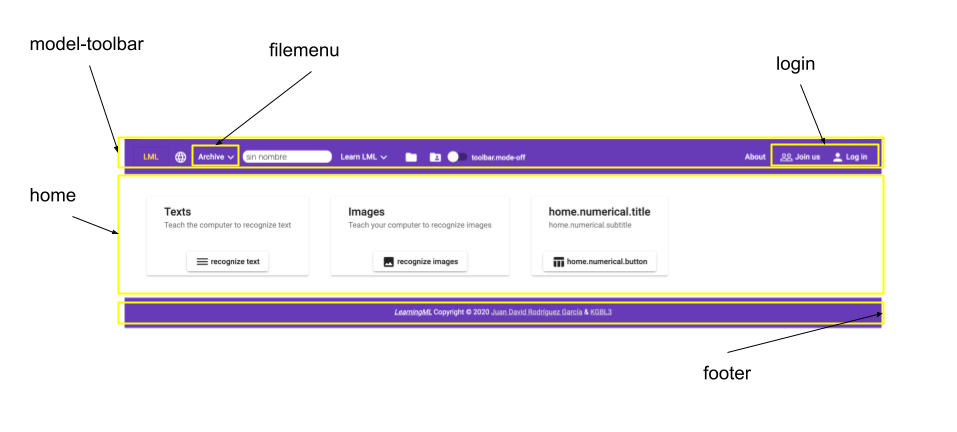
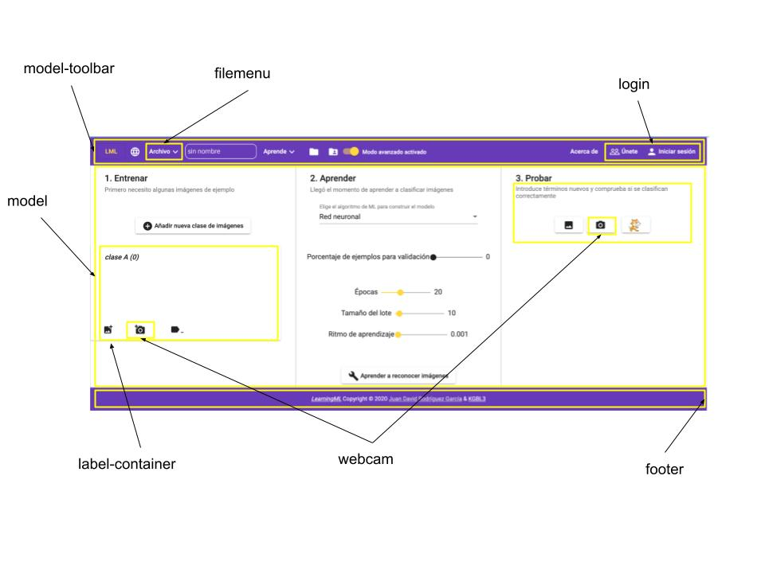

**El desarrollo de cualquier tipo de aplicación informática se facilita mucho si se utiliza un _framework_ adecuado.** Aunque es cierto que la curva de aprendizaje de estos _frameworks_ suele ser bastante empinada, **sus ventajas hacen que merezca la pena estudiarlos.**

En primer lugar, **fijan la arquitectura básica de la aplicación,** con lo que nos quitamos un problema. ¡Y qué problema! Por otra parte, **incorporan soluciones para gran parte de los problemas cotidianos que surgen al desarrollar** el tipo de aplicación para el que se ha diseñado el _framework_.

Como tenía claro que _learningml-editor_ debía ser una aplicación web, decidí usar un _framework_ para el desarrollo de este tipo de aplicaciones. Y de entre todos, el que más me convenció, fundamentalmente porque ya lo conocía, fue _[Angular](https://angular.io/)_. No quiero decir que sea el mejor, pero desde luego, se encuentra entre los mejores.

No voy a entrar en explicar los detalles arquitectónicos de **_Angular_** ni su funcionamiento, tan solo diré que **es un _framework_ modular basado en componentes, lo cual facilita mucho la organización y reutilización del código.** La interfaz gráfica de _learningml-editor_ es un componente de _Angular_ que está compuesto por más componentes. En las siguientes imágenes muestro todos los componentes de la pantalla de entrada y los de la del editor del modelo de Machine Learning.

<figure>



<figcaption>

Componentes de la pantalla de inicio

</figcaption>

</figure>

<figure>



<figcaption>

Componentes de la pantalla de edición

</figcaption>

</figure>

#### Y a continuación, su correspondencia en el código fuente

Ten en cuenta que **solo se muestran los directorios de la carpeta `src`,** que es donde reside todo el código a medida. Los demás directorios son propios de _Angular_ y, prácticamente, no se tocan.

```
src
├── app
│   ├── components
│   │   ├── ml-filemenu
│   │   ├── ml-footer
│   │   ├── ml-home
│   │   ├── ml-label-container
│   │   ├── ml-login
│   │   ├── ml-model
│   │   ├── ml-model-state
│   │   ├── ml-model-toolbar
│   │   ├── ml-projects
│   │   ├── ml-report-bugs
│   │   ├── ml-shared-projects
│   │   ├── ml-signup
│   │   ├── ml-test-image-model
│   │   ├── ml-test-numerical-model
│   │   ├── ml-test-sound-model
│   │   ├── ml-test-text-model
│   │   ├── ml-web-cam
│   │   ├── page-not-found
│   │   └── progress-spinner-dialog
│   ├── interfaces
│   ├── models
│   └── services
│       ├── featureExtractors
│       └── mlAlgorithms
├── assets
│   ├── config
│   ├── i18n
│   ├── images
│   │   └── favicon_io
│   └── models
└── environments
```

#### **Cada componente tiene, al menos, 4 ficheros**

- **uno** para el código _typescript_, donde **se establece la lógica de funcionamiento del componente** (`ml-home.component.ts`),

- **uno** con el código _html,_ que es donde **se establece cómo se mostrará el componente** (`ml-home.component.html`),

- **uno** con las _CSS's_ que **define los estilos con los que se mostrará el componente** (`ml-home.component.css`),

- y por último, **uno para realizar test unitarios** (`ml-home.component.spec.ts`).

Veamos un ejemplo en el que se muestra como cambiar el icono del botón para el reconocimiento de texto por otro distinto:

<figure>


<figcaption>

El icono que queremos cambiar

</figcaption>

</figure>

Como es un elemento de presentación, buscamos en el fichero `.html` de su respectivo componente, en este caso `ml-home`. Es decir, el fichero es `src/app/ml-home/ml-home.component.html`. Buscamos la línea en la que se establece el icono:

```
 <mat-card-actions style="text-align: center;">
        <button (click)="openText()" matTooltip="Reconocer textos" mat-raised-button>
          <mat-icon>dehaze</mat-icon> {{'home.text.button' | translate}}
        </button>
 </mat-card-actions>
```

Estos iconos son propios de _[Angular Material](https://material.angular.io/)_, la librería que he elegido para facilitarme la vida con el aspecto de la interfaz gráfica. En este caso se está usando un icono llamado `dehaze`. Vamos a cambiarlo por otro que se llama `textsms`:

```
<mat-card-actions style="text-align: center;">
        <button (click)="openText()" matTooltip="Reconocer textos" mat-raised-button>
          <mat-icon>textsms</mat-icon> {{'home.text.button' | translate}}
        </button>
 </mat-card-actions>
```

Guardamos los cambios y el servidor de desarrollo de _Angular_ recarga la página y muestra dichos cambios:

<figure>


<figcaption>

El icono cambiado

</figcaption>

</figure>

**¡Y listo!** La mejor forma de entender el código de _learningml-editor,_ es montando un entorno de desarrollo y trasteando por los ficheros de los distintos componentes. Puedes probar a quitar partes, para ver su efecto, cambiarlas, añadir nuevas, etc, etc, etc... En fin, lo que viene siendo **trastear para alcanzar a comprender qué hace cada cosa y cómo se puede cambiar su comportamiento.**

Recuerda que tienes disponible el código para estudiarlo y modificarlo en [https://gitlab.com/learningml/learningml-editor](https://gitlab.com/learningml/learningml-editor). **Y, si haces alguna cosa "chula" y quieres que la añada a la versión oficial no dudes en hacer un _pull request_!**
