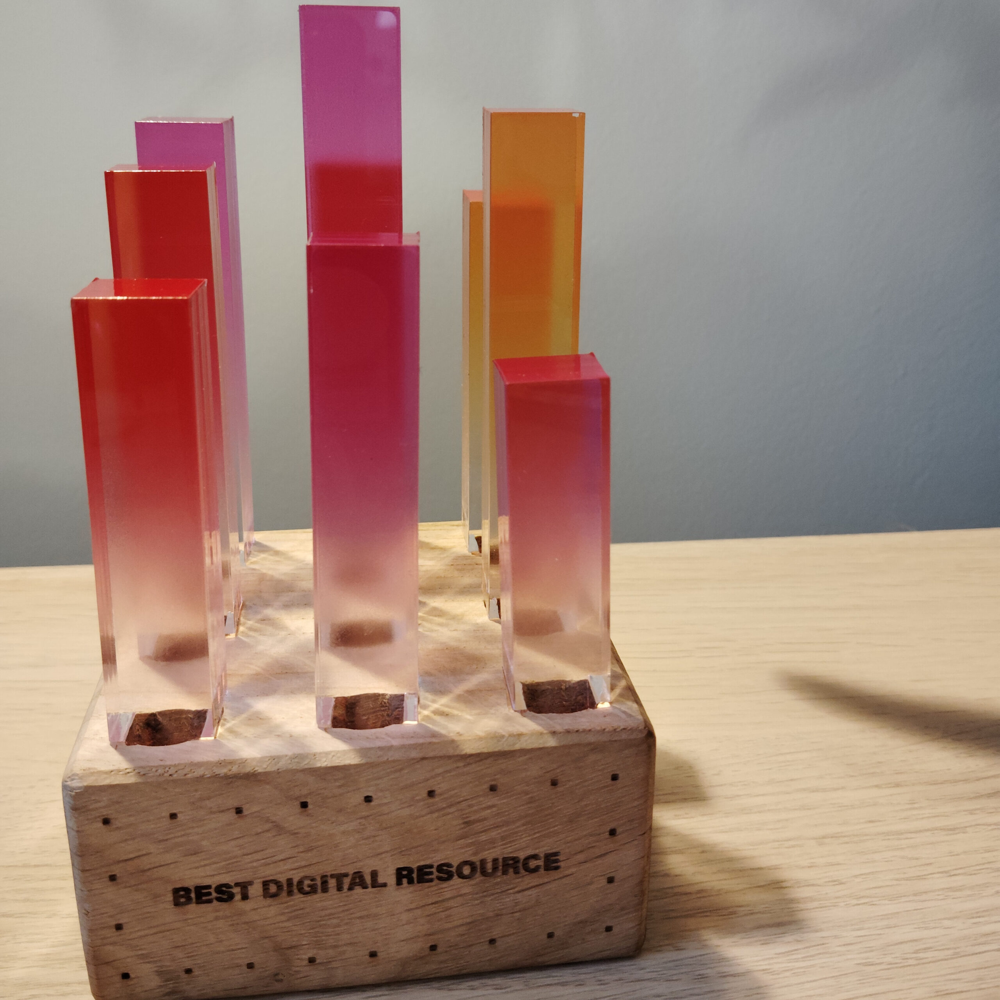
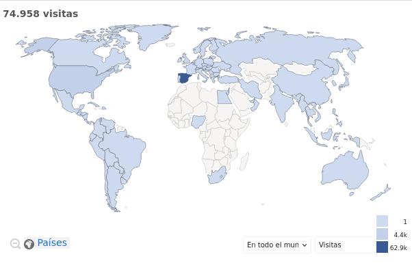

El 16 de octubre de 2024 LearningML fue reconocida como el "**[mejor recurso educativo de 2024](https://x.com/AllDigitalEU/status/1846576936899813534)"** por la organización [All Digital](https://all-digital.org/).

La ceremonia de entrega de premios tuvo lugar en el espacio madrileño conocido como [La Nave](https://www.lanavemadrid.com/), y durante el evento se entregaron los siguientes premios:

- Best digital educator

- Best digital changemaker

- **Best digital resource**

- ALL DIGITAL Weeks best event

- ALL DIGITAL Weeks best campaign

- Best use of GenAI in Education

**Este premio reconoce la labor** que venimos realizando desde 2019. No solo yo como desarrollador de LearningML, si no **todas las [personas e instituciones](https://web.learningml.org/agradecimientos/)** que han colaborado de una u otra forma con el proyecto.

Este es un momento perfecto para darles una vez más las **¡GRACIAS!**

Quiero hacer una mención especial a [Hector Martínez](https://www.linkedin.com/in/hmtez/) que, estando en la **[Fundación Bofill](https://fundaciobofill.cat/)** como Jefe de Proyecto, propuso a LearningML como recurso candidato al **_Best digital resource de 2024_ de All Digital.** Y como no, tengo que **agradecer de manera destacada a los muchísimos docentes y estudiantes** que usan LearningML para aprender IA. Cada día son más y son los que realmente dan sentido a todo el trabajo realizado.

El agradecimiento final, y no menos importante, va dedicado a Paula, Jara y Ciro, mi familia, los que todos los días soportan los frecuentes momentos de ausencia física o mental que me exige el desarrollo de este proyecto.

Estoy realmente emocionado con este premio. No voy a ocultar que llevaba algún tiempo pensando que el proyecto, por toda su trayectoria, merecía algún reconocimiento. ¡Y ya lo tiene!

Esto es una inyección de motivación que llega en un momento perfecto; cuando acabamos de lanzar la **[versión 2 de LearningML](https://v2.learningml.org)** y la **Asociación _LearningML para el Desarrollo y Fomento de la IA en Educación_** ya está legalmente constituida. Así que, seguimos pedaleando fuerte para ayudar a docentes, estudiantes y ciudadanos en general a conocer los fundamentos de la IA de una manera sencilla y eficaz.
