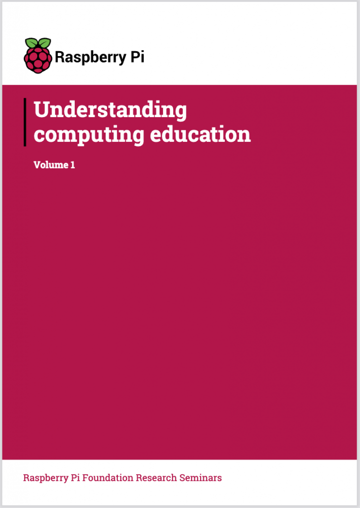
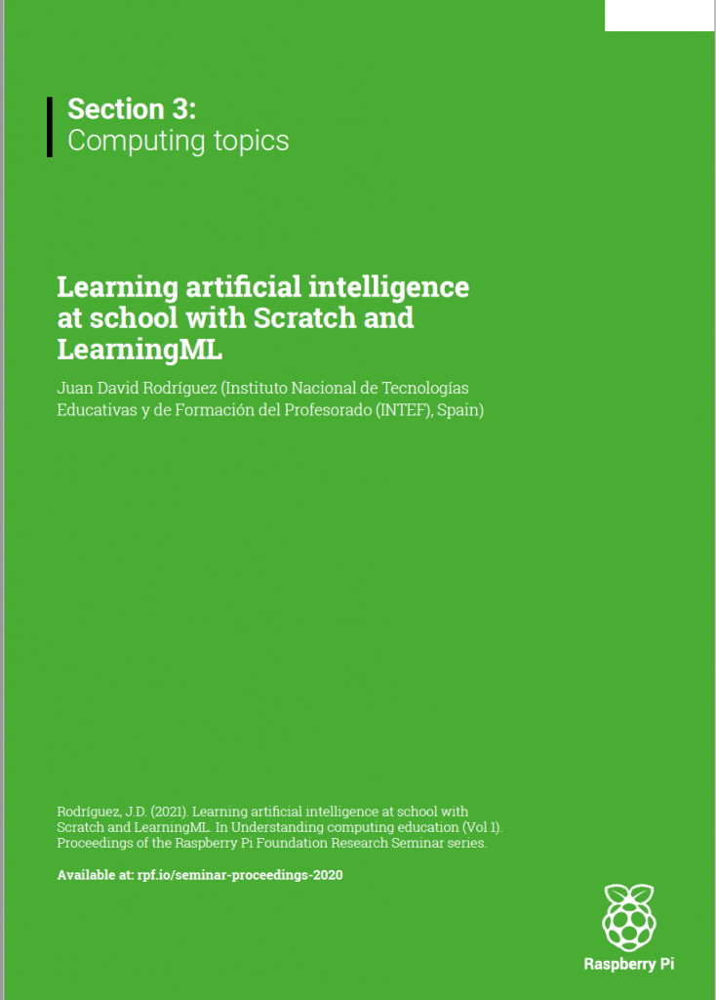

Hace un tiempo que participé en la **[primera edición de los seminarios quincenales](https://localhost:8080/learningml-en-los-seminarios-quincenales-de-la-fundacion-raspberry-pi/) de la Fundación [Raspberry Pi](https://www.raspberrypi.org/)** que tienen como **objetivo** tratar temas actuales sobre **Computing Education.** Con todas las charlas impartidas, los organizadores elaboraron una compilación de todos los trabajos en forma de **[libro _online_](https://www.raspberrypi.org/app/uploads/2021/05/Understanding-computing-education-Volume-1-%E2%80%93-Raspberry-Pi-Foundation-Research-Seminars.pdf)** que acaba de ser publicado. 

Estoy muy contento y orgulloso por haber contribuido a esta gran iniciativa con el **artículo "_Learning artificial intelligence at school with Scratch and LearningML_".** 

**¡Gracias a todos los que lo habéis hecho posible!**  

  

 
