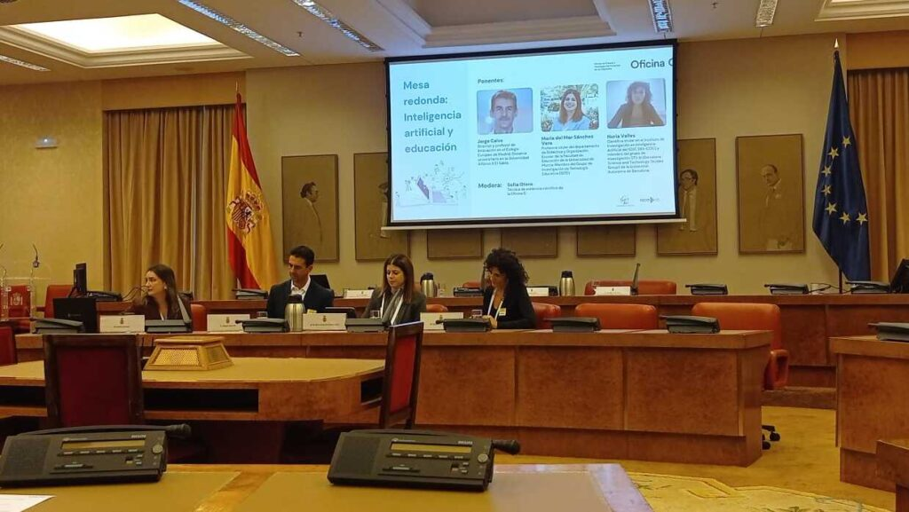
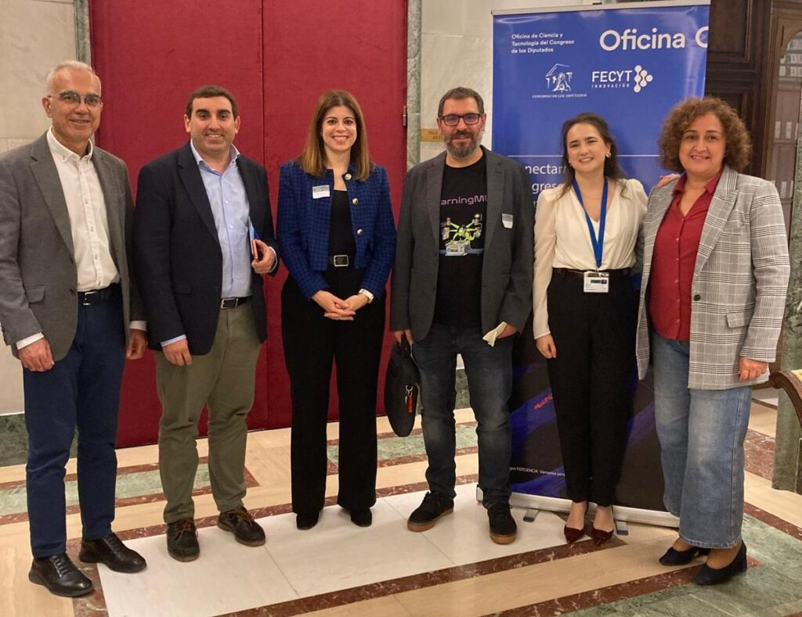

El día 11 de noviembre en la **"Sala Constitucional" del Congreso de los Diputados se presentaron los 4 [informes](https://www.oficinac.es/es/informes-c/inteligencia-artificial-y-educacion) que la Oficina de Ciencia y Tecnología del Congreso de los Diputados (Oficina C),** ha elaborado durante este año sobre 4 temas científicos de interés para la política actual:

- Inteligencia artificial y educación,

- Prevención activa del suicidio,

- Materiales y materias primas críticas en la transición energética, y

- Gestión sostenible de las zonas costeras.

Todos ellos contaron con una **mesa redonda** en la que algunos de los expertos consultados para la elaboración de los informes participaron como ponentes. Al acto **asistieron diputados, expertos, periodistas, personal de la Oficina C, de la FECYT y del Congreso.** Los ponentes usaron toda la habilidad adquirida en sus trabajos para ofrecer un ilustrado y ameno debate sobre cada uno de los temas.

<figure>

<figure>

<figcaption>

Mesa redonda Inteligencia Artificial y Educación

</figcaption>

</figure>

</figure>

<figure>

<figure>

<figcaption>

Jorge Lobo, César Poyatos, Azucena Vázquez, Juan David Rodríguez, Mª del Mar Sánchez, Jorge Calvo, Nuria Vallés Peris

</figcaption>

</figure>

</figure>

#### Ahí no acabó la experiencia...

Al día siguiente tuvo lugar en el antiguo edificio del Banco de Exteriores, parte actual del Congreso, **sesiones de diálogos sobre cada uno de los informes.** En el de "Inteligencia artificial y educación" asistieron 6 diputados, 5 expertos colaboradores y las coordinadoras del informe. **En esta sesión de trabajo, diputados y expertos, en estrecho diálogo, realizaron propuestas, resolvieron dudas y plantearon algunas preocupaciones sobre la IA y la educación.**

Como colofón, las chicas de la oficina C tenían preparado una sorpresa para la que contaron conmigo: **un breve taller para mostrar a los diputados la propuesta construccionista que venimos trabajando desde hace varios años en LearningML.** El taller servía para **ilustrar una parte del informe que trataba sobre alfabetización en IA.** La experiencia, en un contexto tan institucional como es el Congreso de los diputados, fue divertida e inesperada y le dio cierta frescura al evento que, a juzgar por las caras y los comentarios de los participantes, ¡tuvo una estupenda acogida!

<figure>

<figure>

<figcaption>

Taller sobre alfabetización en IA

</figcaption>

</figure>

</figure>

<figure>

<figure>

<figcaption>

Andreu Martín, Roberto García, Mª del Mar Sánchez, Juan David Rodríguez, Sofía Otero, Caridad Rives

</figcaption>

</figure>

</figure>

Por mi parte quiero **agradecer a Sofía Otero,** técnica de evidencia científica y tecnológica y líder del informe, el interés mostrado por LearningML. Resaltar sus altas capacidades para liderar, coordinar y destilar información y, especialmente, destacar la intrepidez que ha mostrado al proponer este **taller con un enfoque lúdico-pedagógico en el que los participantes, para construir un modelo de IA, tenían que colocarse distintos tipos de gafas estrambóticas, divirtiéndose y aprendiendo a la vez.**

**Y, gracias a la diputada Caridad Rives Arcayna del G.P. Socialista por ofrecerse a enseñarnos el hemiciclo y las salas aledañas del edificio principal del Congreso.**

¡**Fue un "final de fiesta" inesperado y emocionante**!
