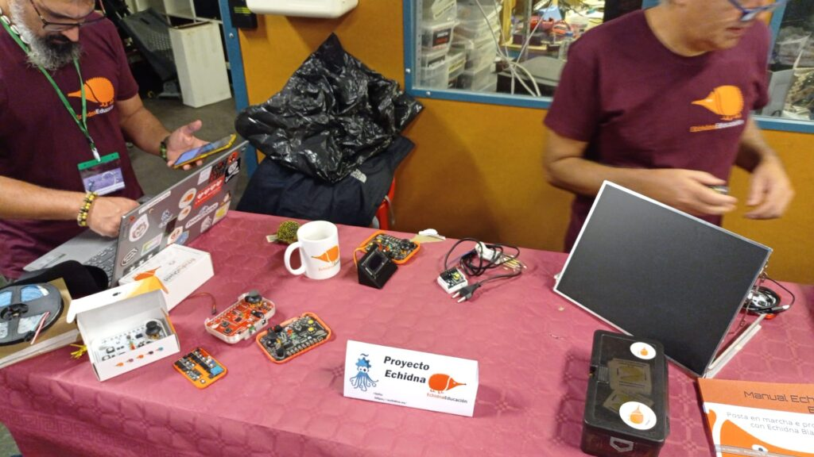
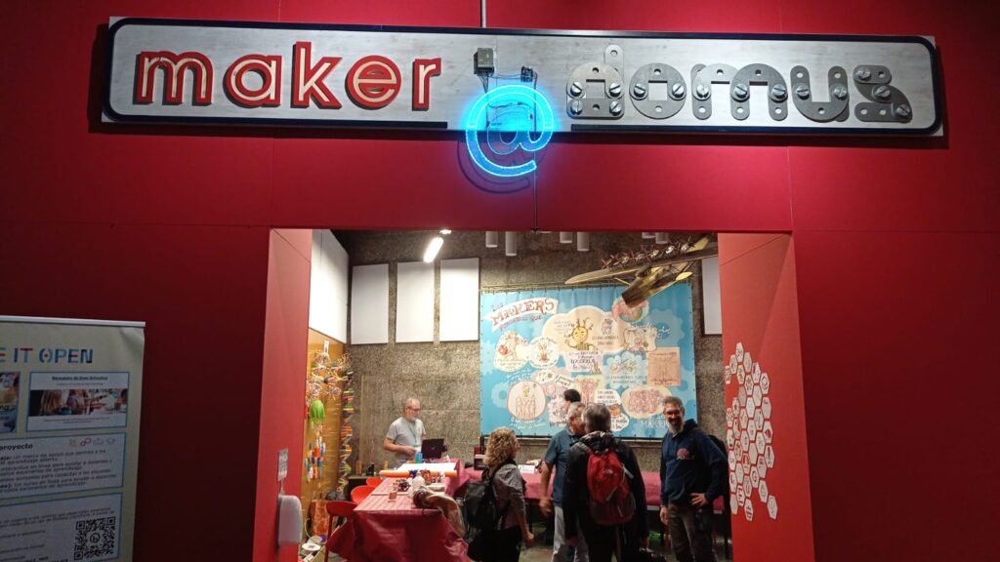
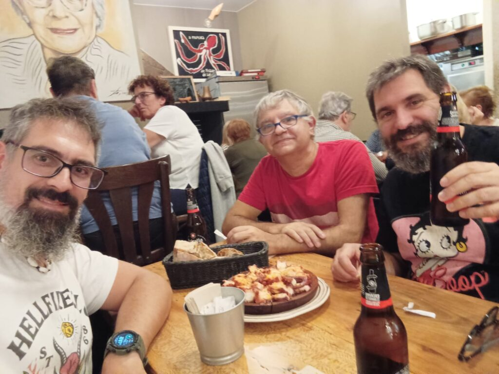

E**n colaboración con el equipo de [Echidna Educación](https://echidna.es/)**, el pasado 12 de octubre participamos de **[OSHWDEM’24](https://oshwdem.org/), la feria de tecnologías abiertas en A Coruña.** Tuvimos la oportunidad de mostrar en un _stand_ las **placas educativas y el _software_** que hemos desarrollado para programarlas, al que hemos llamado **[EchidnaML](https://echidna.es/a-programar/echidnaml/).**

#### Pero, ¿qué es EchidnaML?

Participamos en una charla donde presentamos el _software_ con el que **puedes:**

- hacer programas con Scratch,

- programar las placas Echidna desde Scratch

- y construir modelos de Inteligencia Artificial que se pueden integrar en los programas con [LearningML](https://learningml.org).

Es decir, **una combinación de _hardware_ y _software_ integral** con la que puedes trabajar todos los **aspectos de la programación, la robótica, la Inteligencia Artificial y el Pensamiento Computacional.** La experiencia fue espléndida y los interesados y curiosos que se acercaron al _stand_ quedaron muy satisfechos e incluso sorprendidos.

#### **[OSHWDEM](https://oshwdem.org/)** es la feria que todo maker debería conocer

Se celebró en el colosal [Museo Domus](https://www.coruna.gal/mc2/es/domus), y se organizó en varias partes: las **exposiciones**, los **talleres**, las **charlas**, las **competiciones de robots** (siguelineas,  laberintos, luchadores) y los destornillantes y chiflados artefactos de la competición **Hebocon**. Todos los ingredientes necesarios para el disfrute de los hacedores (_makers_), los fanáticos de la construcción de tecnologías, los que disfrutan más del proceso que del final y, en general, de los espíritus curiosos.

**Un lugar idóneo para hacer nuevos amigos con la excusa de los cacharros que diseñamos y de enriquecernos con nuevas y buenas ideas** que, a lo mejor, con mucho trabajo, ilusión y tesón, terminan convirtiéndose en productos útiles.

Tuvimos la suerte de contar con un día soleado y amable, suficiente para disfrutar del tiempo libre que la feria nos dejó. Y, por supuesto, para saborear hasta la gula los sabrosos encantos culinarios que la ciudad nos ofreció, destacando el pulpo a feira cuyo solo recuerdo me sigue estimulando las glándulas salivales.

En fin, **una feria de tecnologías para construir, no para consumir; para aprender, no para entretener; para humanizar, no para alienar.** Muchas ferias tecnológicas como estas necesitamos para enmendar el nefasto uso que las sociedades están haciendo de la propia tecnología. No se vence al enemigo evitándolo, se vence conociéndolo.
