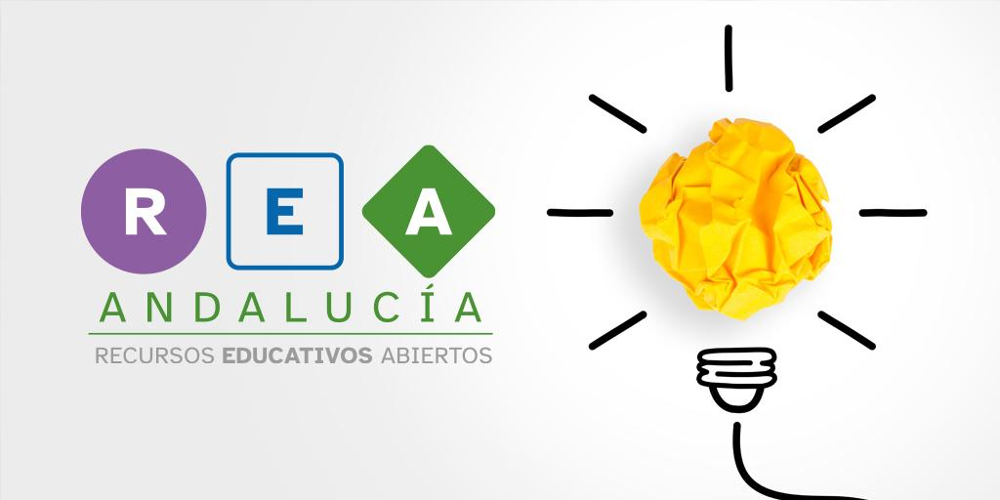

**Un Recurso Educativo Abierto (REA)** **es un material de enseñanza, aprendizaje o investigación que está en dominio público o** se distribuye con una licencia abierta, **permitiendo su uso, adaptación y redistribución de forma gratuita.**

**El Diseño Universal para el Aprendizaje (DUA) es un enfoque educativo** **que busca crear entornos de aprendizaje flexibles y accesibles para todos los estudiantes.** Ofrece múltiples medios de representación, expresión y participación, con el objetivo de atender la diversidad de habilidades, intereses y necesidades de los estudiantes. Además de **promover una educación inclusiva.**

#### Entonces... ¿qué es REA-DUA Andalucía?

Pues estos dos conceptos son los que se han juntado de manera magistral en **[REA-DUA Andalucía](https://www.juntadeandalucia.es/educacion/portals/web/transformacion-digital-educativa/rea)**, **un proyecto** de la Consejería de Educación de la Junta de Andalucía en el que se constituyeron **varios grupos de docentes coordinados** por otros docentes y que, como debe ser, fueron recompensados económicamente por su trabajo.

> _**¡El resultado es alucinante!** Todos los recursos mantienen una misma linea gráfica y responden al mismo modelo pedagógico con base en el **Diseño Universal Para el Aprendizaje**._

- Comienzan con una **tarea motivadora** para "enganchar" al estudiante, continúan con situaciones de activación para evocar sus conocimientos previos.

- Las **actividades de exploración promueven el "aprender pensando"** y con las de reflexión el estudiante sintetiza lo descubierto en la fase anterior.

- **Lo aprendido es transferido a nuevas situaciones** mediante tareas especificas y finalmente se concluye con una **evaluación que pone fin al proceso.**

- Las actividades propuestas se gradúan con el fin de poder **atender a la diversidad** y para que todos alcancen un mínimo suficiente.

#### REA + LearningML

Durante el proyecto se desarrollaron **REAs para los niveles:**

- Primaria (Lengua, Matemáticas, Inglés y Robótica),

- Secundaria (Computación y Robótica, Investigación Aeroespacial, Lengua e Inglés)

- y Bachillerato (Creación Digital y Pensamiento Computacional y Programación y computación).

> **Nos alegra** que **en algunos de los REAs se usa [LearningML](https://learningml.org)** como parte de las actividades que ayudan a trabajar los contenidos de la Situación de Aprendizaje.

Desconocemos la razón por la que este hermoso y útil proyecto no ha tenido la difusión que se merece, después del **enorme esfuerzo invertido y el magnífico resultado obtenido** _(aunque tenemos nuestras sospechas)_.

De cualquier manera, **si eres docente, te recomendamos enormemente que los estudies y te animes a llevarlos a tu aula!!!** Ah! y lo mejor, como están hechos con la herramienta de autor **[Exelearning](https://exelearning.net)** siempre **puedes modificarlos y adaptarlos a tu gusto** para que funcionen mejor con tus estudiantes.

[Aquí puedes descargarte el .pdf del proyecto.](https://edea.juntadeandalucia.es/bancorecursos/file/64bdd7d0-8dac-4344-bfdc-d009ce0e6000/1/REA_Diptico_sin_enlaces.pdf)
