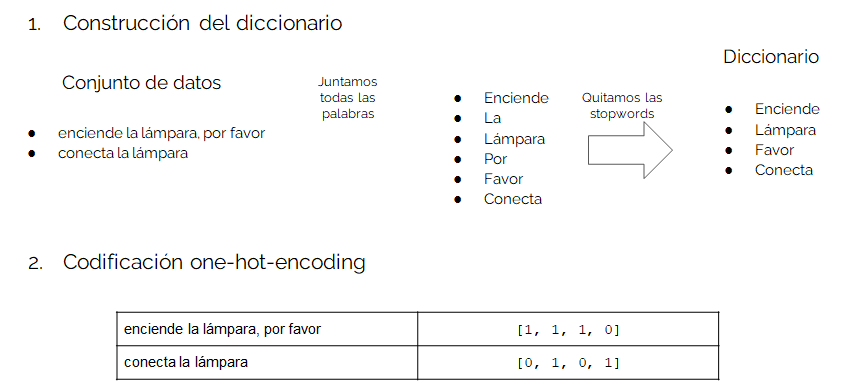
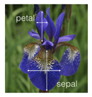
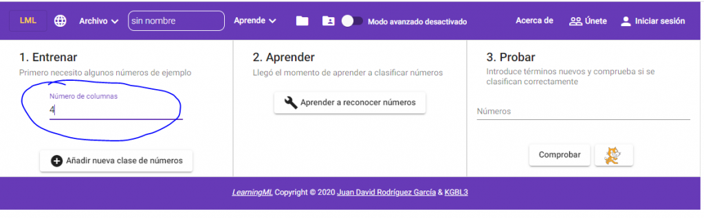
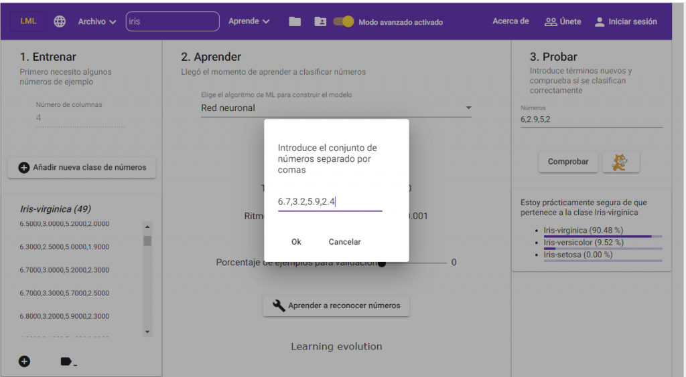
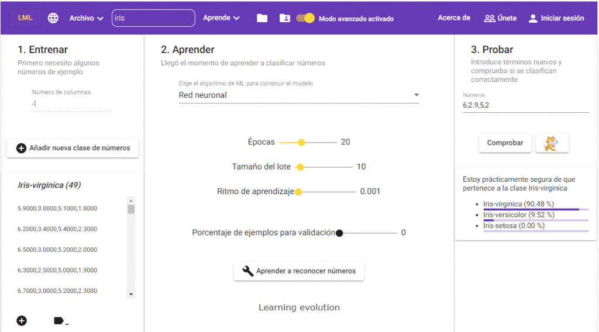
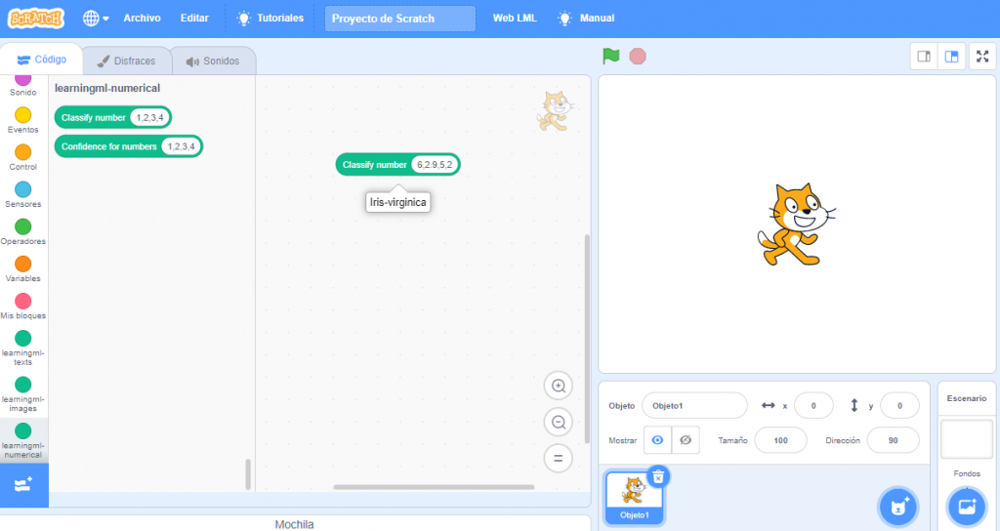

Una de las **funcionalidades** que se añadí en la versión 1.3 de LearningML es el **reconocimiento de conjuntos numéricos.** ¿Y en qué consiste esto de reconocer números? Pues, en honor a la verdad, **reconocer patrones numéricos es lo único que pueden hacer los algoritmos de ML.** De hecho, **cuando trabajamos con imágenes o textos, antes de ser introducidas como entradas del algoritmo, son convertidas (codificadas) a conjuntos numéricos.**

En LearningML, cada imagen de ejemplo es convertida en un conjunto de números (denominado tensor). La imagen se divide en una red de 227x227 cuadraditos (pixeles) y el color de cada uno de estos cuadraditos es codificado como una combinación de rojo (R), verde (G) y azul (B). De ahí que el número total de números necesario para codificar una imagen sea 154587.

#### Con los textos pasa algo parecido

**Se construye un diccionario con todas las palabras de todos los textos** **de ejemplo,** **se eliminan** de ese diccionario **palabras que no aportan mucho a la semántica** de la frase (_stopwords_) **y se usa la presencia o ausencia de los términos del diccionario en cada texto para codificarlo.**

Total, que en realidad, lo que los algoritmos de Machine Learning requieren son conjuntos numéricos. Sin embargo, hasta la versión 1.3, no teníamos la posibilidad de introducir directamente estos conjuntos numéricos en LearningML. Y esto resulta muy útil pues, **en muchas ocasiones, los conjuntos de datos que tenemos son, simplemente, conjuntos de datos organizados tabularmente,** como en una hoja de cálculo, en el que cada fila de números representa un ejemplar.

**Uno de los conjuntos numéricos más característicos y conocidos en el mundo de la estadística y el Machine Learning es el _[iris dataset](https://es.wikipedia.org/wiki/Conjunto_de_datos_flor_iris)._** Se trata de 150 ejemplares de flores Iris clasificadas en tres especies: _Iris Setosa, Iris Virgínica e Iris Versicolor_.  Cada ejemplar se ha caracterizado usando 4 rasgos típicos de las flores: la longitud del sépalo, la anchura del sépalo, la longitud del pétalo y la anchura del pétalo.

#### Reproducimos aquí 6 de los 150 ejemplares del conjunto:

<figure>

<figcaption>

Caracterización de un ejemplar mediante la medida de las longitudes y anchuras de sus pétalos y sépalos

</figcaption>

</figure>

<figure>

| Ejemplar | Representación numérica del ejemplar | Representación numérica de la clase |
| --- | --- | --- |
| 1 | \[5.1, 3.5, 1.4, 0.2\] | Iris Virginica |
| 2 | \[4.9, 3.0 , 1.4, 0.2\] | Iris Virginica |
| 3 | \[5.5, 4.2, 1.4, 0.2\] | Iris Versicolor |
| 4 | \[4.9, 3.1, 1.5, 0.2\] | Iris Versicolor |
| 5 | \[6.2, 3.4, 5.4, 2.3\] | Iris Setosa |
| 6 | \[5.9, 3.0 , 5.1, 1.8, 2\] | Iris Setosa |

<figcaption>

6 ejemplos de los datos del iris dataset

</figcaption>

</figure>

Puedes descargarte el conjunto completo en formato _CSV_ o en el formato _JSON_ de LearningML (listo para ser cargado en la herramienta) desde los siguientes enlaces:

| [Iris dataset CSV](http://archive.ics.uci.edu/ml/datasets/Iris) | [Iris dataset (JSON)](https://learningml.org/editor/iris.json) |
| --- | --- |

#### Vamos a construir con LearningML, un modelo de ML con estos datos

El procedimiento es el mismo de siempre:

1. Introducir los datos de ejemplo (entrenar).

3. Construir el modelo a partir de los datos de ejemplo (aprender).

5. Evaluar el modelo (probar).

**La única diferencia es que en este caso hacemos _clic_ en el botón _“Reconocer números”_ de la pantalla de inicio.**

En el caso de los conjuntos de números, **antes de comenzar a introducir datos hay que indicar el número de atributos del conjunto de datos que deseamos procesar.** Este valor, por defecto es 2, pero podemos cambiarlo usando la caja de texto “_Número de columnas_”. En el ejemplo que nos traemos entre mano dicho número es 4.

Ahora creamos las tres clases del problema: _Iris Setosa, Iris Versicolo_r e _Iris Virginica,_ y añadimos los datos numéricos correspondientes a cada clase. La manera de hacerlo es **separando los números mediante comas (“,”)**, como se ve en la siguiente imagen.

Una vez que tenemos los datos de ejemplo, **procedemos a construir el modelo de ML haciendo _clic_ en “_Aprender a reconocer números_”.**

#### Llega el momento de "las pruebas"

Y, una vez finalizado el proceso de aprendizaje, **hacemos algunas pruebas** para ver si el modelo nos convence. De nuevo, la manera de introducir los números es separarlos mediante comas.

Por último, y al igual que con los otros tipos de datos (textos e imágenes), **podemos construir un programa con Scratch que use el modelo construido para reconocer nuevos conjuntos numéricos que codifiquen nuevos ejemplares** (de flores iris en este modelo).

**La creación de modelos de reconocimiento de números abre nuevas posibilidades para el diseño de actividades de programación de aplicaciones con IA,** y ayudará a trabajar los conceptos de ciencia de datos, _big data_ e incluso _IOT_ (internet de las cosas). **Pues, usando sensores podemos recoger datos sobre distintos fenómenos, clasificarlos, crear un modelo y usarlo para predecir o clasificar nuevos datos recogidos con esos mismos sensores.**

De esta manera, **conectamos** aún más íntimamente, **las actividades de IA con las de robótica educativa.** [EchidnaSTEM](https://echidna.es/) y _[micro:bit](bit)_ son dos placas para la robótica educativas con las que puedes diseñar alguna actividad de este tipo. **¿Te animas a plantear alguna?**
