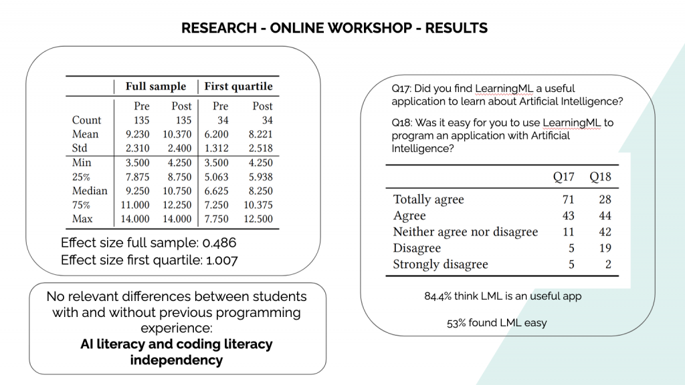

Hace un tiempo os contábamos que habíamos diseñado y realizado una [**investigación _online_**](https://web.learningml.org/investigacion-sobre-learningml/) con el fin de comprobar:

- si LearningML es una **herramienta** con la que los usuarios **aprenden contenidos sobre IA** y

- si LearningML es una **herramienta atractiva y fácil de usar.**

Pues bien, a finales de agosto de 2020, finalizamos nuestra investigación, analizamos los datos obtenidos y elaboramos un **artículo** que **presentamos a [SIGCSE '21](http://sigcse2021.sigcse.org/).** ¡Y nos lo han aceptado!

¡Estamos muy contentos con esta publicación! No solo aporta **evidencias sobre la validez instruccional** y aparente de la herramienta, además será **publicada en los _proceedings_** **de** "un congreso con mucha solera", el **[SIGCSE Technical Symposium](https://sigcse.org/sigcse/).** Se lleva celebrando desde el año 1970 y es uno de los referentes en el mundo del _[computing education research](https://gist.github.com/amyjko/689837b8eefccb3a8a28ff0aa5300615)._

A modo de **resumen:**

- encontramos una **mejora** significativa **en la puntuación del test sobre IA** que hemos usado en la investigación,

- la **opinión de los estudiantes** es que LearningML es una herramienta **fácil de usar, apropiada para aprender contenidos sobre IA,**

- **los estudiantes cambian la percepción que tienen sobre el concepto de IA**. Después de usar LearningML, pasan de descripciones relacionadas con "robots" a descripciones relacionadas con _"_solución de problemas"**.** Es decir, se pasa **de la visión idealizada**, que los medios ofrecen sobre IA, **a una visión más real** sobre lo que es realmente la IA.

Si quieres saber más **puedes descargar la versión preliminar (preprint) del [artículo](https://www.researchgate.net/publication/344744220_Evaluation_of_an_Online_Intervention_to_Teach_Artificial_Intelligence_With_LearningML_to_10-16-Year-Old_Students#fullTextFileContent)** y leer todos los detalles.

De nuevo quiero aprovechar para **agradecer a todos** los profesores, padres y madres que han participado con sus estudiantes e hijos y que han hecho posible la realización de este trabajo.
