[https://1drv.ms/p/c/e489072cc5443527/EQmnjGxeKpVBrOuRiQkq5P4BemHwrinm25arDpKPHOHD-w?e=H0fNDb](https://1drv.ms/p/c/e489072cc5443527/EQmnjGxeKpVBrOuRiQkq5P4BemHwrinm25arDpKPHOHD-w?e=H0fNDb)

### Práctica 1. El imitador

Esta práctica nos servirá para introducir la herramienta LearningML con un ejemplo muy fácil y rápido de realizar. Se trata de la construcción de un modelo de Machine Learning de reconocimiento de nuestra cara con gafas, desnuda o con un gorro. Si no dispones de gafas o gorro puedes usar gestos de tu cara cómo "sonriente" o "triste", o también algunos gestos como "mano en boca", " ojo guiñado" o cualquier otro que se te ocurra.

Una vez que tengamos el modelo de Machine Learning funcionando correctamente veremos como se puede incorporar en una aplicación informática escrita con Scratch. En esta aplicación el gatito de Scratch imitará el gesto que nosotros hagamos: ponerse el sombrero, las gafas, ponerse alegre, triste, ...

El mismo ejemplo que Juanda mostrará en el taller lo podéis ver también en este video:

<figure>

https://youtu.be/4CmsigSmS70

<figcaption>

Tutorial: construcción de modelos para el reconocimiento de imágenes

</figcaption>

</figure>

Si quieres seguir explorando la plataforma te recomendamos los siguientes recursos:

<figure>

| [Primeros pasos con Scratch](https://web.learningml.org/programamos-con-scratch/) | Si aún no sabes lo que es Scratch o no lo conoces suficientemente. |
| --- | --- |
| [Flípalo en colores con LearningML](https://web.learningml.org/flipalo-en-colores-con-learningml/) | Un ejemplo de modelo para reconocer colores con un divertido programa en Scratch. |
| [Programando con Ciro 1ª parte](https://web.learningml.org/programando-con-ciro-reconocimiento-facial-1a-parte/)   [Programando con Ciro 2ª parte](https://web.learningml.org/programando-con-ciro-reconocimiento-facial-2a-parte/) | Ciro Rodríguez, con 10 años, nos explica un ejemplo programación de reconocimiento facial. |
| [Programando con Jara 1ª parte](https://web.learningml.org/programando-con-jara-estilos-pictoricos-1o-parte/)   [Programando con Jara 2ª parte](https://web.learningml.org/programando-con-jara-estilos-pictoricos-2o-parte/) | Jara Rodríguez, con 13 años, construye un modelo y una aplicación informática capaz de reconocer distintos estilos pictóricos |
| [Concurso de conocimientos sobre la prehistoria](https://web.learningml.org/el-concurso-de-la-prehistoria/) | Una aplicación que usa un modelo de Machine Learning de reconicimiento de textos para implementar un concurso de conocimiento sobre las edades de la prehistoria. |
| [Reconocimiento de sonidos](https://web.learningml.org/construimos-un-modelo-de-reconocimiento-de-sonido/) | Cómo construir un modelo de Machine Learning para el reconocimiento de sonidos. |

<figcaption>

Recursos para aprender LearningML

</figcaption>

</figure>

### Práctica 2. Enseñamos a la computadora a reconocer problemas sencillos de sumas y restas.

##### Recursos:

| [Enunciados de problemas de matemáticos sencillos](https://web.learningml.org/wp-content/uploads/2025/05/problemas-matematicos-sencillos-1.zip) |
| --- |
| [Recurso Educativo Abierto (REA) para el desarrollo de la situación de aprendizaje en el aula](https://procomun.intef.es/ode/view/1676257202053) |

Esta práctica está basada en el artículo del docente Álvaro Molina Ayuso (@molinaayuso) _["Introducción a la Inteligencia Artificial desde el aula de Matemáticas", revista epsilon, 2023, nº 114, 99-111](https://www.saemthales.es/epsilon/sites/default/files/2023-09/epsilon114_06.pdf)_.

En ese artículo Álvaro desarrolla una actividad para la asignatura de Matemáticas de 1º de ESO en la que desarrolla la competencia específica 3: _Formular y comprobar conjeturas sencillas o plantear problemas de forma autónoma, reconociendo el valor del razonamiento y la argumentación, para generar nuevo conocimiento (Ministerio de Educación y Formación Profesional, 2022_), la cual se puede concretar a través del criterio de evaluación 3.3: _emplear herramientas tecnológicas adecuadas en la investigación comprobación de conjeturas o problemas_. El desarrollo de la actividad se realiza a través de una serie de fases a partir de una propuesta pedagógico-didáctica basada en el aprendizaje experiencial, la instrucción directa y la reflexión cognitiva + modelo Aula del Futuro.

En el artículo Álvaro usa LearningML como parte del proceso, y justifica con rigor cómo la elaboración de un modelo de Machine Learning capaz de reconocer tipos de problemas sencillos de sumas y restas con LearningML permite desarrollar la alfabetización en IA

- Algoritmos,

- Programación informática,

- Resolución de problemas contextualizados,

- Alfabetización en datos,

- Técnicas de IA y

- Implicaciones sociales de la IA

Una de las ideas más potentes, en relación al uso de LearningML, es que el estudiante, en el proceso de enseñar a la computadora a clasificar tipos de cosas para construir el modelo de Machine Learning, aprende, él mismo, sobre el tema que esté tratando de resolver. Gran parte de los contenidos que se imparten en la escuela, en cualquier área del conocimiento, tienen que ver con clasificaciones. Por tanto, la construcción de modelos de Machine Learning por parte de los estudiantes se revela como una eficaz tarea para el aprendizaje de la asignatura en cuestión, más allá de los conocimientos sobre IA que se puedan alcanzar.

### Práctica 3. Reglas vs datos: dos estrategias para resolver problemas

##### Recursos

| [Conjunto de puntos en 2D en todos los cuadrantes del plano](https://web.learningml.org/wp-content/uploads/2025/05/cuadrantes.zip) |
| --- |

Esta práctica está basada en la actividad _["Propuesta didáctica: Inteligencia artificial con LearningML. Modelo numérico. Matemáticas; puntos, coordenadas y cuadrantes"](https://matematicas11235813.luismiglesias.es/2022/06/19/propuesta-didactica-inteligencia-artificial-con-learningml-modelo-numerico-matematicas-puntos-coordenadas-y-cuadrantes/)_ del docente [Luis Miguel Iglesias](https://luismiglesias.es/).

En esta actividad Luis Miguel, mediante el problema de asignar un punto del plano al cuadrante que pertenece, muestra como el Machine Learning permite resolver problemas matemáticos sin utilizar reglas explícitas, es decir sin programar la computadora explicitamente. En su lugar, las técnicas de Machine Learning usan conjuntos de soluciones de ejemplo a partir de las cuales el ordenador "aprende" a resolver el problema, analizando patrones y estableciendo relaciones entre dichas soluciones y el problema. Esta es **la esencia del Machine Learning: aprender a resolver problemas a partir de soluciones existentes que se usan como ejemplos**.

Normalmente recurrimos al _Machine Learning_ cuando, aunque resulte muy difícil —o incluso imposible— definir un conjunto de reglas que resuelva un problema, sí disponemos de muchos ejemplos de soluciones. En el caso que vamos a plantear, el problema **puede resolverse fácilmente mediante reglas**, pero lo utilizaremos para mostrar cómo el _Machine Learning_ también puede ofrecer una solución correcta **sin necesidad de conocer esas reglas previamente**. Así, el estudiante podrá comprender mejor la diferencia entre las estrategias **basadas en reglas** (deductivas) y las **basadas en datos** (inductivas)

A lo largo de la historia de la Inteligencia Artificial se han usado ambas aproximaciones. En los albores de la IA las soluciones deductivas tuvieron más exitos. A este acercamiento se le denominó **TOP- DOWN**. Actualmente, los mayores éxitos de la IA, incluyendo las IAs generativas como chatGPT, se están produciendo con estrategias basadas en datos, denominadas **BOTTON-UP**.

#### Solución basada en reglas

```
Introduce un punto del plano (X, Y)
Lee la cordenada X y la coordenada Y del punto
Si X > 0 y Y > 0 el punto pertenece al cuadrante I
Si X > 0 y Y < 0 el punto pertenece al cuadrante II
Si X < 0 y Y < 0 el punto pertenece al cuadrante III
Si X < 0 y Y > 0 el punto pertenece al cuadrante IV
```

#### Solución basada en datos

En efecto, la solución deductiva, basada en reglas, es muy sencilla. Pero, ¿podrá un algoritmo de Machine Learning "inducir" las reglas del problema a partir de un conjunto de soluciones del mismo? Es decir, ¿podemos construir un modelo de Machine Learning capaz de asignar a qué cuadrante pertenecen puntos del planos distintos a los usados en el conjunto de soluciones de ejemplo? En este video el propio Luis Miguel muestra la solución con LearningML.

https://youtu.be/1D8konHIjbI

### Práctica 4. Reconocimiento de figuras simples

##### Recursos

| [Conjunto de imágenes de figuras geométricas](https://web.learningml.org/wp-content/uploads/2025/05/figuras-geometricas.zip) |
| --- |

Una actividad muy sencilla que puede realizarse con estudiantes de primaria es el reconocimiento de figuras geométricas simples: triángulos, cuadrados, pentágonos, etcétera. Basta con buscar muchas imágenes de cada una de las figuras y clasificarlas con LearningML, construir el modelo y comenzar a usarlo. Para probarlo se pueden usar imágenes de objetos (edificios, cajas, instrumentos musicales) para comprobar si el modelo construido es capaz de extraer la forma geométrica más similar al objeto en cuestión.

### Práctica 5. Medimos la calidad del modelo con la _matrix de confusión_

##### Recursos

| [Conjunto de imágenes de cuadros de distintos estilos](https://web.learningml.org/wp-content/uploads/2025/05/estilos-pictoricos.zip) |
| --- |

En el modo avanzado de LearningML podemos obtener una estimación de lo bueno que es el modelo que hemos elaborado mediante el algoritmo de Machine Learning. Para ello seleccionamos un porcentaje de datos que se usarán para probar el modelo, es decir, esos datos **NO** se usarán durante el entrenamiento, por lo que serán **nuevos** para el modelo.

Una vez generado el modelo estos ejemplos elegidos para evaluar serán usados para construir la matriz de confusión en la que cada fila representa las clases reales (que conocemos, pues forman parte del conjunto de datos de ejemplo) y cada columna, las predicciones del modelo (que las calculamos simplemente pasando como entradas los ejemplos seleccionados para la evaluación).

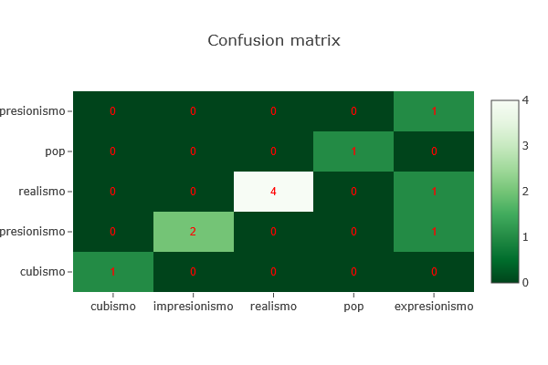

En esta imagen, el modelo intenta clasificar obras de arte en cinco estilos: **cubismo, impresionismo, realismo, pop y expresionismo**.

- Los valores en **la diagonal** (de arriba a la izquierda hacia abajo a la derecha) indican las **predicciones correctas**. Por ejemplo, el modelo ha clasificado correctamente 4 obras de realismo y 2 de impresionismo.

- Los valores **fuera de la diagonal** muestran los **errores**. Por ejemplo, una obra de cubismo fue clasificada erróneamente como impresionismo, y una de expresionismo fue clasificada como cubismo.

Una buena matriz de confusión debería tener la mayoría de los valores en la diagonal principal. Este tipo de visualización ayuda a detectar en qué clases el modelo se confunde más y es muy útil para seguir mejorando su rendimiento.

### Práctica 6. Perros, gatos y sesgos

##### Recursos

| [Un conjunto de imágenes de perros y gatos](https://web.learningml.org/wp-content/uploads/2025/05/perros-y-gatos.zip) |
| --- |

En esta actividad vamos a trabajar con LearningML el problema del sesgo. Crea dos clases llamada _perro_ y _gato_. En la primera añade las imágenes de la carpeta `dogs/train`, y en la segunda las de la carpeta `cats/train`. Entonces construye el modelo y pruébalo con las imágenes de las carpetas `dogs/test` y `cats/test`. Comprobarás que funciona bastante bien salvo en el caso de un gato negro que hay en la carpeta `cats/test`. Para ese ejemplo el modelo no da una confianza muy grande. Incluso puede que determine que es un perro con más probabilidad que un gato.

¿Qué ha ocurrido? En el conjunto de perros los hay de todos los colores, incluido el negro. Sin embargo no hay ejemplares negros en el conjunto de gatos. Por ello, cuando mostramos la imagen de un gato negro el modelo no es capaz de determinar con confianza el resultado, pues aunque tenga características de gato, no ha visto en su entrenamiento ningún gato que sea negro, mientras que sí ha visto perros negros. La causa de este error es el sesgo de los datos con respecto al color negro. Para reducir el problema debemos añadir imágenes de gatos negros. Puede hacerlo usando la carpeta `cats/retrain`. Verás como el modelo comienza a funcionar mucho mejor despues de reentrenarlo con estas nuevas imágenes.

### Práctica 7. Explicación de algoritmos sencillos de ML en 2D

##### Recursos

| [Tensorflow playground](https://playground.tensorflow.org/#activation=tanh&batchSize=10&dataset=circle&regDataset=reg-plane&learningRate=0.03&regularizationRate=0&noise=0&networkShape=4,2&seed=0.30972&showTestData=false&discretize=false&percTrainData=50&x=true&y=true&xTimesY=false&xSquared=false&ySquared=false&cosX=false&sinX=false&cosY=false&sinY=false&collectStats=false&problem=classification&initZero=false&hideText=false) | Una aplicación con la que puedes diseñar redes neuronales de tipo feedfoward, ajustando el nº de capas ocultas y los hiperparámetros de entrenamiento y visualizar el proceso de entrenamiento con conjuntos de datos bidimensionales que son representados gráficamente para mejorar su comprensión. |
| --- | --- |
| [Machine Learning playground](https://ml-playground.com/) | Otra magnífica aplicación para explorar los fundamentos de los algoritmos de Machine Learning más conocidos (KNN, Naïves Bayes, decision trees, ...). El usuario construye un conjunto de datos 2D pertenecientes a dos clases, elige el algoritmo a usar, lo entrena y la aplicación visualiza la frontera de decisión que el algoritmo ha construido. |

Se entiende por Machine Learning a un conjunto de técnicas matemáticas y computacionales que se basan en el análisis estadísticos de multitud de datos para ofrecer soluciones a problemas complejos. Los algoritmos y otras técnicas que se usan para construir modelos de IA basados en datos pueden alcanzar una complejidad muy alta, por lo que quedan fuera del ámbito de la enseñanza no universitaria.

Sin embargo, y aunque pueda parecer sorprendente, los fundamentos de alguno de esos algoritmos y técnicas son realmente sencillos. Especialmente cuando para estudiarlos se utilizan puntos del plano (2D). Y este hecho ofrece una gran oportunidad en el área de matemáticas para mostrar la utilidad que tienen muchos de los contenidos en el diseño de algoritmos de ML.

En esta práctica vamos a explicar dos algoritmos clásicos del ML que han cosechado importantes éxitos y que, en lo más básico, pueden ser explicados desde primer ciclo de la ESO e, incluso en el último de primaria. Los algoritmos que explicaremos son:

- Máquina de soporte vectoriales

- Los N vecinos más próximos, conocido como KNN (K- Nearest Neighbors)

Si deseas ampliar esta lista puedes añadir:

- Naïve Bayes

- Random decision trees

También son fáciles de explicar, aunque, en mi opinión, son más aptos para el segundo ciclo de ESO o, incluso, bachillerato.

#### Extracción de características

Lo primero que conviene tener claro es que, sea cual sea el algoritmo de _Machine Learning_, **los datos de entrada son conjuntos de números** que pueden representarse mediante un **tensor**, una estructura matemática que generaliza los conceptos de vector y matriz a más dimensiones.

En el caso más sencillo, cada ejemplo (o instancia) del conjunto de datos se describe mediante un vector con M componentes, correspondientes a las distintas características o variables que definen el problema. Si tenemos N ejemplos, el conjunto completo puede representarse como una **matriz de tamaño N×M**. Es decir:

- Cada fila representa un ejemplo distinto.

- Cada columna corresponde a una característica.

Por tanto, en este caso, los datos forman un tensor de dimensión 2, o simplemente una matriz.

Sin embargo, hay situaciones en las que cada ejemplo no es un vector, sino una estructura más compleja. Por ejemplo, en el procesamiento de imágenes, cada ejemplo puede ser una matriz (una imagen en blanco y negro) o incluso un bloque tridimensional (una imagen en color con canales rojo, verde y azul). En estos casos, los datos se organizan como **tensores de dimensión 3 o más**. Un ejemplo típico sería un tensor de forma \[N,H,W,C\], donde:

- N: número de ejemplos (imágenes),

- H: altura de la imagen (en píxeles),

- W: anchura de la imagen (en píxeles),

- C: número de canales (por ejemplo, 3 en imágenes RGB).

En todos los casos, **la primera dimensión del tensor siempre representa el número de ejemplos** del conjunto de datos. Esta estructura es la base sobre la que operan los algoritmos de aprendizaje automático, que aprenden a partir de patrones presentes en este tipo de representaciones numéricas.

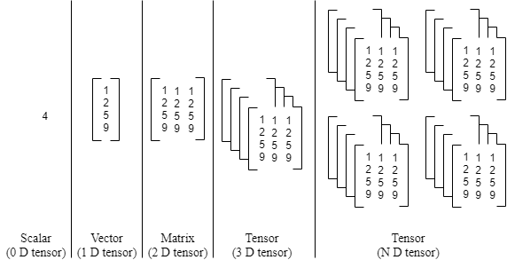

Sin embargo, es frecuente que los problemas que tratamos con Machine Learning, como el reconocimiento y/o generación de textos o imágenes no sean números. Por tanto lo primero que se necesita es un procedimiento que codifique el objeto (texto, imagen, ...) a un tensor (conjunto de números). Este procedimiento se conoce en la terminología del Machine Learning como **extracción de características** (features extraction), y es de especial relevancia para obtener los mejores resultados con los algoritmos de ML.

Veamos algunos ejemplos de codificación.

##### Pingüinos antárticos

Tan fácil como medir la anchura y altura del pico.

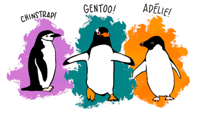


##### Flores Iris

Tan fácil como medir las anchuras y alturas del sépalo y pétalo. Como curiosidad, el [conjunto de datos iris](https://en.wikipedia.org/wiki/Iris_flower_data_set) es un clásico de la estadística y el Machine Learning.

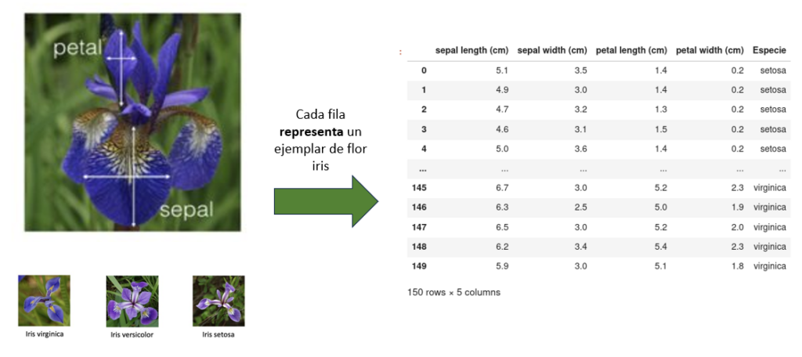

##### Codificación automática de imágenes con \[aspecto, relleno\]

En aplicaciones de ML, la codificación se debe realizar de manera automática. El aspecto y el relleno son dos cantidades que se pueden usar cuando las imagenes de nuestro problema se pueden siluetear.


##### Codificación de textos sencilla: one hot encoding

Aunque no es la codificación de texto más eficaz para los algoritmos de Machine Learning, por su sencillez, es perfecta para explicarla a nuestros estudiantes.

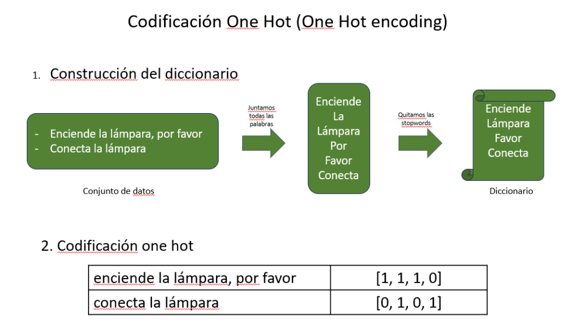

##### Codificación de imágenes a color con embedding

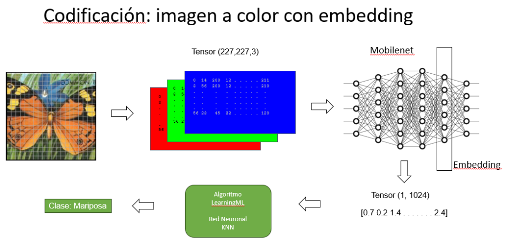

#### Algoritmos de Machine Learning

Cualquier algoritmo de ML, como acabamos de ver, requiere como entrada un conjunto de vectores (o tensores). En el caso más sencillo, la entrada sería un conjunto de vectores de dimensión 2. Cada vector representa a un ejemplo del conjunto de datos. Tomando el caso especial y extremadamente sencillo de objetos que pueden representarse con vectores de dos dimensiones, se pueden explicar algunos algoritmos que han tenido mucho éxito en el mundo del Machine Learning.

##### Máquina de soportes vectoriales

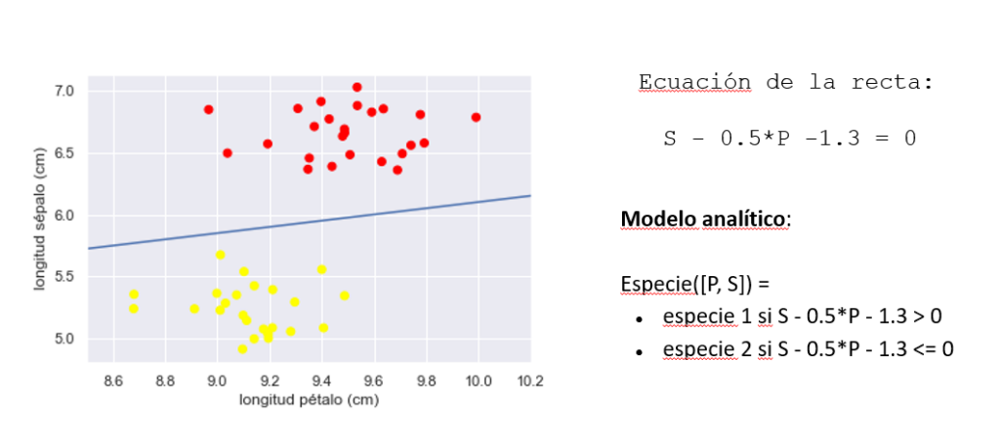


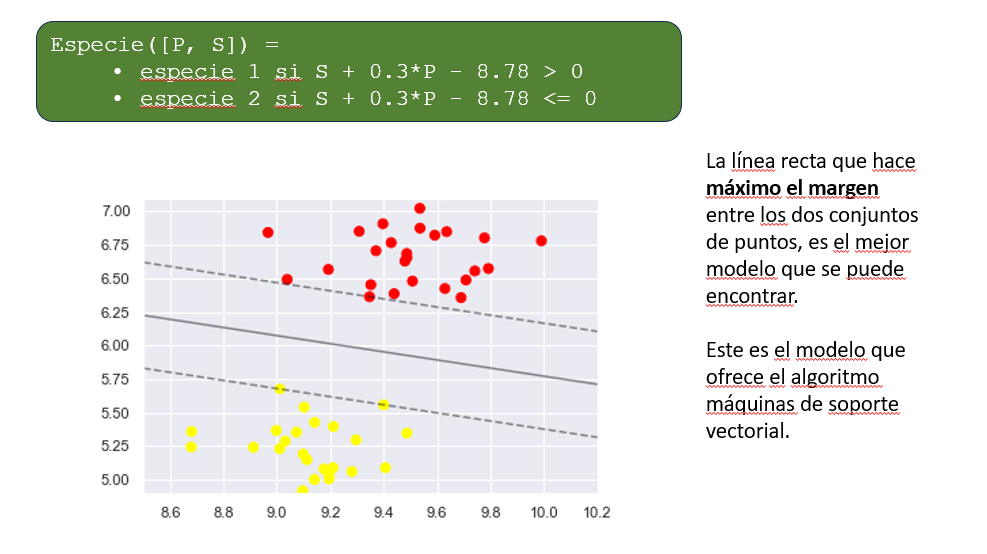

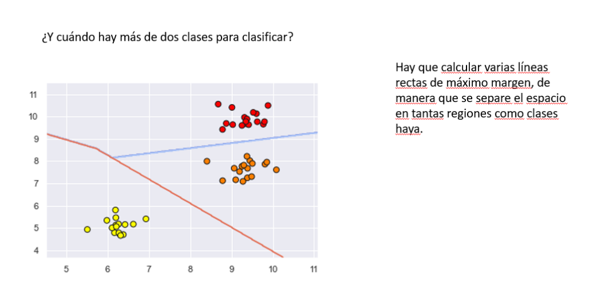

##### K vecinos más próximos (KNN)

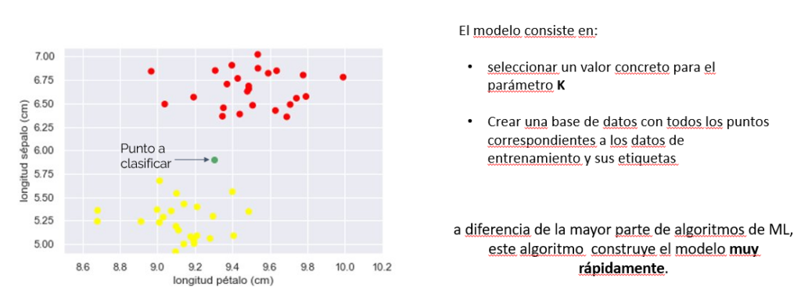

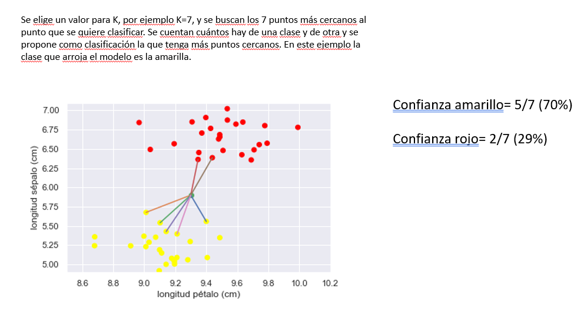

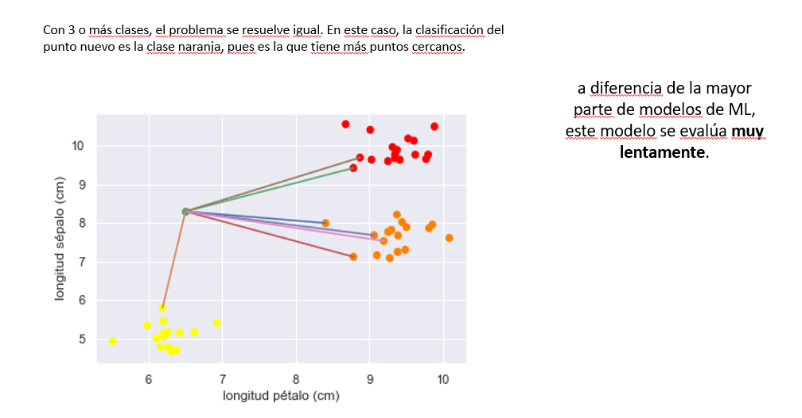

##### Redes neuronales

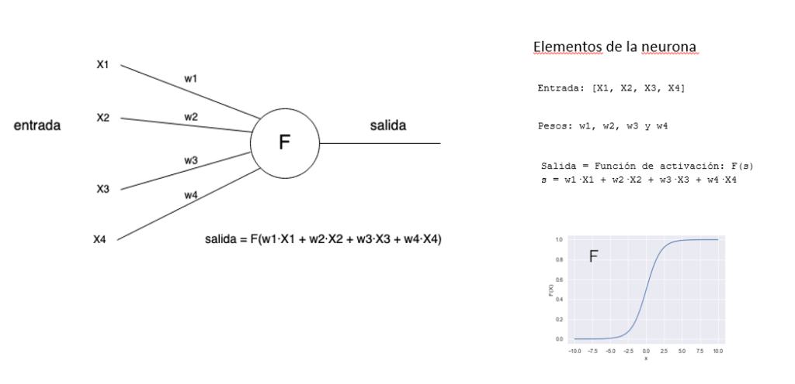

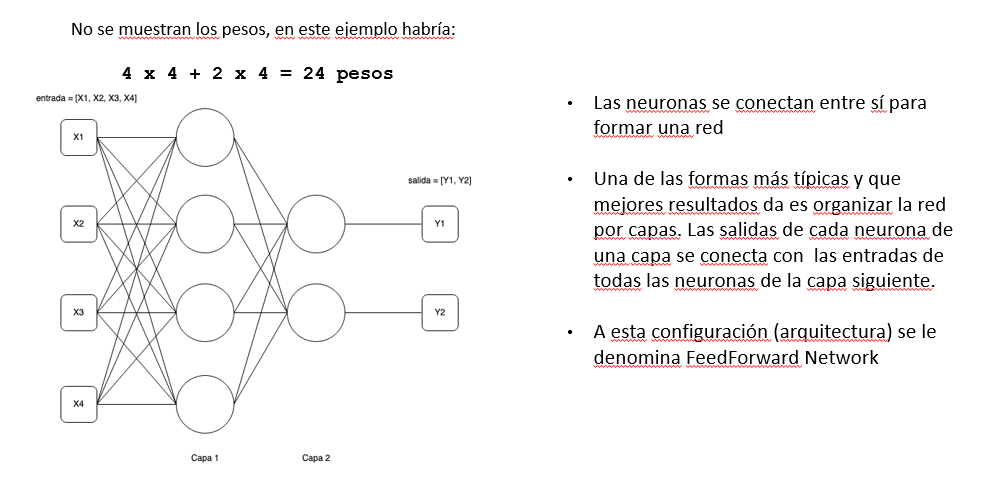

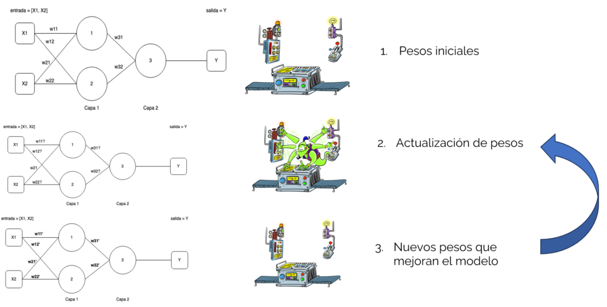

**Entrenamiento de una red neuronal con backpropagation**

El algoritmo de _backpropagation_ ajusta los **pesos** de la red para minimizar el error entre la salida esperada y la salida obtenida. Esto se logra a través de los siguientes pasos:

1. **Función de pérdida**: mide cuánto se equivoca la red (por ejemplo, error cuadrático medio).

3. **Precisión**: indica qué tan bien acierta la red al hacer predicciones, suele expresarse como porcentaje.

5. **Épocas**: una época es un ciclo completo en el que el modelo ve todos los datos de entrenamiento una vez.

7. **Learning rate** (tasa de aprendizaje): controla qué tan grandes son los ajustes de los pesos en cada paso.

9. **Tamaño del batch**: es la cantidad de ejemplos que se procesan antes de actualizar los pesos.

Durante cada época, la red ajusta sus pesos usando el gradiente de la función de pérdida, mejorando paso a paso su capacidad para predecir correctamente.

#### Explorando KNN y redes neuronales con el modo avanzado de LearningML

Cuando se usa el modo avanzado de LearningML, en la fase de aprendizaje, se puede optar por usar dos algoritmos de ML distintos: KNN o Red neuronal. En ambos casos se pueden ajustar los parámetros típicos del algoritmos, llamados hiperparámetros. El resultado del modelo depende en gran parte del valor de estos parámetros. Construyendo varios modelos con los mismos datos pero distintos hiperparámetros podemos estudiar cómo afectan a la calidad del resultado.

## FAIAS. Result 3. Actividades de matemáticas

[https://fosteringai.github.io/project/result3/](https://fosteringai.github.io/project/result3/)

### Bachillerato:

1. [https://gsyc.urjc.es/grex/faias/CURSO\_CAM\_TRABAJOS/Bachillerato/Matem%e1ticas/Documentos/FAIaS\_C%f3nicas\_Jos%e9RemirodelCaz.pdf](https://gsyc.urjc.es/grex/faias/CURSO_CAM_TRABAJOS/Bachillerato/Matem%e1ticas/Documentos/FAIaS_C%f3nicas_Jos%e9RemirodelCaz.pdf)

3. [https://gsyc.urjc.es/grex/faias/CURSO\_CAM\_TRABAJOS/Bachillerato/Matem%e1ticas/Documentos/FAIaS\_Modelo%20de%20IA%20para%20clasificaci%f3n%20de%20funciones\_JoseMiguelSancho.pdf](https://gsyc.urjc.es/grex/faias/CURSO_CAM_TRABAJOS/Bachillerato/Matem%e1ticas/Documentos/FAIaS_Modelo%20de%20IA%20para%20clasificaci%f3n%20de%20funciones_JoseMiguelSancho.pdf)

### ESO:

1. Poliedros y cuerpos de revolución: [https://gsyc.urjc.es/grex/faias/CURSO\_CAM\_TRABAJOS/ESO/Matem%e1ticas/Documentos/FAIaS\_Aprendiendo%20Poliedros%20y%20Cuerpos%20de%20Revoluci%f3n%20con%20IA\_Mar%edaJos%e9Rodr%edguezRubiales.pdf](https://gsyc.urjc.es/grex/faias/CURSO_CAM_TRABAJOS/ESO/Matem%e1ticas/Documentos/FAIaS_Aprendiendo%20Poliedros%20y%20Cuerpos%20de%20Revoluci%f3n%20con%20IA_Mar%edaJos%e9Rodr%edguezRubiales.pdf)

3. Ecuaciones de un vistazo: [https://gsyc.urjc.es/grex/faias/CURSO\_CAM\_TRABAJOS/ESO/Matem%e1ticas/Documentos/FAIaS\_Ecuaciones%20de%20un%20vistazo\_Juli%e1nCegarra.pdf](https://gsyc.urjc.es/grex/faias/CURSO_CAM_TRABAJOS/ESO/Matem%e1ticas/Documentos/FAIaS_Ecuaciones%20de%20un%20vistazo_Juli%e1nCegarra.pdf)

### Primaria:

1. Reconociendo cuadriláteros: [https://gsyc.urjc.es/grex/faias/CURSO\_CAM\_TRABAJOS/Educaci%f3n%20Primaria/Matem%e1ticas/Documentos/FAIaS\_Cuadril%e1teros%20la%20IA%20nos%20ayuda%20en%20su%20reconocimiento\_Joaqu%ednSalasPalomo.pdf](https://gsyc.urjc.es/grex/faias/CURSO_CAM_TRABAJOS/Educaci%f3n%20Primaria/Matem%e1ticas/Documentos/FAIaS_Cuadril%e1teros%20la%20IA%20nos%20ayuda%20en%20su%20reconocimiento_Joaqu%ednSalasPalomo.pdf)
