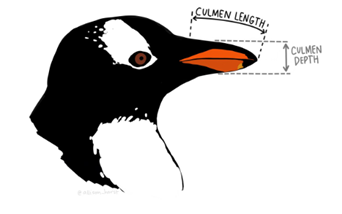
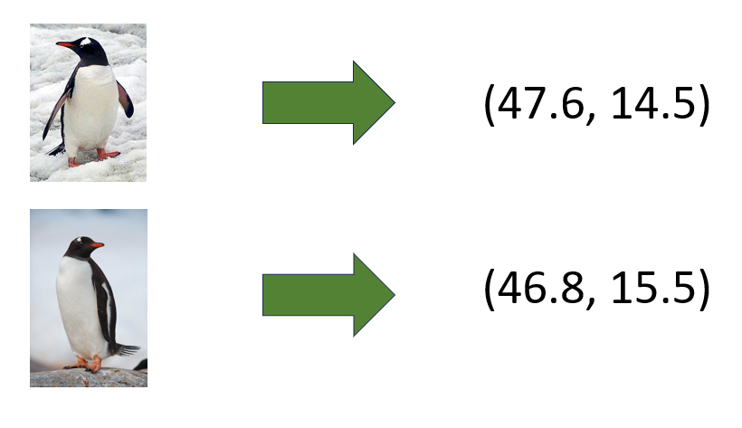
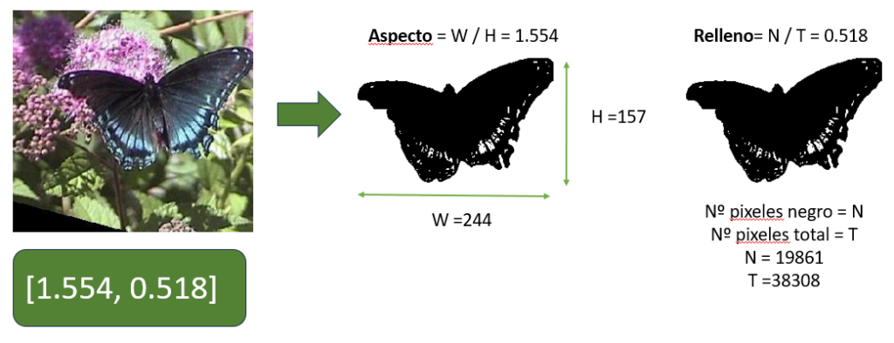
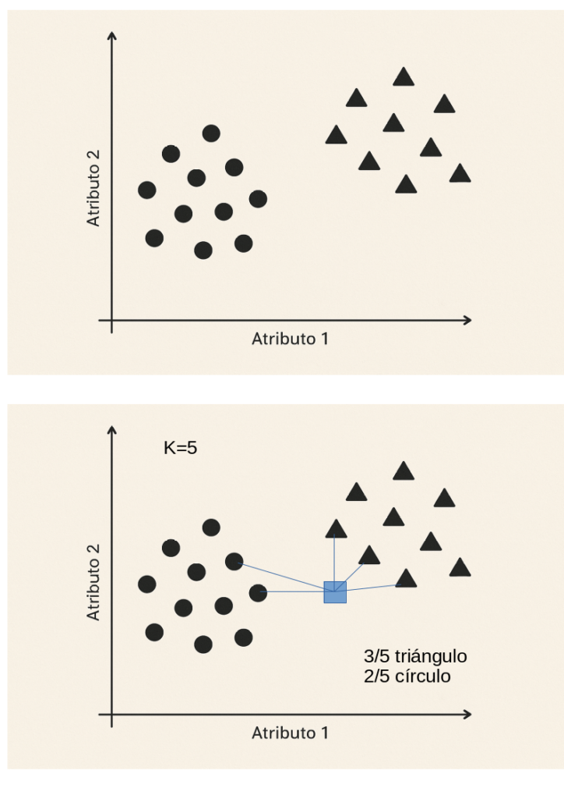

### Presentación

El objetivo de este taller es mostrar los fundamentos básicos del Machine Learning; un conjunto de técnicas matemáticas y computacionales de gran éxito en el desarrollo de la Inteligencia Artificial actual. GhatGPT, Gemini, Siri, Midjourney, Dalle y todas las IAs generativas que tanto impacto están teniendo desde hace unos años, están basadas en el Machine Learning. Realmente, como podéis imaginar, son técnicas muy complejas y sofisticadas. Sin embargo, sus principios básicos son muy fáciles de entender. Y ese es el objetivo de este taller, introducir estos principios y trabajarlos desde la práctica, realizando algunas actividades en las que crearás tu propia Inteligencia Artificial. Si todo sale bien, la próxima vez que uses tu herramienta de IA favorita, lo harás con otra visión, más crítica y con más fundamento.

[Presentacion-taller](https://web.learningml.org/wp-content/uploads/2025/10/Presentacion-taller.pdf)[Descarga](https://web.learningml.org/wp-content/uploads/2025/10/Presentacion-taller.pdf)

### Práctica 1. El imitador

Esta práctica nos servirá para introducir la herramienta LearningML con un ejemplo muy fácil y rápido de realizar. Se trata de la construcción de un modelo de Machine Learning de reconocimiento de nuestra cara con gafas, desnuda o con un gorro. Si no dispones de gafas o gorro puedes usar gestos de tu cara cómo "sonriente" o "triste", o también algunos gestos como "mano en boca", " ojo guiñado" o cualquier otro que se te ocurra.

Una vez que tengamos el modelo de Machine Learning funcionando correctamente veremos como se puede incorporar en una aplicación informática escrita con Scratch. En esta aplicación el gatito de Scratch imitará el gesto que nosotros hagamos: ponerse el sombrero, las gafas, ponerse alegre, triste, ...

El mismo ejemplo que Juanda mostrará en el taller lo podéis ver también en este video:

<figure>

https://youtu.be/4CmsigSmS70

<figcaption>

Tutorial: construcción de modelos para el reconocimiento de imágenes

</figcaption>

</figure>

Si quieres seguir explorando la plataforma te recomendamos los siguientes recursos:

<figure>

| [Primeros pasos con Scratch](https://web.learningml.org/programamos-con-scratch/) | Si aún no sabes lo que es Scratch o no lo conoces suficientemente. |
| --- | --- |
| [Flípalo en colores con LearningML](https://web.learningml.org/flipalo-en-colores-con-learningml/) | Un ejemplo de modelo para reconocer colores con un divertido programa en Scratch. |
| [Programando con Ciro 1ª parte](https://web.learningml.org/programando-con-ciro-reconocimiento-facial-1a-parte/)   [Programando con Ciro 2ª parte](https://web.learningml.org/programando-con-ciro-reconocimiento-facial-2a-parte/) | Ciro Rodríguez, con 10 años, nos explica un ejemplo programación de reconocimiento facial. |
| [Programando con Jara 1ª parte](https://web.learningml.org/programando-con-jara-estilos-pictoricos-1o-parte/)   [Programando con Jara 2ª parte](https://web.learningml.org/programando-con-jara-estilos-pictoricos-2o-parte/) | Jara Rodríguez, con 13 años, construye un modelo y una aplicación informática capaz de reconocer distintos estilos pictóricos |
| [Concurso de conocimientos sobre la prehistoria](https://web.learningml.org/el-concurso-de-la-prehistoria/) | Una aplicación que usa un modelo de Machine Learning de reconicimiento de textos para implementar un concurso de conocimiento sobre las edades de la prehistoria. |
| [Reconocimiento de sonidos](https://web.learningml.org/construimos-un-modelo-de-reconocimiento-de-sonido/) | Cómo construir un modelo de Machine Learning para el reconocimiento de sonidos. |

<figcaption>

Recursos para aprender LearningML

</figcaption>

</figure>

### Práctica 2. Reglas vs datos: dos estrategias para resolver problemas

##### Recursos

| [Conjunto de puntos en 2D en todos los cuadrantes del plano](https://web.learningml.org/wp-content/uploads/2025/10/cuadrantes.zip) |
| --- |

Esta práctica está basada en la actividad _["Propuesta didáctica: Inteligencia artificial con LearningML. Modelo numérico. Matemáticas; puntos, coordenadas y cuadrantes"](https://matematicas11235813.luismiglesias.es/2022/06/19/propuesta-didactica-inteligencia-artificial-con-learningml-modelo-numerico-matematicas-puntos-coordenadas-y-cuadrantes/)_ del docente [Luis Miguel Iglesias](https://luismiglesias.es/).

En esta actividad Luis Miguel, mediante el problema de asignar un punto del plano al cuadrante que pertenece, muestra como el Machine Learning permite resolver problemas matemáticos sin utilizar reglas explícitas, es decir sin programar la computadora explícitamente. En su lugar, las técnicas de Machine Learning usan conjuntos de soluciones de ejemplo a partir de las cuales el ordenador "aprende" a resolver el problema, analizando patrones y estableciendo relaciones entre dichas soluciones y el problema. Esta es **la esencia del Machine Learning: aprender a resolver problemas a partir de soluciones existentes que se usan como ejemplos**.

Normalmente recurrimos al _Machine Learning_ cuando resulta muy difícil —o incluso imposible— definir un conjunto de reglas que resuelva un problema, pero disponemos de muchos ejemplos de sus soluciones. En el caso que vamos a plantear, el problema **puede resolverse fácilmente mediante reglas**, pero lo utilizaremos para mostrar cómo el _Machine Learning_ también puede ofrecer una solución correcta **sin necesidad de conocer esas reglas previamente**. Así, el estudiante podrá comprender mejor la diferencia entre las estrategias **basadas en reglas** (deductivas) y las **basadas en datos** (inductivas)

A lo largo de la historia de la Inteligencia Artificial se han usado ambas aproximaciones. En los albores de la IA las soluciones deductivas tuvieron más éxito. A este acercamiento se le denominó **TOP- DOWN**. Actualmente, los mayores éxitos de la IA, incluyendo las IAs generativas como chatGPT, se están produciendo con estrategias basadas en datos, denominadas **BOTTON-UP**.

#### Solución basada en reglas

```
Introduce un punto del plano (X, Y)
Lee la cordenada X y la coordenada Y del punto
Si X > 0 y Y > 0 el punto pertenece al cuadrante I
Si X < 0 y Y > 0 el punto pertenece al cuadrante II
Si X < 0 y Y < 0 el punto pertenece al cuadrante III
Si X > 0 y Y < 0 el punto pertenece al cuadrante IV
```

#### Solución basada en datos

En efecto, la solución deductiva, basada en reglas, es muy sencilla. Pero, ¿podrá un algoritmo de Machine Learning "inducir" las reglas del problema a partir de un conjunto de soluciones del mismo? Es decir, ¿podemos construir un modelo de Machine Learning capaz de asignar a qué cuadrante pertenecen puntos del planos distintos a los usados en el conjunto de soluciones de ejemplo? En este vídeo el propio Luis Miguel muestra la solución con LearningML.

https://youtu.be/1D8konHIjbI

### Práctica 3. Perros, gatos y sesgos del Machine Learning

##### Recursos

| [Un conjunto de imágenes de perros y gatos](https://web.learningml.org/wp-content/uploads/2025/05/perros-y-gatos.zip) |
| --- |

En esta actividad vamos a trabajar con LearningML una problemática que todos los algoritmos de Machine Learning presentan: la aparición del sesgo en sus soluciones. Esto es, soluciones erróneas debidas a la naturaleza estadística del Machine Learning.

Con LearningML Crea dos clases llamada _perro_ y _gato_. En la primera añade las imágenes de la carpeta `dogs/train`, y en la segunda las de la carpeta `cats/train`. Entonces construye el modelo y pruébalo con las imágenes de las carpetas `dogs/test` y `cats/test`. Comprobarás que funciona bastante bien salvo en el caso de un gato negro que hay en la carpeta `cats/test`. Para ese ejemplo el modelo no da una confianza muy grande. Incluso puede que determine que es un perro con más probabilidad que un gato.

¿Qué ha ocurrido? En el conjunto de perros los hay de todos los colores, incluido el negro. Sin embargo no hay ejemplares negros en el conjunto de gatos. Por ello, cuando mostramos la imagen de un gato negro el modelo no es capaz de determinar con confianza el resultado, pues aunque tenga características de gato, no ha visto en su entrenamiento ningún gato que sea negro, mientras que sí ha visto perros negros. La causa de este error es el sesgo de los datos con respecto al color negro.

¿Cómo podemos corregir, o al menos reducir, este sesgo? Añadiendo ejemplares de gatos negros a la clase _gato_ y volviendo a crear el modelo para que tenga en cuenta estas nuevas imágenes. Puedes hacerlo usando la carpeta `cats/retrain`, que contienen algunos ejemplares negros. Verás como el modelo comienza a funcionar mucho mejor después de reentrenarlo con estas nuevas imágenes.

### Práctica 4. Codificación de textos (text embeddings)

Sea cual sea el tipo de datos que alimente a un algoritmo de Machine Learning (textos, imágenes, sonidos, vídeos, ...) antes de ser procesados por este deben ser codificados en un conjunto de números, que es lo que una computadora puede entender. Para que entendamos este concepto fíjate en el siguiente ejemplo con pingüinos antárticos.

Tenemos tres clases de pingüinos. ¿Cómo podemos codificar a cada ejemplar? Es decir, ¿cómo podemos representarlos mediante un conjunto de números? Tan fácil como fijarnos en aspectos **característicos** que se puedan medir (asignar un número) y construir un conjunto de números que representa a cada pingüino. Aclaración: a este conjunto de números se le llama vector.






Veamos otro ejemplo: la codificación automática de imágenes con \[aspecto, relleno\]

En aplicaciones de ML, la codificación se debe realizar de manera automática. El aspecto y el relleno son dos cantidades que se pueden medir automáticamente cuando las imágenes de nuestro problema se pueden siluetear.



Lo interesante de la codificación es que ejemplares similares tengan asociados vectores similares, esto es, cercanos. De esa manera, la clasificación automática, es decir, la creación de algoritmos capaces de clasificar, será bastante fácil. La siguiente imagen ilustra el fundamento de un algoritmo de Machine Learning sumamente sencillo pero muy eficaz en ciertos problemas clasificatorios: KNN. Se llama así por ser las siglas de K - Nearest Neighbors (los K vecinos más próximos).



Lo mismo sucede con los textos, existen técnicas de Machine Learning que consiguen codificar palabras o incluso frases enteras cómo un conjunto de números, lo que pasa es que son más de dos atributos los que se necesitan para que la palabra o frase quede debidamente codificada. En esta actividad vamos a jugar con codificaciones de texto, denominadas _text embedding,_ que son fundamentales en el funcionamiento de las IAs generativas como chatGPT.

La actividad que se ha desarrollado en el taller está basada en la [sesión 4](https://programamos.es/curso-inteligencia-artificial-y-educacion-como-entienden-el-texto-los-ordenadores/) del fabuloso curso "_[Inteligencia Artificial y Educación](https://programamos.es/ia/)_" de la [Asociación Programamos](https://programamos.es/). Os animamos a seguir el curso completo, es ameno, revelador y trata las cuestiones más sobresalientes y necesarias para entender la Inteligencia Artificial. Aunque su público objetivo es el docente, es perfecto para cualquier persona que quiera aprender sobre el tema sin entrar en complicaciones técnicas y matemáticas.

##### Recursos

- El lenguaje de programación basado en bloque [Snap!](https://snap.berkeley.edu/snap/snap.html)

- La [librería de IA](https://ecraft2learn.github.io/ai/AI-Teacher-Guide/words%20blocks.xml) del proyecto [E-craft-to-learn](https://ecraft2learn.github.io/ai/)

### Práctica 5. ¿Construimos nuestro propio chatGPT?

Bueno, el título es un poco pretencioso, aunque como lo hemos puesto entre interrogantes, lo vamos a dar por bueno :-). No, no vamos a construir un chatGPT, no somos ingenieros de OpenAI, Google o Antropic. Pero vamos a construir algo que nos ayudará a comprender que los modelos de IA generativa de textos, a pesar de ser tan prodigiosos, no son magia. Aunque uno solo encuentre explicaciones sobrenaturales cuando los usa.

Una vez más usaremos el curso "_[Inteligencia Artificial y Educación](https://programamos.es/ia/)_", en esta ocasión la sesión 8: "[¿Cómo funcionan los sistemas de IA generativa?](https://programamos.es/curso-inteligencia-artificial-y-educacion-como-funcionan-los-sistemas-de-ia-generativa/)".

##### Recursos

La versión de [Snap!GPT](https://snap.berkeley.edu/snap/snap.html#present:Username=programamoses&ProjectName=SnapGPT%20%2d%20Spanish&editMode&noRun) de Programamos.
