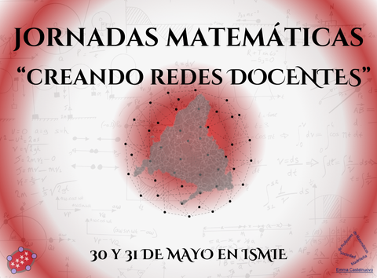

Jornadas sobre la enseñanza y el aprendizaje de las matemáticas ["Creando redes docentes".](https://innovacionyformacion.educa.madrid.org/actividades/jornadas-ensenanza-aprendizaje-matematicas-creando-redes-docentes-i0069) Organizadas por La Dirección de Bilingüismo y Calidad de la Enseñanza en colaboración con la Sociedad Madrileña de Profesores de Matemáticas (SMPM) «Emma Castelnuovo». En el Instituto Superior Madrileño de Innovación Educativa (ISMIE).

Ha sido **un placer y un auténtico privilegio** participar en estas encuentro representando a **LearningML**. Compartiendo ideas sobre **cómo la inteligencia artificial puede integrarse de forma significativa en la enseñanza de las matemáticas y potenciar el pensamiento computacional desde las aulas.**

Gracias a la organización por abrir este **espacio de encuentro, reflexión y aprendizaje** entre docentes, donde el conocimiento se convierte en red, y la innovación educativa se hace realidad.

Nos llevamos inspiración, retos y muchas ganas de seguir colaborando, para **transformar la educación** desde la tecnología, la creatividad y el trabajo conjunto.

**¡Vamos a seguir creciendo y conectando a quienes creemos en una educación abierta, crítica y con propósito!**

