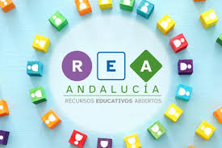
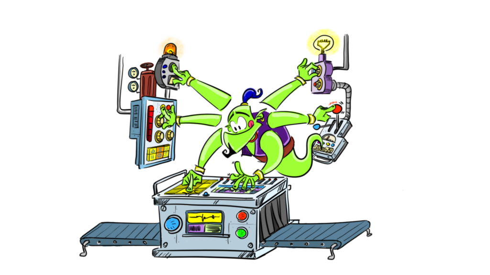

**[KGBL-III](http://kgblll.github.io), who have promoted the scientific foundations of the platform,** its academic dissemination and masterfully advised on the pedagogical use of LearningML.

[Fundación Cruzando](http://fundacioncruzando.org) (Chile), **who are helping to disseminate the platform and promote teacher training courses** with LearningML and have provided the necessary means to develop the desktop version of LearningML.

[Programamos.es](http://programamos.es) has done an impeccable job in the **dissemination and disclosure** of LearningML.

[EchidnaSTEAM](http://echidna.es), **who have promoted the integration** of LearningML **with educational robotics** through Echidna boards and are an unconditional support in pedagogical advice and dissemination.

[FAIAS project](http://fosteringai.github.io), which **has selected LearningML as an interactive tool** to develop new activities and help disseminate the platform throughout Europe.

[REA/DUA Andalucía Project](http://juntadeandalucia.es/educacion/portals/web/transformacion-digital-educativa/rea), a fascinating project in which **several teams of teachers have developed several dozens of Open Educational Resources with a common pedagogical sequence and style and aligned with the principles of Universal Design for Learning.** Several of these resources have used LearningML as a tool for teaching AI and have contributed greatly to its dissemination.

**Teachers** who are actively using LearningML in their classes, develop activities and help disseminate the project in different school environments.

The **friends** who have translated the platform's texts into several languages and who have helped LearningML become more international!

[Ammagamma solutions](http://ammagamma.com) (Modena, Italy) who are helping to **disseminate the platform in Italy** and have incorporated it as a tool for teaching ML in some of their courses.

University of Loja (Ecuador), who are helping to **disseminate the platform and studying its code** in order to continue its development and use it in an [ambitious project on mathematics and artificial intelligence.](http://unl.edu.ec/noticia/unl-lidera-proyecto-de-inteligencia-artificial-aplicada-la-educacion)

**Students from Universidad Rey Juan Carlos** who are studying the source code of the platform to continue its development as part of their TFG.

Roberto Marcano Ganzo, who has **designed the friendly genie and his amazing machine** as a metaphor for the Machine Learning that accompanies us while we use LearningML.

- Gregorio Robles

- Jesús Moreno León

- Marcos Román González

- Rodrigo Fábregas and collaborators

- Jesús Moreno León

- José Ignacio Huertas

- José Pujol Pérez

- Jorge Lobo

- Francisco Javier Álvarez

- Xavier Rosas

- Rey Juan Carlos University (Spain)

- Collective UP (Belgium)

- Teatro Circo Braga (Portugal)

- Vrije Universiteit (Brussels)

- José Pujol Pérez

- Jorge Lobo

- Francisco Javier Álvarez

- Álvaro Molina Ayuso

- Pablo Dúo Terrón

- Dave Ames (@davidames) (english)

- María Loureiro (@tecnoloxia) (galego)

- Vicenç Casas (@VicenCasas) i David Muns (@davidmuns) (català)

- Luca Baraldi (@elbilab) (italiano)

- Adrian Koegl und Peter Hubwieser (Deutsche)

- Κατερίνα Τσαράβα (@k\_tsarava) (griego)

- Pietro Monari

- Luca Baraldi (@elbilab)

- Luis Chamba-Eras y colaboradores

- Isaac Merchan Blanco

- Álvaro del Hoyo Arias

- Ignacio Rueda Rodríguez

And a very special thanks **to all the teachers and students** who are using LearningML to learn a little more about the world of Machine Learning and Artificial Intelligence.

And of course to **my wife Paula and my sons Jara and Ciro** for the “absences” they have to put up with when I go into “development” mode and travel inside the machine to build this modest piece of software.

Translated with DeepL.com (free version)
