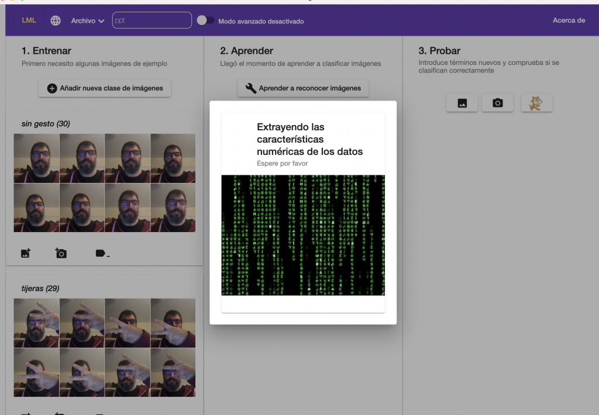
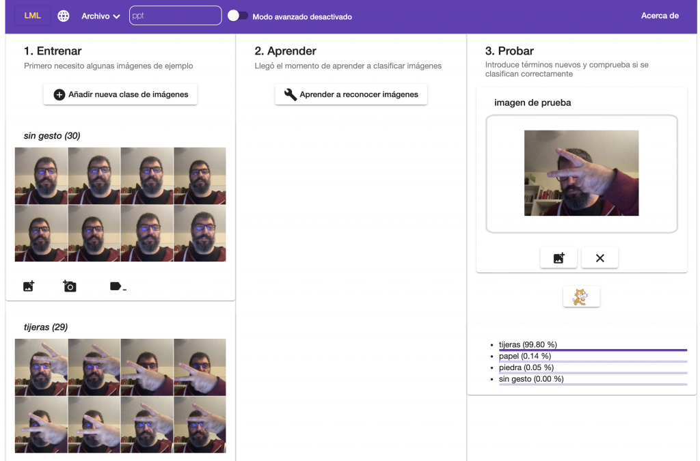
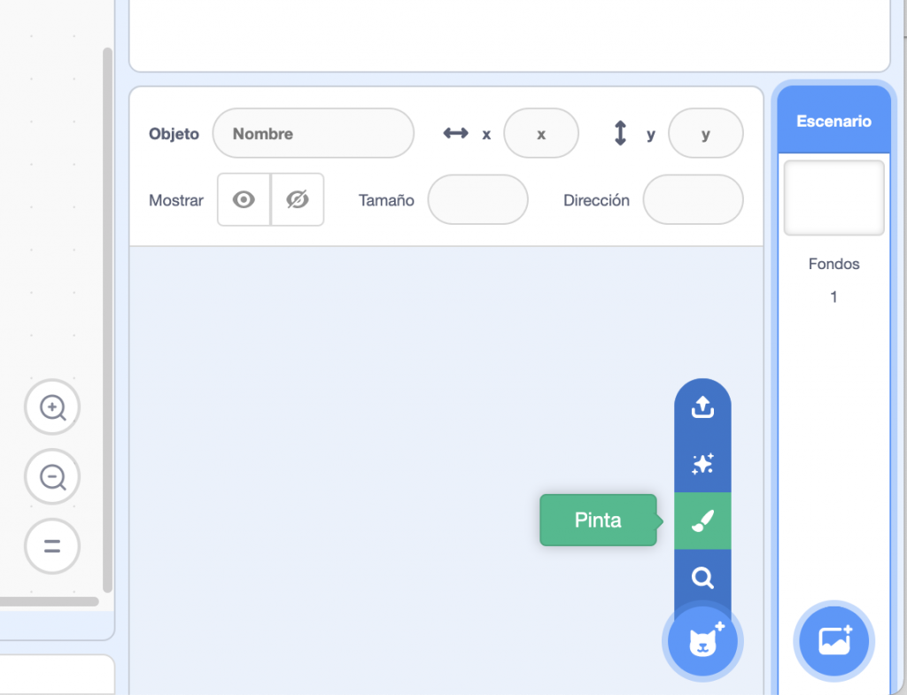
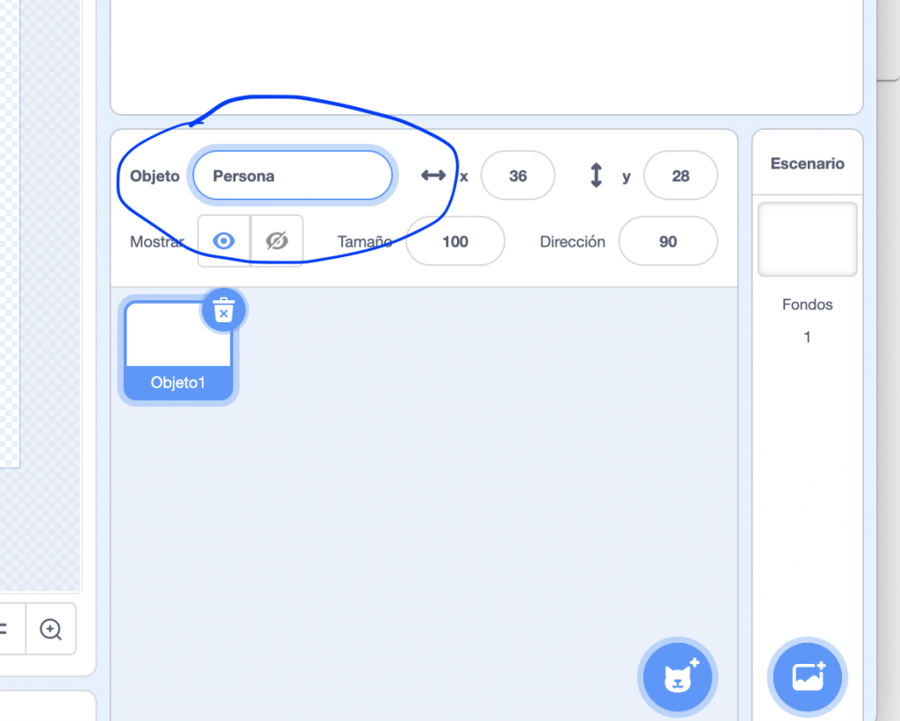
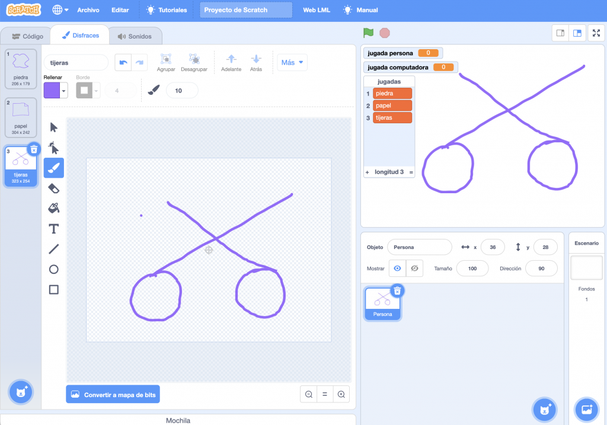
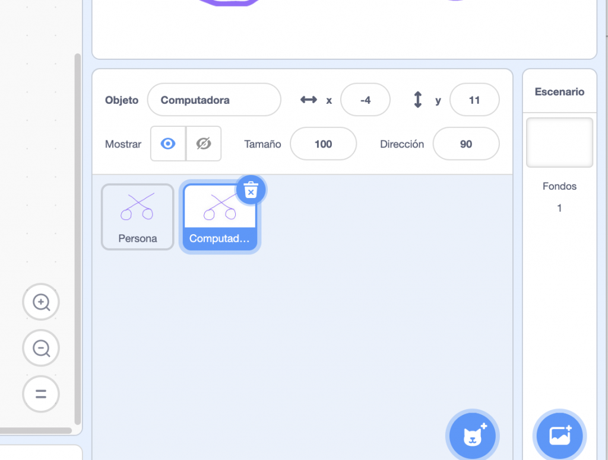
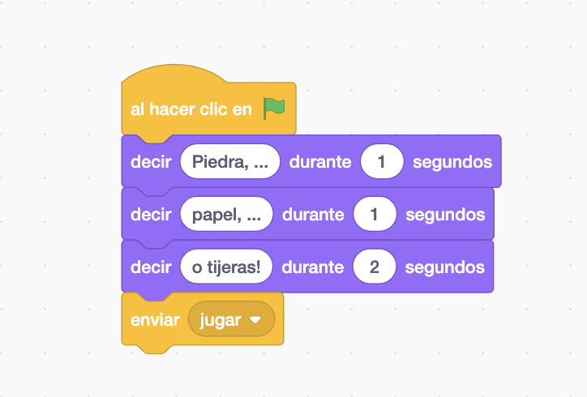
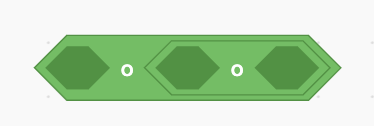
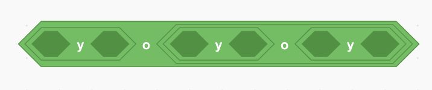

#### Objetivo

En esta actividad **construiremos un videojuego** en el que la computadora jugará contra nosotros al popular juego “piedra, papel o tijeras”. **Y lo hará viendo e interpretando los gestos de nuestras manos.**

Esto es, tendrá que ser capaz de reconocer el gesto de la mano que simboliza cada una de las jugadas permitidas en el juego.

##### En este video puedes ver el resultado final, pare que te hagas una idea

https://youtu.be/6H1rBWBE3fY

#### ¿Cómo es el juego?

Aunque seguramente el 99% de la población conoce el juego, lo explicaremos para el 1% de la población restante. **Dos jugadores se enfrentan, esconden tras la espalda una de sus manos y las colocan en una de las tres posibles posiciones:**

- **piedra**, con el puño cerrado,

- **papel**, con la palma abierta o

- **tijeras**, con los dedos índice y anular extendidos y el resto contraídos.

Entonces **se entona el canto: “piedra, papel o tijeras”**, y al terminarlo ambos jugadores muestran su jugada. Si ambos han jugado el mismo gesto empatan. Si no, la piedra gana a las tijeras, pues la rompe, la tijera al papel, pues lo corta y el papel a la piedra, pues la envuelve. Y así se repite jugada tras jugada hasta que los jugadores se aburren.

#### Y entonces, ¿cómo lo creamos?

La intención de la aplicación que vamos a desarrollar es que uno de los jugadores sea la computadora, y el otro una persona.

Teniendo en cuenta las reglas del juego, un posible análisis del problema sería el siguiente:

1. Un **objeto**, al que llamaremos **_Árbitro_** dirá: “piedra, papel o tijeras”.

3. Un **objeto**, al que llamaremos _**Computadora**_, jugará de manera aleatoria una de las tres posibles jugadas, y se almacenará en una variable. Podemos llamarla jugada\_computadora.

5. Un **objeto**, al que llamaremos _**Persona**_, activará la cámara de la computadora, y el jugador le mostrará su gesto, es decir, la jugada que ha elegido.

7. El **computador**, a través del objeto _**Persona**_, reconocerá la jugada que corresponde al gesto del jugador, y cuando la confianza en el reconocimiento de la imagen sea suficientemente alta, almacenará el resultado en una variable. Podemos llamarla jugada\_persona.

9. Entonces, el objeto _Árbitro_, aplicando las reglas del juego, decidirá quién de los dos ha ganado y el juego termina.

#### Parece que la computadora es juez y parte en el juego, pero no tiene porqué ser así...

Recordemos que **la computadora es una máquina absolutamente obediente,** solo hace lo que nosotros le ordenemos mediante nuestro programa. Así que, el objeto _Computadora,_ cuando selecciona su juego, no tiene que usar la información que la computadora tiene sobre el gesto que ha usado la persona. Eso es algo que el programador decide. **Por tanto, la computadora no juega con ventaja.** 

#### Pues bien, ¡vamos al lío!

El análisis que hemos realizado parece fácil de convertir en un programa informático. Sin embargo, hay una parte que podría parecer muy complicada de implementar: **el reconocimiento del gesto que la persona expone a la computadora a través de la cámara.** Pero nosotros ya sabemos que este tipo de problemas se resuelve aplicando las técnicas de Machine Learning.

Para resolver esa parte del problema podemos **crear un modelo de ML** capaz de reconocer los tres gestos del juego, y una vez que funcione correctamente, lo podemos usar, como cualquier otro bloque, en nuestro videojuego.

#### Comencemos por construir el modelo de ML

Abrimos el editor de _LearningML_ y en la sección _1\. Entrenar_, creamos cuatro clases, una para cada jugada que llamaremos _piedra_, _papel_ y _tijeras_, y la cuarta para reconocer la ausencia de gesto, que llamaremos _sin gesto_. Esta última nos vendrá bien para que la computadora no asocie por error una de las jugadas cuando aún no la hemos mostrado a la cámara.

<figure>

<figcaption>

Añadimos la clases del problema

</figcaption>

</figure>

- A cada clase añadimos unas 30 imágenes del gesto que le corresponda.

- Es importante colocar la mano en distintas posiciones de la cámara, es decir, más arriba, más abajo, hacia la derecha, hacia la izquierda, más cerca, más lejos, etcétera.

La intención es que el conjunto de imágenes sea representativo del gesto, y que el modelo sea capaz de reconocer cada gesto con independencia de la posición exacta que la mano ocupe en el cuadro de la cámara. 

#### Pasamos a la fase de aprendizaje

Cuando hayamos completado el conjunto de entrenamiento, pasamos a la fase de aprendizaje **para que el algoritmo de ML construya un modelo a partir de las imágenes.**

Esto lo hacemos haciendo _clic_ en el botón “_Aprender a reconocer imágenes”_ de la sección _2\. Aprendizaje_.

<figure>

<figcaption>

Construcción del modelo

</figcaption>

</figure>

#### Hagamos pruebas

Y cuando haya finalizado, es el momento de **probarlo y comprobar si funciona correctamente.** Esto lo hacemos usando los controles de la sección _3\. Probar_. Hacemos _clic_ en el botón con la cámara y comprobamos si los gestos que presentamos a la cámara se reconocen correctamente y con suficiente confianza.

<figure>

<figcaption>

Evaluamos el modelo probando con nuevas imágenes

</figcaption>

</figure>

Si durante la evaluación vemos que el modelo **no está funcionando correctamente**, hay que **mejorar el conjunto de datos de entrenamiento**, añadiendo o quitando imágenes a las clases que presentan problemas en la clasificación.

#### ¡Y ya tenemos el modelo!

Ahora hay que usarlo en el videojuego que vamos a construir. **Este modelo constituirá el componente de Inteligencia Artificial de la aplicación.** 

Ahora, hacemos _clic_ en el botón del gatito de **Scratch**, para iniciar la plataforma de programación. Una vez en ella, **crearemos 3 objetos**: uno para implementar las acciones del jugador, otro para las de la computadora y el último para el árbitro.

Primero eliminamos el objeto del gatito que viene por defecto y después **creamos las variables** _jugada\_persona_ y _jugada\_computadora_, que almacenarán las jugadas realizadas por la persona y la computadora respectivamente.

Además, crearemos una lista, que llamaremos _jugadas_, con los elementos _piedra_, _papel_ y _tijera_.

<figure>

<figcaption>

Creación de las variables y la lista

</figcaption>

</figure>

Ahora, agregamos el **objeto _Persona_** usando la herramienta de creación manual de objetos. Se accede a ella haciendo _clic_ en el desplegable de creación de objetos y eligiendo el botón del pincel. 

<figure>

<figcaption>

Creación del objeto Persona (1)

</figcaption>

</figure>

Usaremos _Persona_ como nombre del objeto.

<figure>

<figcaption>

Creación del objeto Persona (2)

</figcaption>

</figure>

Y en la sección disfraces del editor de código **añadiremos tres disfraces** que se llamarán como las jugadas: **piedra, papel y tijera**. En cada uno de los disfraces dibujaremos algo que recuerde a una piedra, a un papel y a una tijera respectivamente.

También puedes usar imágenes que descargues de internet o  fotografías que tú mismos hagas. 

<figure>

<figcaption>

Creación de los disfraces para el objeto Persona

</figcaption>

</figure>

#### Vamos a crear el objeto Computadora

Copiando el **objeto** _**Persona**_ y cambiándole el nombre. 

<figure>

<figcaption>

Creación del objeto Computadora por duplicación del objeto Persona

</figcaption>

</figure>

Finalmente, tenemos dos objetos con los mismos disfraces.

<figure>

<figcaption>

Dos objetos idénticos con distinto nombre

</figcaption>

</figure>

#### Y creamos el objeto árbitro

Esto lo hacemos a partir de un objeto predefinido de Scratch.

<figure>

<figcaption>

Creación de un objeto a partir de librerías

</figcaption>

</figure>

#### Nos quedará algo así

<figure>

<figcaption>

Creación del objeto Árbitro

</figcaption>

</figure>

Seleccionamos el objeto _Árbitro_ y añadimos el siguiente código que implementa la cuenta atrás para sacar la jugada. 

<figure>

<figcaption>

Código inicial del objeto Árbitro

</figcaption>

</figure>

El último bloque envía el mensaje “jugar”, y será recogido tanto por el **objeto _Computadora_** como por _Persona_.

Comencemos con el código del **objeto _Computadora_**. 

<figure>

<figcaption>

Código inicial del objeto Computadora

</figcaption>

</figure>

Cuando hacemos _clic_ en la bandera, es decir, cuando se inicia el programa, fijamos el tamaño del objeto a la mitad, lo colocamos a la izquierda de la pantalla y lo escondemos, pues aún no queremos mostrar la jugada de la computadora.

Al recibir el mensaje “mostrar”, el objeto se mostrará. Este mensaje lo enviará el árbitro cuando las dos partes hayan realizado su jugada. Por último, cuando reciba el mensaje “jugar”, el objeto genera un número aleatorio entre 1 y 3 (ambos inclusive) que será utilizado para elegir uno de los elementos de la lista jugadas, y almacenarlo en la variable jugada\_computadora. Es decir, esta variable terminará conteniendo uno de los textos “piedra”, “papel” o “tijeras”.

Finalmente, como hemos llamado a los disfraces con los nombres de las jugadas, podemos usar el contenido de la variable _jugada\_computadora_  para seleccionar el disfraz que mostrará la computadora. 

#### Llegados a este punto puedes probar el código

Si todo va bien el árbitro dará comienzo al juego y la computadora seleccionará su jugada.

A continuación añadimos el siguiente código al objeto _Persona_.

<figure>

<figcaption>

Código inicial del objeto Persona

</figcaption>

</figure>

Igual que con el **objeto _Computadora_**, cuando se hace _clic_ en la bandera, se fija el tamaño a la mitad, se coloca en la parte derecha de la pantalla y se esconde, pues no queremos que se vea la jugada de la persona hasta que no llegue el momento.

Además, se apagará la cámara, pues al no haber comenzado aún el juego, no es necesaria. Al recibir el mensaje “mostrar”, el objeto aparecerá en pantalla. Como ya hemos comentado, es el **objeto _Árbitro_** quien decide cuándo enviar ese mensaje.

Y la parte más compleja sucede **cuando el objeto recibe el mensaje “a jugar”.**

- Primero definiremos la transparencia de la cámara al 50%. Para usar ese bloque hay que añadir la extensión “sensor de video”. Se hace _clic_ en el botón de abajo a la izquierda. Aparecen las extensiones disponibles entre las que se encuentra “sensor de video”. Una vez seleccionada ya tienes disponible dicho bloque.

<figure>

<figcaption>

Añadir la extensión de video

</figcaption>

</figure>

- El siguiente bloque activa la cámara. Este bloque se encuentra en la sección “_learningml-images_”. A continuación esperamos un pequeño tiempo. Esto se hace con la intención de estabilizar la cámara de video. 

- **Creamos una variable llamada _confianza_,** para almacenar la confianza del reconocimiento realizado por el modelo de ML, y le asignamos el valor inicial cero. A continuación, creamos un bucle que se repetirá hasta que se cumpla el valor de la _confianza_ sea superior a 0.8 y además la clasificación realizada sea distinta “sin gesto”. Esta última nos garantiza que no se realizará lectura de la jugada hasta que la mano sea presentada a la cámara.

Durante la ejecución del bucle la variable confianza se va actualizando con el valor calculado por el bloque “_confianza para la imagen <imagen>_” y la variable _jugada\_persona_ se carga con el valor dado por el bloque “_clasificar imagen <imagen>_”, es decir, con el resultado que ofrece nuestro modelo de ML.

Ambos bloques se encuentran en la sección “_learningml-images_”. Por último, ten en cuenta que estos bloques pueden leer la imagen de entrada desde uno de los disfraces del objeto o desde la cámara. **En nuestro caso queremos que se haga desde la cámara.** Por eso debes colocar el bloque “imagen de video” como argumentos de ambos bloques.

Cuando la persona presenta el gesto a la cámara y la condición de salida del bucle se ha cumplido, tenemos almacenado en la variable _jugada\_persona_, el valor que el modelo de ML ha interpretado sobre el gesto de la persona. Y como hemos tenido la precaución de llamar a los nombre de las clases de jugadas igual que a los disfraces, esto es, “piedra”, “papel”, o “tijeras”, podemos usar el valor de la variable _juagada\_persona_ para fijar el disfraz que el **objeto _Persona_** debe mostrar. 

- Ahora sí, apagamos la cámara y **enviamos el mensaje “listo jugador”,** para indicar al árbitro que la lectura del gesto del jugador ya se ha realizado correctamente.

- Volvemos al código del objeto Árbitro. Vamos a ocultar la representación de las variables y de la lista y a resolver el juego. Para ello usamos el siguiente código:

<figure>

<figcaption>

Código del objeto Árbitro

</figcaption>

</figure>

**Aprovechamos para esconder todas las variables y colocar al árbitro en el centro de la pantalla.**

Además, **añadimos el programa que se ejecutará** cuando el árbitro reciba el mensaje “listo jugador”, es decir, cuando ha sido interpretado correctamente el gesto mostrado por la persona a la cámara.

Este programa, tal y como se ve en la imagen es muy sencillo: primero dice “Listo”, para indicar que ya se ha terminado la partida, después envía el mensaje “mostrar”, que es recibido por los objetos _Computadora_ y _Persona_ para aparecer en pantalla y mostrar el disfraz que corresponde a su jugada. Y por último se resuelve el juego en los bloques “si - si no” anidados.

Se comprueba si ambos jugadores han sacado la misma jugada, en cuyo caso se produce un empate. En caso contrario, se comprueban todas las opciones ganadoras de la persona.

Esto se hace en el **bloque con forma de diamante** que es tan largo que no cabe en la imagen. Construir la condición puede resultar algo lioso, pero no es difícil. Hay que concatenar dos bloques de condición “O”:

<figure>

<figcaption>

dos bloques "O"

</figcaption>

</figure>

Meter en cada hueco un bloque de condición “Y”:

<figure>

<figcaption>

Tres bloques "Y" combinados en dos bloques "O"

</figcaption>

</figure>

Y en cada uno de esos bloque conjuntivos (Y), meter una de las condiciones ganadoras:

<figure>

<figcaption>

Las tres condiciones ganadoras para la persona

</figcaption>

</figure>

Finalmente podemos añadir dos objetos sin código para indicar quién es la computadora y quién la persona.

**Y con esto ya tenemos una versión sencilla del juego “piedras, papel o tijeras”. Ya solo nos queda probarlo y jugar.**
