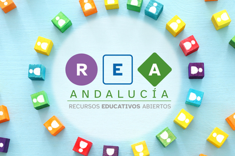
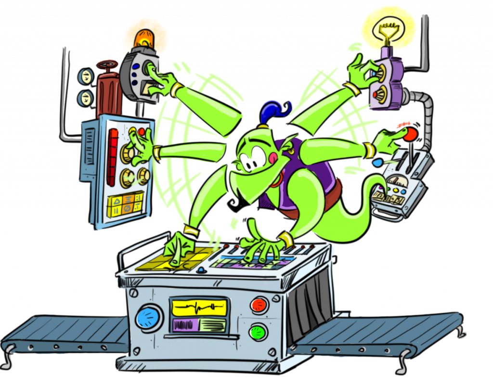

**[KGBL-III](https://kgblll.github.io/), que han impulsado las bases científicas de la plataforma**, su divulgación académica y asesorado magistralmente en el uso pedagógico de LearningML.

- Gregorio Robles

- Jesús Moreno León

- Marcos Román González

[Fundación Cruzando](https://fundacioncruzando.org/) (Chile), que están **ayudando a divulgar la plataforma y promueven cursos de formación del profesorado** con LearningML y han facilitado los medios necesarios para desarrollar la versión de escritorio de LearningML.

- Rodrigo Fábregas y colaboradores

[Programamos.es](https://programamos.es) que ha hecho un trabajo impecable en la **difusión y divulgación** de LearningML.

- Jesús Moreno León

- José Ignacio Huertas

[EchidnaSTEAM](https://echidna.es/), que han **impulsado la integración** de LearningML **con la robótica educativa** a través de las placas Echidna y son un apoyo incondiciona en el asesoramiento pedagógico y su divulgación.

- José Pujol Pérez

- Jorge Lobo

- Francisco Javier Álvarez

- Xavier Rosas

Proyecto [FAIAS](https://fosteringai.github.io/), que **ha seleccionado LearningML como herramienta interactiva** para desarrollar nuevas actividades y ayudan a la difusión de la plataforma en toda Europa.

- Universidad Rey Juan Carlos (Spain)

- Collective UP (Belgium)

- Teatro Circo Braga (Portugal)

- Vrije Universiteit (Bruselas)

[Proyecto REA/DUA Andalucía](https://www.juntadeandalucia.es/educacion/portals/web/transformacion-digital-educativa/rea), un fascinante proyecto en el que varios **equipos de profesores han desarrollado varias decenas de Recursos Educativos Abiertos con una secuencia pedagógica y estilo común y alineados con los principios del Diseño Universal para el Aprendizaje.** Varios de esos recursos han usado LearningML como herramienta para la enseñanza de la IA y han contribuido enormemente a su difusión.

**Profesores** que están usando activamente en sus clases LearningML, desarrollan actividades y ayudan a la difusión del proyecto en distintos ámbitos escolares.

- José Pujol Pérez

- Jorge Lobo

- Francisco Javier Álvarez

- Álvaro Molina Ayuso

- Pablo Dúo Terrón

Los **amigos** que han traducido los textos de la plataforma a varios idiomas y que han ayudado a que LearningML sea más internacional!

- Dave Ames (@davidames) (english)

- María Loureiro (@tecnoloxia) (galego)

- Vicenç Casas (@VicenCasas) i David Muns (@davidmuns) (català)

- Luca Baraldi (@elbilab) (italiano)

- Adrian Koegl und Peter Hubwieser (Deutsche)

- Κατερίνα Τσαράβα (@k\_tsarava) (griego)

[Ammagamma solutions](https://ammagamma.com/) (Módena, Italia) que están ayudando a **divulgar la plataforma en Italia** y la han incorporado como herramienta para la enseñanza del ML en algunos de sus cursos.

- Pietro Monari

- Luca Baraldi (@elbilab)

Universidad de Loja (Ecuador), que están ayudando a **divulgar la plataforma y estudiando su código** para continuar su desarrollo y usarla en un [ambicioso proyecto sobre matemáticas e inteligencia artificial](https://unl.edu.ec/noticia/unl-lidera-proyecto-de-inteligencia-artificial-aplicada-la-educacion).

- Luis Chamba-Eras y colaboradores

**Alumnos de la Universidad Rey Juan Carlos** que están estudiando el código fuente de la plataforma para continuar su desarrollo como parte de sus TFG.

- Isaac Merchan Blanco

- Álvaro del Hoyo Arias

- Ignacio Rueda Rodríguez

Roberto Marcano Ganzo, que ha **diseñado el simpático genio y su asombrosa máquina** como una metáfora del Machine Learning que nos acompaña mientras usamos LearningML.

<figure>

<figcaption>

El genio de LML

</figcaption>

</figure>

Y un agradecimiento muy especial **a todos los docentes y estudiantes** que están usando LearningML para aprender un poco más acerca del mundo del Machine Learning y la Inteligencia Artificial.

Y por supuesto a **mi mujer Paula y a mis hijos Jara y Ciro** por las "ausencias" que les toca aguantar cuando entro en modo "desarrollo" y viajo al interior de la máquina para construir esta modesta pieza de _software_.
