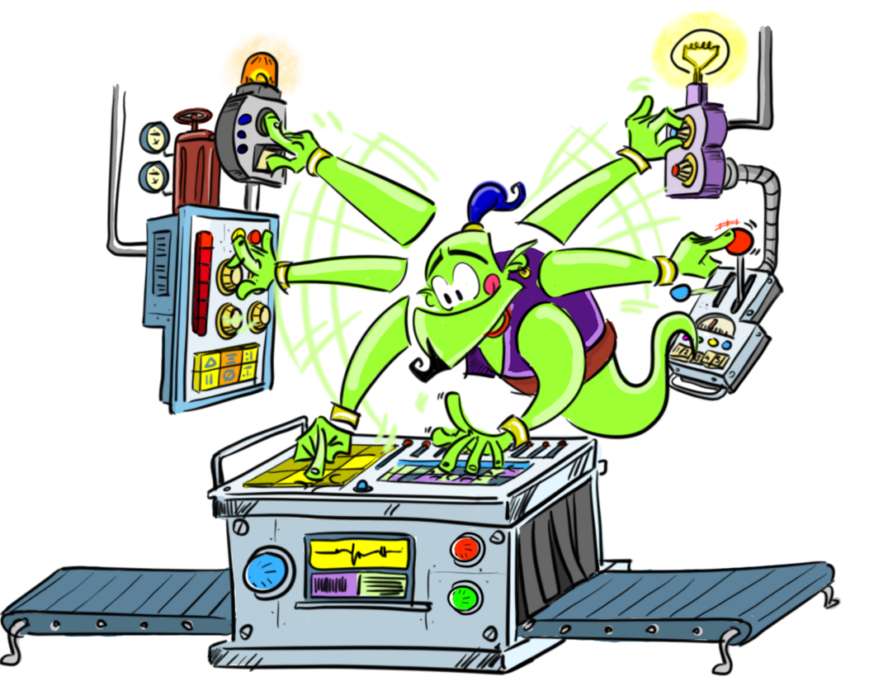

🏆 Best Educational Resource

[All Digital Awards 2024 Winner](https://all-digital.org/all-digital-awards-2024-best-digital-resource/)

🏅 2024

[**Try LearningML V2**](https://v2.learningml.org)

* * *

[**LearningML Basic**](https://basic.learningml.org/editor)

Ideal to enter the world of Machine Learning. Build AI models to recognize text and images. It can be used from the last grades of primary school.

[**LearningML Advanced**](https://advanced.learningml.org/editor)

This version adds the classification of sets of numbers and the [advanced mode](https://web.learningml.org/el-modo-avanzado-de-learningml/), with which you can explore the behavior of ML algorithms.

[**LearningML Desktop**](https://web.learningml.org/learningml-desktop/)

For those who prefer to have LearningML v1.3 installed on their computer (Linux, Windows, Mac) and go offline. Ideal to be incorporated into educational Linux distributions and for schools that have internet connection problems

[**LearningML Snap!**](https://snap.learningml.org/snap.html)

For those who want more power programming applications. All phases of ML are done by programming. Ideal for high school, vocational training and first university courses

* * *

##### This is how easy it is to build a Machine Learning model (data-driven AI) with LearningML

#### Collect data

Collect texts or images about something that you want to classify automatically and add them to LearningML indicating which class each one of them belongs to. This data constitutes the training set.

#### Create a model

Build with LearningML a model capable of correctly classifying other data that is different, but similar, to that of the training set.

#### Build an application

Export your Machine Learning model to Scratch and program an application with the ability to classify data on the topic you have chosen. !! Congratulations!! You have incorporated Artificial Intelligence into your Scratch program!

<figure>

<figcaption>

Mini tutorial de uso de LearningML

</figcaption>

</figure>
