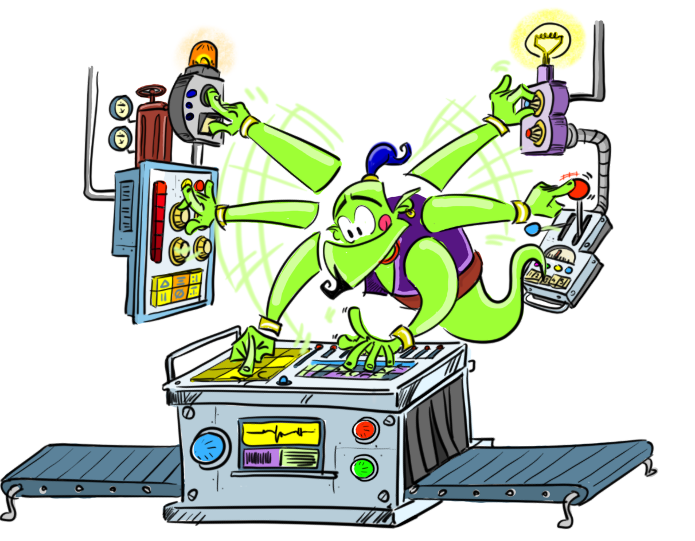

🏆 Mejor Recurso Educativo

[All Digital Awards 2024 Winner](https://all-digital.org/all-digital-awards-2024-best-digital-resource/)

🏅 2024

[¡**Prueba LearningML V2!**](https://v2.learningml.org)

* * *

[**LearningML Básico**](https://basic.learningml.org/editor)

Ideal para introducirse en el mundo del Machine Learning. Construye modelos de IA para reconocer textos e imágenes. Se puede usar desde los últimos cursos de primaria.

[**LearningML Avanzado**](https://advanced.learningml.org/editor)

En esta versión se añade la clasificación de conjuntos de números y el [modo avanzado](https://web.learningml.org/el-modo-avanzado-de-learningml/), con el que podrás explorar el comportamiento de los algoritmos de ML.

[**LearningML Escritorio**](https://web.learningml.org/learningml-desktop/)

Para los que prefieren tener instalado LearningML v1.3 en su ordenador (Linux, Windows, Mac) y pasar de Internet. Ideal para ser incorporado en distribuciones educativas de Linux y para colegios que tengan problemas de conexión a internet

[**LearningML Snap!**](https://snap.learningml.org/snap.html)

Para los que quieren más potencia programando aplicaciones. Todas las fases del ML se hacen programando. Ideal para bachillerato, formación profesional y primeros cursos universitarios

* * *

##### Así de fácil se construye un modelo de Machine Learnig (IA basada en datos) con LearningML

#### Recopila datos

Recopila textos o imágenes sobre algo que quieras clasificar de forma automática y añádelos a LearningML indicando a qué clase pertenece cada uno de ellos. Estos datos constituyen el conjunto de entrenamiento.

#### Crea un modelo

Construye con LearningML un modelo capaz de clasificar correctamente otros datos distintos, aunque similares, a los del conjunto de entrenamiento.

#### Construye una aplicación

Exporta tu modelo de Machine Learning a Scratch y programa una aplicación con capacidad para clasificar datos sobre el tema que hayas elegido. ¡Enhorabuena! ¡has incorporado Inteligencia Artificial a tu programa Scratch!.

<figure>

<figcaption>

Mini tutorial de uso de LearningML

</figcaption>

</figure>
